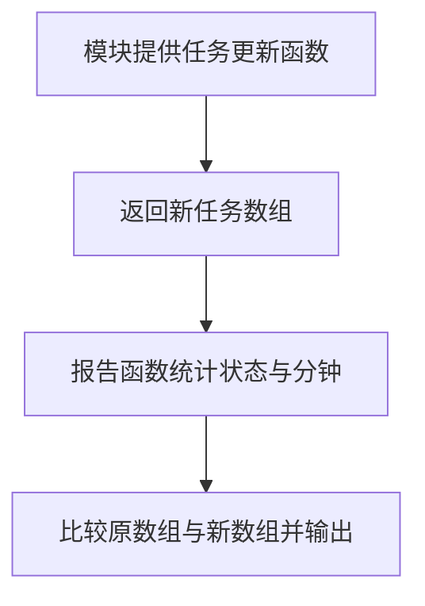

# Day 25｜结课项目（二）：业务逻辑、不可变更新与模块

昨天导入了可信任务。今天要把任务 `a` 从 `todo` 改成 `done`，同时保留修改前的数据：`original` 中的任务仍是 `todo`，`updated` 中对应任务才是 `done`。这样旧页面、历史记录或其他调用者不会被一次更新偷偷改掉。

你会从空文件实现更新、筛选、排序和统计。示例用多个模块展示代码怎样分工；独立练习只写一个入口文件，先把“旧值不能变、新值怎样产生”练清楚。

建议用时：60–90 分钟。

## 今天会学到

- 用 `map` 和对象展开替换一个任务，不修改旧数据；
- 区分新数组、新对象与复用的旧引用；
- 避免 `sort` 原地修改调用者数组；
- 用 `Record` 保证每种状态都有统计位置；
- 用受约束泛型保留实体的具体类型。

## 核心讲解

### `map` 这一行到底发生了什么

假设 `original` 有三个任务：`a/todo`、`b/doing`、`c/done`。调用 `completeTask(original, "a")` 后，`map` 依次查看每一项：

1. 看到任务 `a`，id 命中，于是用对象展开创建一个新对象，并把新对象的状态改成 `done`。
2. 看到任务 `b` 和 `c`，id 没命中，直接返回原来的对象。
3. `map` 把三次返回值装进一个新数组 `updated`。

| 比较 | 结果 | 原因 |
| --- | --- | --- |
| `original === updated` | `false` | `map` 创建了新数组 |
| `original[0] === updated[0]` | `false` | 命中的任务创建了新对象 |
| `original[1] === updated[1]` | `true` | 没变化的任务复用了旧对象 |

这就是“不可变更新”：不改原值，另外创建能表示新状态的值。对象展开只复制当前这一层。如果任务里还有可修改的 `details.notes`，只复制任务对象仍会共享内部的 `details` 和 `notes`。

### 排序与统计

`sort` 会直接改变调用它的数组顺序。参数如果是调用者传进来的原数组，应先复制、`filter` 或 `map` 得到新数组，再排序。`Record<TaskStatus, number>` 要求 `todo`、`doing`、`done` 每个状态都有一个数字位置；以后新增状态时，TypeScript 会提醒你补上对应统计。

### 泛型在这里保留什么

`T extends { readonly id: string }` 可以拆成两句：`T` 可以是任务、商品或其他对象；但它至少要有只读字符串 `id`。函数接收 `T[]`，更新回调也处理 `T`，最后仍返回 `T[]`，所以任务自己的 `title`、`minutes` 等字段不会因为经过通用函数而丢失。

## 为什么要这样设计

同一个任务对象可能同时被页面、缓存和历史记录引用。若业务函数直接改 `status` 或在原数组上 `sort`，所有引用都会看到变化，调用者也很难知道数据是在什么时候被改掉的。不可变更新用新数组表示新版本，使修改前后的值可以同时存在并比较。

`map` 负责逐项收集返回值并创建新数组，对象展开负责复制当前对象这一层，泛型则保留调用者原有的字段类型；你仍要决定哪一个 id 命中、哪些字段改变、是否需要深层复制，以及排序规则。代价是会创建额外数组和目标对象，而且对象展开只是浅复制：嵌套对象若也会修改，必须继续复制相应层级。

## 函数变量追踪

示例中的值按这条路线移动：`original` 和目标 id `"a"` 进入 `completeTask`；`map` 产生 `updated`；`updated` 再进入 `buildReport`；统计结果由 `report` 接住。最后同时打印 `original[0].status` 和 `updated[0].status`，你可以直接确认旧值是 `todo`，新值是 `done`。

给每一步结果取新名称，不只是写法偏好。它让你能在同一处比较更新前后，也能看出下一个函数拿到的是哪一版数据。

## Example 实际输出

运行 `example.ts` 后，终端会按下面的顺序显示。先用代码推测结果，再逐行对照：

```text
Original first status: todo
Updated first status: done
Done: 2
Todo: 0
Total minutes: 105
```

## Example 代码流程图

运行 `example.ts` 前先沿图预测执行顺序；运行后再把每个节点对应到代码行。



## 独立练习导航

本日共有 3 道独立练习。每道题都有单独目录、说明、作答文件和解题结构提示；题目之间不共享代码。

| 目录 | 场景 | 类型 |
| --- | --- | --- |
| [practice01](./practice01/README.md) | Day 25 · 结课项目（二）独立综合题 | 主任务 |
| [practice02](./practice02/README.md) | 任务更新与统计 | 闭卷迁移 |
| [practice03](./practice03/README.md) | 库存不可变更新 | 综合应用 |

右击任意练习目录中的 `practice.ts` 即可单独检查；命令行也可运行 `npm run beginner -- day25 practice02`。

## 常见错误

- 直接写 `task.status = "done"`；
- 对参数数组直接 `sort`；
- 误以为对象展开会深复制；
- 用任意字符串键统计状态。

### 错误代码示例

```ts
function completeFirst(tasks: StudyTask[]): StudyTask[] {
  tasks[0].status = "done"; // ❌ 修改了调用者持有的原任务对象。
  return tasks.sort((a, b) => a.minutes - b.minutes);
  // ❌ sort 还会原地重排调用者的原数组。
}
```

### 正确写法

```ts
function completeFirst(tasks: readonly StudyTask[]): StudyTask[] {
  const updated = tasks.map((task, index) =>
    // ✅ 命中项创建新对象；未命中项可以安全复用旧引用。
    index === 0 ? { ...task, status: "done" as const } : task
  );

  // ✅ updated 已是新数组；也可写 [...tasks].sort(...) 后再做其他处理。
  return updated.sort((a, b) => a.minutes - b.minutes);
}
```

## 面试时怎么回答

**问：** TypeScript 的结构化类型和不可变更新有什么关系？

**答：** 结构化类型看对象“有哪些成员”，不要求类型名称相同。`updateById<T extends { readonly id: string }>` 因此能接收任务、商品等不同对象，只要它们有字符串 `id`，泛型 `T` 还会保留各自的 `title`、`stock` 等字段。更新时用 `map` 创建新数组；命中项用 `{ ...item, status: "done" }` 创建新对象，未命中项可以复用旧引用。这样 `original !== updated`，目标项引用不同，而未变化项引用可以相同。

**容易答错或追问：** 不要把 `readonly` 说成运行时冻结，它主要限制 TypeScript 中的写操作；也不要说对象展开会深拷贝。若任务含 `details.notes`，只展开任务仍会共享 `details`。面试官可能追问 `sort`：它会原地改数组，所以要在筛选或复制得到的新数组上排序。不可变更新更容易追踪历史，但会分配新容器，深层更新还要明确复制哪些层。

## 拓展思考（不要求写代码）

如果任务新增可修改的 `details: { notes: string[] }`，更新其中一条 notes 时需要复制哪几层，才能保证旧任务完全不变？

## 官方资料

- [Object Types](https://www.typescriptlang.org/docs/handbook/2/objects.html)
- [Generics](https://www.typescriptlang.org/docs/handbook/2/generics.html)
- [Utility Types：Record](https://www.typescriptlang.org/docs/handbook/utility-types.html#recordkeys-type)
- [Modules](https://www.typescriptlang.org/docs/handbook/2/modules.html)
