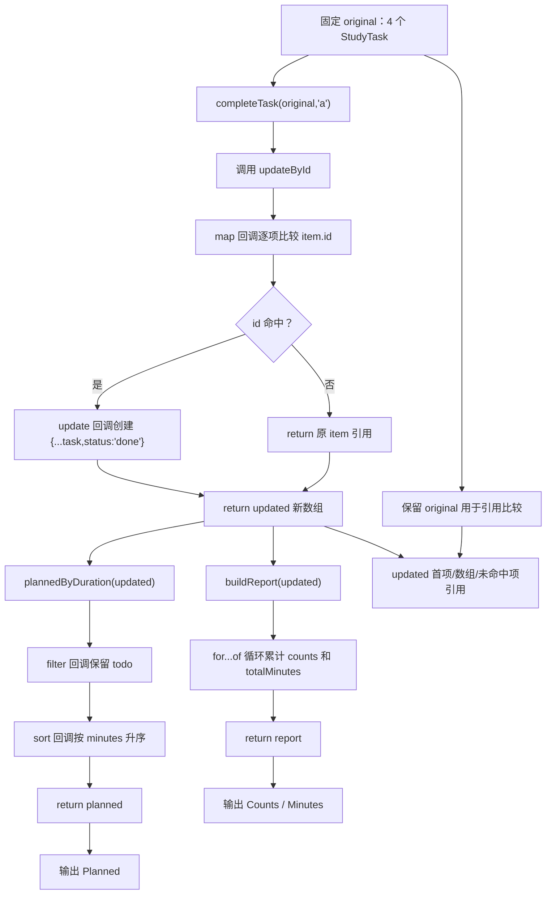

# DAY25 · Practice 01：学习任务快照更新

[返回当天课程](../README.md)

## 文件位置

- 作答文件：[practice.ts](../../../day25/practice01/practice.ts)
- 完整参考答案：[solution.ts](../../../day25/practice01/solution.ts)
- 答案调用说明：[SOLUTION.md](./SOLUTION.md)

这是一道完整、独立的主练习。不要导入其他 practice 文件夹中的代码。

## 场景背景

学习计划应用要在多个界面之间共享同一批任务，业务服务接收任务数组和待完成的任务编号，再生成更新结果与统计报告。若服务直接修改原数组或原对象，历史视图、缓存和当前页面会同时被意外改变，排序也可能破坏原顺序。你需要交付新的任务集合、按时长排列的待办清单和完整状态报告，同时证明原数据仍保持不变。

## 数据流

先沿变量名看数据怎样分叉和汇合；`──>` 表示值被交给下一步。

```text
original
   ├── completeTask(id) ──> updated
   │                          ├── plannedByDuration ──> planned
   │                          └── buildReport ──> report
   └── 保持不变 ────────────────────────────────┐
original + updated + planned + report ────────┴──> 业务输出
```


## 代码流程图

下面这张图按实际执行顺序展开；菱形是判断，箭头上的文字表示走哪条分支。



## 起始代码

以下代码提前给出固定数据、函数签名、调用位置和输出位置。代码可作为完整脚手架阅读；判断、循环、回调与 `return` 的正确实现仍留在 TODO 中。

```ts
type TaskStatus = "todo" | "doing" | "done";
type StudyTask = { readonly id: string; title: string; minutes: number; status: TaskStatus };
type Report = { counts: Record<TaskStatus, number>; totalMinutes: number };
function updateById<T extends { readonly id: string }>(
  items: readonly T[], id: string, update: (item: T) => T,
): T[] {
  // TODO：map、判断 id、执行 update，并 return 新数组。
  void id;
  void update;
  return [...items];
}
function completeTask(tasks: readonly StudyTask[], id: string): StudyTask[] {
  // TODO：把参数交给 updateById，并提供不可变更新回调。
  void id;
  return [...tasks];
}
function plannedByDuration(tasks: readonly StudyTask[]): StudyTask[] {
  // TODO：filter、sort、return。
  void tasks;
  return [];
}
function buildReport(tasks: readonly StudyTask[]): Report {
  // TODO：for...of 循环累计并 return Report。
  void tasks;
  return { counts: { todo: 0, doing: 0, done: 0 }, totalMinutes: 0 };
}
const original: StudyTask[] = [
  { id: "a", title: "Types", minutes: 30, status: "todo" },
  { id: "b", title: "Modules", minutes: 45, status: "doing" },
  { id: "c", title: "Validation", minutes: 20, status: "todo" },
  { id: "d", title: "Variables", minutes: 50, status: "todo" },
];
const updated = completeTask(original, "a");
const planned = plannedByDuration(updated);
const report = buildReport(updated);
console.log(`Original first: ${original[0]?.status}`);
console.log(`Updated first: ${updated[0]?.status}`);
console.log(`Same array: ${original === updated}`);
console.log(`Same untouched task: ${original[1] === updated[1]}`);
console.log(`Planned: ${planned.map((task) => task.title).join(", ")}`);
console.log(`Counts: todo=${report.counts.todo}, doing=${report.counts.doing}, done=${report.counts.done}`);
console.log(`Minutes: ${report.totalMinutes}`);
```


## 任务要求

1. `updateById` 使用 `map` 创建新数组，命中 id 才执行更新回调，未命中项保持原引用。
2. `completeTask` 复用通用更新器并创建新任务对象，不能修改 `original`。
3. `plannedByDuration` 只保留 todo，并在新数组上按分钟升序排列。
4. `buildReport` 循环累计三种状态计数和总分钟。

## 精确期望输出

```text
Original first: todo
Updated first: done
Same array: false
Same untouched task: true
Planned: Validation, Variables
Counts: todo=2, doing=1, done=1
Minutes: 145
```

## 要完成的功能

在 `practice.ts` 中从零完成“任务业务服务与报告”。

先在文件顶层**分别声明**下面三个类型：

```ts
type TaskStatus = "todo" | "doing" | "done";

type StudyTask = {
  readonly id: string;
  title: string;
  minutes: number;
  status: TaskStatus;
};

type Report = {
  counts: Record<TaskStatus, number>;
  totalMinutes: number;
};
```

- `TaskStatus` 是状态类型。
- `StudyTask` 是单个任务的类型，`status` 字段必须使用 `TaskStatus`。
- `Report` 是报告返回对象的类型：`counts` 必须同时有 `todo`、`doing`、`done` 三个计数字段，`totalMinutes` 保存所有任务的分钟总数。

把这些对象结构直接内联到函数参数或返回类型里，TypeScript 可能仍会接受，但不符合本题“声明并复用 `TaskStatus`、`StudyTask`、`Report`”的结构练习。

接着实现四个函数：

1. 泛型函数 `updateById<T extends { readonly id: string }>(items: readonly T[], id: string, update: (item: T) => T): T[]`：
   - `items` 是要检查的数组；
   - `id` 是要查找的目标编号；
   - `update` 是“命中后怎样产生新对象”的回调函数；
   - 返回值是 `map` 创建的新数组，只有命中项交给 `update`，未命中项原样保留。
2. 函数 `completeTask(tasks: readonly StudyTask[], id: string): StudyTask[]`：复用 `updateById`，把目标任务的 `status` 改为 `"done"`。
3. 函数 `plannedByDuration(tasks: readonly StudyTask[]): StudyTask[]`：只保留 todo，再按 `minutes` 升序排列，不能改动传入数组。
4. 函数 `buildReport(tasks: readonly StudyTask[]): Report`：返回一个 `Report` 对象；`counts` 记录三种状态的数量，`totalMinutes` 记录总分钟数。

核心函数可以先写成下面的结构，`TODO` 仍由你完成：

```ts
function updateById<
  T extends { readonly id: string },
>(
  items: readonly T[],
  id: string,
  update: (item: T) => T,
): T[] {
  // TODO：用 map 判断 id，并在命中时调用 update。
}

function buildReport(
  tasks: readonly StudyTask[],
): Report {
  // TODO：统计 counts 和 totalMinutes。
}
```

最后声明并使用这些变量：

- `original: StudyTask[]`：固定任务 a / Types / 30 / todo；b / Modules / 45 / doing；c / Validation / 20 / todo；d / Variables / 50 / todo。
- `updated`：保存 `completeTask(original, "a")` 的返回数组。
- `planned`：保存 `plannedByDuration(updated)` 的返回数组。
- `report`：保存 `buildReport(updated)` 的返回对象。

输出时比较 `original` 与 `updated`，读取 `planned` 的标题顺序，并从 `report.counts` 和 `report.totalMinutes` 读取报告数据。

精确输出：

```text
Original first: todo
Updated first: done
Same array: false
Same untouched task: true
Planned: Validation, Variables
Counts: todo=2, doing=1, done=1
Minutes: 145
```

限制：不使用 `any`、非空断言 `!`；不得给原数组调用会修改它的方法，不得直接赋值修改任务属性。

完成标准：右击运行 `practice.ts` 后输出完全一致；能解释为何目标项是新对象、未命中项可以复用，以及 `Record` 如何防止遗漏状态。

## 本题易漏语法

数组方法每一步都返回值；用 const 保存中间结果。sort 前先复制，避免修改参数数组。

## 写完后自检

- 把目标 id 改成不存在的 `"x"` 时，返回数组和每个任务引用应该怎样变化？你的实现是否仍满足约定？
- 为什么只写 `[...tasks]` 还不够完成不可变更新，而命中项需要 `{ ...task, status: "done" }`？
- 给任务增加可修改的 `details.notes` 后，若要更新一条 note，还需要复制哪些层？

## 文件

- 在 `practice.ts` 中独立作答。
- 独立完成后，再查看完整的 `solution.ts`，并用 `SOLUTION.md` 对照直接调用逻辑。
