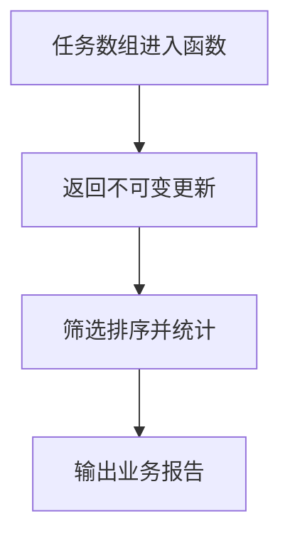

# DAY25 · Practice 01：Day 25 · 结课项目（二）独立综合题

[返回当天课程](../README.md)

## 文件位置

- 作答文件：[practice.ts](../../../day25/practice01/practice.ts)
- 结构提示代码：[solution.ts](../../../day25/practice01/solution.ts)
- 方案说明：[SOLUTION.md](./SOLUTION.md)

这是一道完整、独立的主练习。不要导入其他 practice 文件夹中的代码。

## 场景背景

学习计划应用要在多个界面之间共享同一批任务，业务服务接收任务数组和待完成的任务编号，再生成更新结果与统计报告。若服务直接修改原数组或原对象，历史视图、缓存和当前页面会同时被意外改变，排序也可能破坏原顺序。你需要交付新的任务集合、按时长排列的待办清单和完整状态报告，同时证明原数据仍保持不变。

## 代码流程图



在 `practice.ts` 中从零完成“任务业务服务与报告”。

必须名称：`TaskStatus`、`StudyTask`、`Report`、`updateById`、`completeTask`、`plannedByDuration`、`buildReport`、`original`、`updated`。

固定任务：a / Types / 30 / todo；b / Modules / 45 / doing；c / Validation / 20 / todo；d / Variables / 50 / todo。

需求：

1. `updateById<T extends { readonly id: string }>` 用 `map` 只更新命中项。
2. `completeTask` 复用它，把 id 为 a 的状态改为 done。
3. `plannedByDuration` 只保留 todo，按分钟升序排列，不能改动传入数组。
4. `buildReport` 返回 `Record<TaskStatus, number>` 的 counts 和总分钟数。
5. 输出原始/更新状态、引用比较、计划顺序和更新后报告。

精确输出：

```text
Original first: todo
Updated first: done
Same array: false
Same untouched task: true
Planned: Validation, Variables
Counts: todo=2, doing=1, done=1
Minutes: 145
```

限制：不使用 `any`、非空断言 `!`；不得给原数组调用会修改它的方法，不得直接赋值修改任务属性。

完成标准：右击运行 `practice.ts` 后输出完全一致；能解释为何目标项是新对象、未命中项可以复用，以及 `Record` 如何防止遗漏状态。

## 本题易漏语法

数组方法每一步都返回值；用 const 保存中间结果。sort 前先复制，避免修改参数数组。

## 文件

- 在 `practice.ts` 中独立作答。
- 独立完成后，再查看 `solution.ts` 的 TODO 代码骨架与 `SOLUTION.md` 的解题结构；两者都不提供完整答案。
