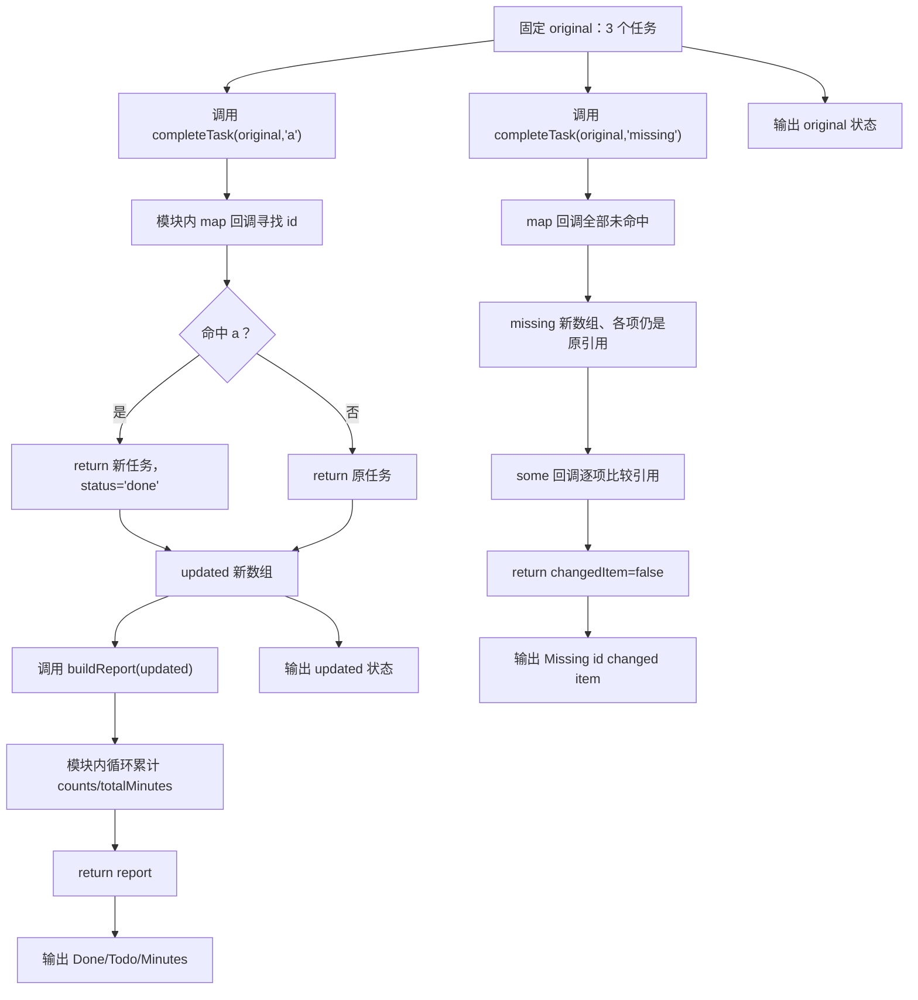

# DAY25 · Practice 02：任务更新与统计

[返回当天课程](../README.md)

## 文件位置

- 作答文件：[practice.ts](../../../day25/practice02/practice.ts)
- 完整参考答案：[solution.ts](../../../day25/practice02/solution.ts)
- 答案调用说明：[SOLUTION.md](./SOLUTION.md)

这题把已经拆成模块的更新器和报告器接到入口，并增加一次不存在 id 的调用，检查“新数组”与“任务真的改变”不是一回事。

## 场景背景

课程看板需要把指定任务标记为完成，并立即刷新完成数、待办数和总学习分钟。输入任务数组同时被原始视图和更新视图引用，若原地修改，两个视图会一起变化，用户便无法比较操作前后的状态。你需要返回独立的更新数组，并输出新旧首项状态及更新后的统计结果。

## 数据流

先沿变量名看数据怎样分叉和汇合；`──>` 表示值被交给下一步。

```text
original
   ├── completeTask(id) ──> updated
   │                          └── buildReport ──> 状态数 + 总分钟
   └── original[0].status ──────────────────────┐
updated[0].status + report ────────────────────┴──> 对照输出
original + missing id ──> completeTask ──> missingResult
original 与 missingResult 的逐项引用比较 ──> 是否误改任务
```


## 代码流程图

下面这张图按实际执行顺序展开；菱形是判断，箭头上的文字表示走哪条分支。



## 起始代码

以下代码提前给出固定数据、函数签名、调用位置和输出位置。代码可作为完整脚手架阅读；判断、循环、回调与 `return` 的正确实现仍留在 TODO 中。

```ts
import type { StudyTask } from "../models.js";
import { buildReport } from "../report.js";
import { completeTask } from "../task-service.js";

const original: StudyTask[] = [
  { id: "a", title: "Types", minutes: 30, status: "todo" },
  { id: "b", title: "Modules", minutes: 45, status: "doing" },
  { id: "c", title: "Validation", minutes: 30, status: "done" },
];
const updated = completeTask(original, "a");
const report = buildReport(updated);
console.log(`Original first status: ${original[0]?.status}`);
console.log(`Updated first status: ${updated[0]?.status}`);
console.log(`Done: ${report.counts.done}`);
console.log(`Todo: ${report.counts.todo}`);
console.log(`Total minutes: ${report.totalMinutes}`);
const missing = completeTask(original, "missing");
// TODO：用 some 回调比较 missing 与 original 的同位置对象。
const changedItem = false;
console.log(`Missing id changed item: ${changedItem}`);
```

## 和 Practice 01 的区别

Practice 01 从零实现泛型更新器、筛选排序和报告器，输入还要生成计划清单。本题不重写算法，而是通过 ES 模块组合现有服务；控制流额外调用一个不存在的 id，并逐项比较引用，验证“没有命中”时业务对象保持不变。

## 任务要求

1. 从当天模块导入 `StudyTask` 类型、`completeTask` 和 `buildReport`，不要在入口里重写已有业务函数。
2. 创建三项 `original`：Types / 30 / todo，Modules / 45 / doing，Validation / 30 / done。
3. 调用 `completeTask(original, "a")` 得到 `updated`；输出前后首项状态，证明旧数组没有被改写。
4. 把 `updated` 交给 `buildReport`，从报告中读取 done、todo 和总分钟，不能在入口重新手算另一套统计。
5. 再调用 `completeTask(original, "missing")`，用逐项引用比较输出是否有任务对象发生变化；期望为 `false`。

- 不得导入 `practice01` 或直接调用其他练习的实现。
- 输出必须由变量、计算或函数返回值产生，不把整行结果写死。
- 每个参数、局部变量和返回值都应能在流程图中找到位置。

## 精确期望输出

```text
Original first status: todo
Updated first status: done
Done: 2
Todo: 0
Total minutes: 105
Missing id changed item: false
```

## 写完后自检

- 把要完成的 id 改成 `"b"` 后，首项状态和 done 数会怎样变化？先根据原数据推算。
- 为什么入口应该调用 `buildReport(updated)`，而不是为了得到三行输出又写一遍统计循环？
- 怎样用引用比较证明“新数组”和“旧任务对象是否被修改”是两个不同问题？

## 文件

在上方链接的 `practice.ts` 作答；独立完成后再查看完整的 `solution.ts`，并用 `SOLUTION.md` 对照直接调用逻辑。
