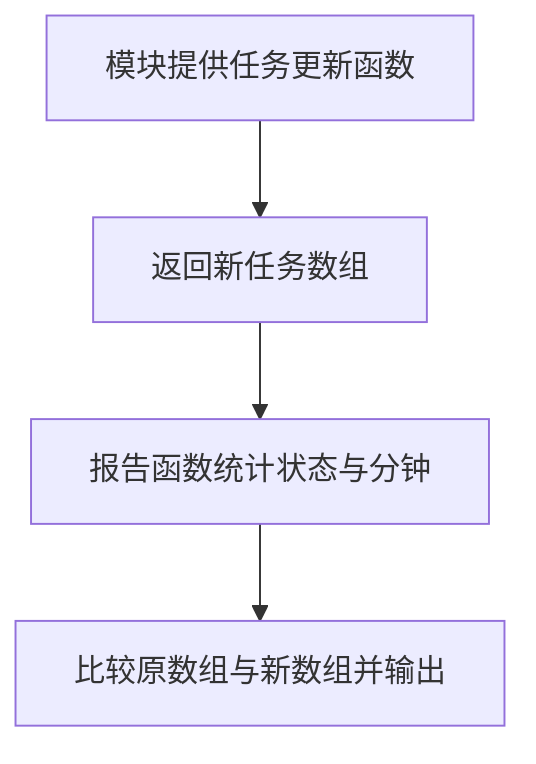

# DAY25 · Practice 02：任务更新与统计

[返回当天课程](../README.md)

## 文件位置

- 作答文件：[practice.ts](../../../day25/practice02/practice.ts)
- 结构提示代码：[solution.ts](../../../day25/practice02/solution.ts)
- 方案说明：[SOLUTION.md](./SOLUTION.md)

这是一道与 Practice 01 文件完全分开的闭卷迁移题。先理解并运行当天 `example.ts`，然后关闭它；不要复制代码，仅根据下面的流程与输出从空白重新实现。

## 场景背景

课程看板需要把指定任务标记为完成，并立即刷新完成数、待办数和总学习分钟。输入任务数组同时被原始视图和更新视图引用，若原地修改，两个视图会一起变化，用户便无法比较操作前后的状态。你需要返回独立的更新数组，并输出新旧首项状态及更新后的统计结果。

## 代码流程图



## 必须练到的能力

业务函数使用参数与返回值，执行不可变更新、筛选、排序和统计。

- 不得导入 `practice01` 或直接调用其他练习的实现。
- 输出必须由变量、计算或函数返回值产生，不把整行结果写死。
- 每个参数、局部变量和返回值都应能在流程图中找到位置。

## 精确期望输出

```text
Original first status: todo
Updated first status: done
Done: 2
Todo: 0
Total minutes: 105
```

## 文件

在上方链接的 `practice.ts` 作答；独立完成后再查看 `solution.ts` 的 TODO 代码骨架与 `SOLUTION.md` 的解题结构；两者都不提供完整答案。
