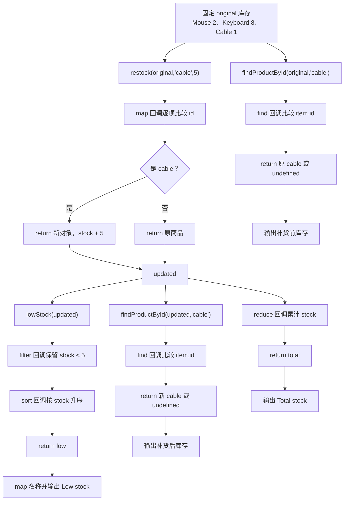

# DAY25 · Practice 03：库存不可变更新

[返回当天课程](../README.md)

## 文件位置

- 作答文件：[practice.ts](../../../day25/practice03/practice.ts)
- 完整参考答案：[solution.ts](../../../day25/practice03/solution.ts)
- 答案调用说明：[SOLUTION.md](./SOLUTION.md)

通过纯函数补货，不修改原库存，再筛选低库存商品并统计总库存。

## 场景背景

小型仓库的补货服务接收当前商品清单、目标商品和补货数量，同一份库存数据还要保留给审计页面查看。若补货操作直接改写原对象，审计记录会失去操作前的数量，低库存排序也可能影响其他页面。你需要返回新的库存结果，并产出目标商品的新旧数量、仍需补货的商品和最新总库存。

## 数据流

先沿变量名看数据怎样分叉和汇合；`──>` 表示值被交给下一步。

```text
original + 商品 id + 增量
   └── restock ──> updated（只替换目标商品）
                     ├── filter 低库存
                     │      └── sort ──> low
                     └── reduce ──> total
original + updated + low + total ──> 库存报告
```


## 代码流程图

下面这张图按实际执行顺序展开；菱形是判断，箭头上的文字表示走哪条分支。



## 起始代码

以下代码提前给出固定数据、函数签名、调用位置和输出位置。代码可作为完整脚手架阅读；判断、循环、回调与 `return` 的正确实现仍留在 TODO 中。

```ts
type Product = { readonly id: string; name: string; stock: number };
function restock(items: readonly Product[], id: string, amount: number): Product[] {
  // TODO：map、id 判断、不可变更新并 return。
  void id;
  void amount;
  return [...items];
}
function lowStock(items: readonly Product[]): Product[] {
  // TODO：filter、sort 并 return。
  void items;
  return [];
}
function findProductById(items: readonly Product[], id: string): Product | undefined {
  // TODO：使用 find 回调比较 item.id 与 id，并 return 找到的商品或 undefined。
  void items;
  void id;
  return undefined;
}
const original: Product[] = [
  { id: "mouse", name: "Mouse", stock: 2 },
  { id: "keyboard", name: "Keyboard", stock: 8 },
  { id: "cable", name: "Cable", stock: 1 },
];
const updated = restock(original, "cable", 5);
const low = lowStock(updated);
// TODO：reduce 回调得到 total。
const total = 0;
const originalCable = findProductById(original, "cable");
const updatedCable = findProductById(updated, "cable");
console.log(`Original cable: ${originalCable?.stock}`);
console.log(`Updated cable: ${updatedCable?.stock}`);
console.log(`Low stock: ${low.map((item) => item.name).join(", ")}`);
console.log(`Total stock: ${total}`);
```

## 任务要求

- 声明 `Product`，包含只读 `id`、`name` 和 `stock`；实现 `restock(items, id, amount)`，只为命中商品创建新对象。
- 实现 `lowStock(items)`：保留库存小于 `5` 的商品，并按库存升序返回新数组。
- 实现 `findProductById(items, id)`：用 `find` 回调比较商品 id，返回第一项命中的商品；没有命中时返回 `undefined`。
- 固定库存为 Mouse / 2、Keyboard / 8、Cable / 1；给 Cable 补货 `5`。
- 从 `updated` 计算总库存，并分别从 `original`、`updated` 读取 Cable 的旧数量和新数量。
- 不得导入其他 practice 文件夹。
- 计算必须来自参数和局部变量；函数用 return 交付结果。
- 保持原数据不变，并按流程图处理边界或状态。

## 精确期望输出

```text
Original cable: 1
Updated cable: 6
Low stock: Mouse
Total stock: 16
```

## 写完后自检

- 如果给不存在的商品 id 补货，函数应该返回怎样的数组和引用关系？当前题目是否需要把它当错误？
- 为什么 `lowStock` 可以直接排序 `filter` 返回的结果，却不应对参数 `items` 直接调用 `sort`？
- 把补货数量改成 `-3` 会发生什么？真实库存接口应在类型、运行时校验还是两处共同限制？

## 文件

在上方链接的 `practice.ts` 作答；完成后再查看完整的 `solution.ts`，并用 `SOLUTION.md` 对照直接调用逻辑。
