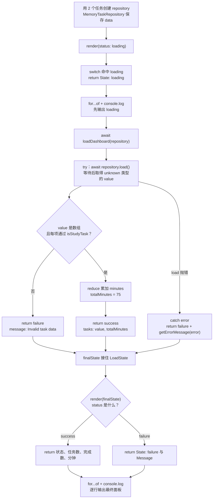

# Day 26｜结课项目（三）：异步加载、状态与测试

任务面板打开时，数据还没回来，所以先显示 `loading`。仓库稍后可能返回任务数组，也可能返回格式错误的数据，还可能直接加载失败。界面要把这三种结果分开处理，不能在等待期间假装已经有任务。

今天把任务报告器接到异步仓库。你会从空文件写出外部数据验证、加载状态、错误处理、渲染和四条回归测试，逐步跟踪一个 `Promise` 最后怎样变成成功或失败界面。

建议用时：60–90 分钟。

## 今天会学到

- 用 `await` 把 `Promise<T>` 变成最终的 `T`；
- 把仓库结果保留为 `unknown` 并运行时验证；
- 用判别联合表达 loading、success、failure；
- 在 `catch` 中把错误当作 `unknown` 收窄；
- 测试正常、空数组、坏数据和异步失败。

## 写 Example 前先认识这些写法

### `Promise.reject`：造出一条失败的异步结果

`Promise.reject(reason)` 由 JavaScript 内置的 `Promise` 提供。点号左边是 `Promise`，括号里的 `reason` 是失败原因，可以传 `Error`；返回的是一个已经失败的 Promise，不是普通的 `Error`。

本日用它让假仓库稳定地走进失败分支，检查界面是否显示正确消息。它不会在这一行同步 `throw`；只有调用方 `await` 这个 Promise，或者用 `.catch(...)` 接住它时，才会进入异步失败处理。

```ts
async function read(): Promise<string> {
  return Promise.reject(new Error("Network unavailable"));
}

try {
  await read();
} catch (error: unknown) {
  console.log(error instanceof Error ? error.message : "Unknown error");
}
```

实际输出：

```text
Network unavailable
```

`read` 是本课程为了演示而写的函数，`Promise.reject` 才是 JavaScript 自带工具。若只是写 `Promise.reject(...)` 却既不 `return`、也不 `await`，调用方的控制流不会按你期望的方式进入失败状态。

## 核心讲解

```text
TaskRepository.load() → Promise<unknown> → await → 运行时验证
                                            ├─ success：任务与总分钟
                                            └─ failure：可读错误消息
```

先按时间顺序看一次加载：

| 时刻 | 手里的值 | 程序做什么 |
| --- | --- | --- |
| 请求开始前 | `{ status: "loading" }` | 渲染正在加载 |
| 调用仓库后 | `Promise<unknown>` | 等待，不读取任务字段 |
| `await` 成功后 | `unknown` | 用 `parseTasks` 检查数据 |
| 验证通过 | `{ status: "success", tasks, totalMinutes }` | 渲染任务数量和分钟 |
| 验证失败或仓库抛错 | `{ status: "failure", message }` | 渲染错误消息 |

如果改用 `isLoading`、`data?`、`error?` 三个互不约束的字段，就可能得到“仍在加载，但同时有数据和错误”的矛盾对象。用 `status` 区分三种对象后，`loading` 不带任务，`success` 一定有任务，`failure` 一定有消息。这组写法的正式名称是“判别联合”。

异步只改变“什么时候得到结果”，不会证明外部数据正确。`await repository.load()` 完成后仍然是 `unknown`，必须运行时验证。合法的空数组 `[]` 表示“加载成功，但现在没有任务”，总分钟自然是 `0`，不应当当作失败。

`catch` 接到的值也不保证是 `Error`，因为 JavaScript 可以抛出字符串或其他值。先用 `instanceof Error` 检查 `error`，成功后才能读 `error.message`；否则使用约定好的备用消息。测试要覆盖任务成功、空数组、坏数据和异步抛错，四条路径各自失败时才容易定位。

## 为什么要这样设计

异步请求不会立刻给出结果。如果只用 `tasks`、`isLoading`、`error` 三个互不关联的变量，它们可能短暂或永久组合成矛盾状态，例如仍在加载却已经有错误。`Promise` 和 `await` 负责等待完成顺序，判别联合把界面限制为 loading、success、failure 三种合法形状，仓库接口则把“从哪里加载”与“加载后怎样处理”分开。

这些工具不会替你判断返回数据是否可信，也不会决定错误提示、重试策略或成功界面要展示什么；这些仍是业务选择。`await` 后得到的外部值依然要验证，`catch` 里的错误仍是 `unknown`，而多出来的状态分支也意味着每条路径都要测试，不能只验证成功情况。

## 函数变量追踪

这里有两条相连的数据流。第一条是异步值：`repository.load()` 返回 `Promise<unknown>`，`await` 后得到 `value`，或者跳进 `catch`。第二条是界面状态：`value` 验证通过后返回 `success`，验证失败或捕获错误后返回 `failure`。调用处用 `finalState` 接住最终状态，再交给 `render`。

`Promise`、`value`、`tasks`、`finalState` 不是四份相同数据。它们分别表示“尚未完成的操作”“未验证结果”“已验证任务”“界面要显示的状态”。

## Example 实际输出

运行 `example.ts` 后，终端会按下面的顺序显示。先用代码推测结果，再逐行对照：

```text
State: loading
State: success
Tasks: 2
Done: 1
Minutes: 75
```

## Example 代码流程图

运行 `example.ts` 前先沿图预测执行顺序；运行后再把每个节点对应到代码行。



## 官方手册扩展阅读（可选）

完成当天教程后，如果还想加深理解，再到 [Day 26 官方手册索引](../OFFICIAL-READING.md#day-26) 只选 1 篇阅读；这不是开始练习前的必修内容。

## 独立练习导航

本日共有 3 道独立练习。每道题都有单独目录、题目说明、作答文件、完整参考答案和调用逻辑说明；题目之间不共享代码。

| 目录 | 场景 | 类型 |
| --- | --- | --- |
| [practice01](./practice01/README.md) | 异步任务仪表板 | 主任务 |
| [practice02](./practice02/README.md) | 异步任务面板 | 闭卷迁移 |
| [practice03](./practice03/README.md) | 异步天气面板 | 综合应用 |

右击任意练习目录中的 `practice.ts` 即可单独检查；命令行也可运行 `npm run beginner -- day26 practice02`。

## 常见错误

- 忘记 `await`，把 Promise 当任务数组；
- 在 `catch` 里直接访问 `error.message`；
- 空数组被错误判为无效；
- 只测试成功路径；
- 用断言越过外部数据边界。

### 错误代码示例

网关需要从远程配置中心读取“每分钟最多允许多少次请求”。开发环境响应很快，有人忘记等待 Promise，就先返回了一份看似成功的默认配置：

```ts
type LimitState =
  | { status: "ready"; perMinute: number }
  | { status: "failure"; message: string };

interface SettingsGateway {
  read(): Promise<unknown>;
}

async function readLimitWrong(
  gateway: SettingsGateway,
): Promise<LimitState> {
  try {
    gateway.read();
    // ❌ 这里只启动了请求。函数马上返回 ready，
    // 配置中心稍后拒绝时已经离开这个 try。
    return { status: "ready", perMinute: 0 };
  } catch {
    return { status: "failure", message: "读取配置失败" };
  }
}
```

如果配置中心一秒后才因网络中断而拒绝，调用者早已拿到 `ready`。网关可能把 `0` 理解成“不限流”，随后还会出现未处理的 Promise 拒绝。`try/catch` 没有失效，它只是不能接住离开当前执行过程后才发生、又没有被 `await` 的拒绝。

这个场景还有一个容易忽略的边界：数字 `0` 是合法配置，但条件判断会把它当成假值：

```ts
function describeRetryCount(value: number | null): string {
  if (!value) {
    // ❌ value 为 0 时也会进入这里，合法的“不重试”被当成无效配置。
    return "配置无效";
  }
  return `最多重试 ${value} 次`;
}
```

`null` 表示解析失败，`0` 表示明确禁止重试。它们在业务上不同，不能只靠 `if (!value)` 合并处理。

### 正确写法

```ts
function parsePerMinute(value: unknown): number | null {
  if (
    value === null ||
    typeof value !== "object" ||
    !("perMinute" in value) ||
    typeof value.perMinute !== "number" ||
    !Number.isFinite(value.perMinute) ||
    value.perMinute < 0
  ) {
    return null;
  }
  return value.perMinute;
}

async function readLimit(
  gateway: SettingsGateway,
): Promise<LimitState> {
  try {
    // ✅ 先等待远程操作结束，再验证仍然不可信的 unknown。
    const raw: unknown = await gateway.read();
    const perMinute = parsePerMinute(raw);
    if (perMinute === null) {
      return { status: "failure", message: "限流配置格式错误" };
    }

    // ✅ 这里用 === null 判断，因此合法的 0 不会被误判。
    return { status: "ready", perMinute };
  } catch (error: unknown) {
    return {
      status: "failure",
      message: error instanceof Error ? error.message : "未知读取错误",
    };
  }
}
```

执行顺序是：等待远程读取、验证 `unknown`、最后构造 `ready`。网络拒绝进入 `catch`，字段错误返回“格式错误”，合法的 `0` 继续保留。日志和页面因此能分清网络故障、协议错误和真实配置。

## 面试时怎么回答

**问：** 为什么异步页面常用判别联合，而不是三个布尔变量？

**可以直接这样回答：**

多个独立布尔值会产生无效组合，例如 `isLoading`、`hasData`、`hasError` 同时为 true。判别联合只列出允许存在的对象：loading 不带数据，success 一定带任务和统计，failure 一定带错误消息。判断 `state.status` 后，TypeScript 会把联合收窄到对应成员，渲染代码只能读取这个状态真正拥有的字段。

`await` 只负责等待 Promise 完成，不会验证仓库返回的 `unknown`，所以成功取值后仍要运行守卫。严格配置下 `catch` 变量是 `unknown`，读取 `message` 前先判断 `error instanceof Error`。新增 `empty` 状态时，我会把它加入联合，并用 `never` 做穷尽检查，让遗漏的 `switch` 分支在编译阶段暴露；同时补上对应测试。

官方参考：[TypeScript 判别联合与穷尽检查](https://www.typescriptlang.org/docs/handbook/2/narrowing.html#discriminated-unions)、[useUnknownInCatchVariables](https://www.typescriptlang.org/docs/handbook/release-notes/typescript-4-4.html#defaulting-to-the-unknown-type-in-catch-variables)、[MDN Promise](https://developer.mozilla.org/en-US/docs/Web/JavaScript/Reference/Global_Objects/Promise)

## 拓展思考（不要求写代码）

如果面板还要从另一个独立仓库加载用户名，怎样用 `Promise.all` 并发等待两项数据？其中一项失败时，最终状态应如何定义才不会留下半成功的矛盾数据？
