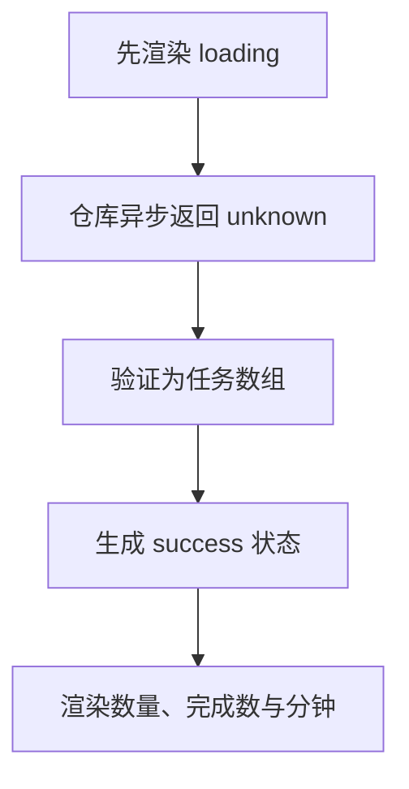

# Day 26｜结课项目（三）：异步加载、状态与测试

任务面板打开时，数据还没回来，所以先显示 `loading`。仓库稍后可能返回任务数组，也可能返回格式错误的数据，还可能直接加载失败。界面要把这三种结果分开处理，不能在等待期间假装已经有任务。

今天把任务报告器接到异步仓库。你会从空文件写出外部数据验证、加载状态、错误处理、渲染和四条回归测试，逐步跟踪一个 `Promise` 最后怎样变成成功或失败界面。

建议用时：60–90 分钟。

## 今天会学到

- 用 `await` 把 `Promise<T>` 变成最终的 `T`；
- 把仓库结果保留为 `unknown` 并运行时验证；
- 用判别联合表达 loading、success、failure；
- 在 `catch` 中把错误当作 `unknown` 收窄；
- 测试正常、空数组、坏数据和异步失败。

## 核心讲解

```text
TaskRepository.load() → Promise<unknown> → await → 运行时验证
                                            ├─ success：任务与总分钟
                                            └─ failure：可读错误消息
```

先按时间顺序看一次加载：

| 时刻 | 手里的值 | 程序做什么 |
| --- | --- | --- |
| 请求开始前 | `{ status: "loading" }` | 渲染正在加载 |
| 调用仓库后 | `Promise<unknown>` | 等待，不读取任务字段 |
| `await` 成功后 | `unknown` | 用 `parseTasks` 检查数据 |
| 验证通过 | `{ status: "success", tasks, totalMinutes }` | 渲染任务数量和分钟 |
| 验证失败或仓库抛错 | `{ status: "failure", message }` | 渲染错误消息 |

如果改用 `isLoading`、`data?`、`error?` 三个互不约束的字段，就可能得到“仍在加载，但同时有数据和错误”的矛盾对象。用 `status` 区分三种对象后，`loading` 不带任务，`success` 一定有任务，`failure` 一定有消息。这组写法的正式名称是“判别联合”。

异步只改变“什么时候得到结果”，不会证明外部数据正确。`await repository.load()` 完成后仍然是 `unknown`，必须运行时验证。合法的空数组 `[]` 表示“加载成功，但现在没有任务”，总分钟自然是 `0`，不应当当作失败。

`catch` 接到的值也不保证是 `Error`，因为 JavaScript 可以抛出字符串或其他值。先用 `instanceof Error` 检查 `error`，成功后才能读 `error.message`；否则使用约定好的备用消息。测试要覆盖任务成功、空数组、坏数据和异步抛错，四条路径各自失败时才容易定位。

## 函数变量追踪

这里有两条相连的数据流。第一条是异步值：`repository.load()` 返回 `Promise<unknown>`，`await` 后得到 `value`，或者跳进 `catch`。第二条是界面状态：`value` 验证通过后返回 `success`，验证失败或捕获错误后返回 `failure`。调用处用 `finalState` 接住最终状态，再交给 `render`。

`Promise`、`value`、`tasks`、`finalState` 不是四份相同数据。它们分别表示“尚未完成的操作”“未验证结果”“已验证任务”“界面要显示的状态”。

## Example 实际输出

运行 `example.ts` 后，终端会按下面的顺序显示。先用代码推测结果，再逐行对照：

```text
State: loading
State: success
Tasks: 2
Done: 1
Minutes: 75
```

## Example 代码流程图

运行 `example.ts` 前先沿图预测执行顺序；运行后再把每个节点对应到代码行。



## 独立练习导航

本日共有 3 道独立练习。每道题都有单独目录、说明、作答文件和解题结构提示；题目之间不共享代码。

| 目录 | 场景 | 类型 |
| --- | --- | --- |
| [practice01](./practice01/README.md) | Day 26 · 结课项目（三）独立综合题 | 主任务 |
| [practice02](./practice02/README.md) | 异步任务面板 | 闭卷迁移 |
| [practice03](./practice03/README.md) | 异步天气面板 | 综合应用 |

右击任意练习目录中的 `practice.ts` 即可单独检查；命令行也可运行 `npm run beginner -- day26 practice02`。

## 常见错误

- 忘记 `await`，把 Promise 当任务数组；
- 在 `catch` 里直接访问 `error.message`；
- 空数组被错误判为无效；
- 只测试成功路径；
- 用断言越过外部数据边界。

### 错误代码示例

```ts
async function loadDashboard(repository: TaskRepository): Promise<LoadState> {
  try {
    const tasks = repository.load() as unknown as StudyTask[];
    // ❌ 既忘了 await，又用双重断言绕过外部数据验证。
    if (!tasks.length) throw new Error("没有任务");
    // ❌ 合法的空数组被错误当成失败。
    return { status: "success", tasks, totalMinutes: 0 };
  } catch (error) {
    // ❌ catch 中的值可能是字符串、数字或其他对象，不一定有 message。
    return { status: "failure", message: error.message };
  }
}
```

### 正确写法

```ts
async function loadDashboard(repository: TaskRepository): Promise<LoadState> {
  try {
    // ✅ await 后仍是 unknown；异步完成不代表外部数据已经可信。
    const value: unknown = await repository.load();
    const tasks = parseTasks(value);
    if (tasks === null) {
      return { status: "failure", message: "Task data is invalid" };
    }

    // ✅ [] 能通过验证，并自然得到 totalMinutes = 0。
    const totalMinutes = tasks.reduce((sum, task) => sum + task.minutes, 0);
    return { status: "success", tasks, totalMinutes };
  } catch (error: unknown) {
    return {
      status: "failure",
      // ✅ 先收窄，再读取 Error 独有的 message。
      message: error instanceof Error ? error.message : "Unknown error",
    };
  }
}
```

## 拓展思考（不要求写代码）

如果面板还要从另一个独立仓库加载用户名，怎样用 `Promise.all` 并发等待两项数据？其中一项失败时，最终状态应如何定义才不会留下半成功的矛盾数据？

## 官方资料

- [Narrowing](https://www.typescriptlang.org/docs/handbook/2/narrowing.html)
- [Utility Types：Awaited](https://www.typescriptlang.org/docs/handbook/utility-types.html#awaitedtype)
- [Modules](https://www.typescriptlang.org/docs/handbook/2/modules.html)
