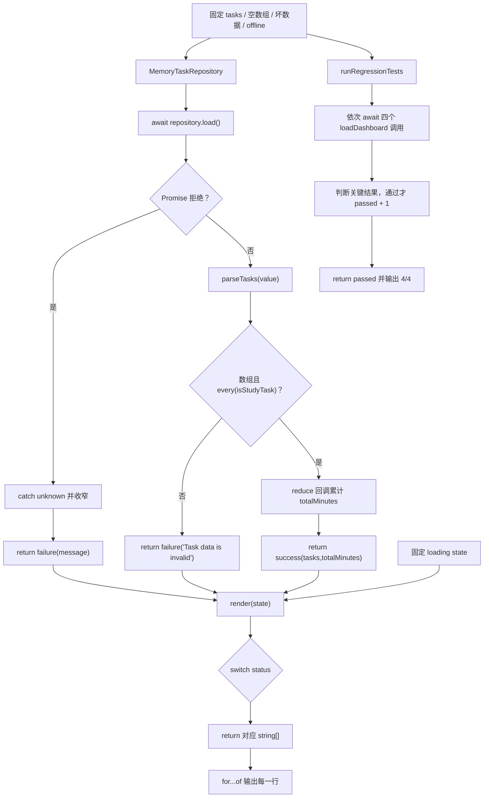

# DAY26 · Practice 01：异步任务仪表板

[返回当天课程](../README.md)

## 文件位置

- 作答文件：[practice.ts](../../../day26/practice01/practice.ts)
- 完整参考答案：[solution.ts](../../../day26/practice01/solution.ts)
- 答案调用说明：[SOLUTION.md](./SOLUTION.md)

这是一道完整、独立的主练习。不要导入其他 practice 文件夹中的代码。

## 场景背景

学习平台的任务面板通过异步仓库加载数据，但仓库边界只承诺返回 `unknown`，也可能因离线直接抛出错误。若面板跳过验证或吞掉异常，坏任务会被显示成成功状态，用户也无法判断数据是否真的加载完成。你需要交付清晰的 loading、success 或 failure 状态、可信统计，以及覆盖正常、空数据、坏数据和离线情况的回归测试结果。

## 数据流

先沿变量名看数据怎样分叉和汇合；`──>` 表示值被交给下一步。

```text
TaskRepository.load() ──> Promise<unknown> ──> await value
                                             └── parseTasks
                                                   ├── 合法 ──> success(tasks)
                                                   └── 非法 ──> failure(message)
Promise 抛错 ──────────────────────────────────────────────> failure(message)
LoadState ──> render ──> 输出行 + 回归测试
```


## 代码流程图

下面这张图按实际执行顺序展开；菱形是判断，箭头上的文字表示走哪条分支。



## 起始代码

以下代码提前给出固定数据、函数签名、调用位置和输出位置。代码可作为完整脚手架阅读；判断、循环、回调与 `return` 的正确实现仍留在 TODO 中。

```ts
type StudyTask = {
  readonly id: string;
  title: string;
  minutes: number;
  status: "todo" | "doing" | "done";
};
type LoadState =
  | { status: "loading" }
  | { status: "success"; tasks: StudyTask[]; totalMinutes: number }
  | { status: "failure"; message: string };
interface TaskRepository { load(): Promise<unknown>; }

function isRecord(value: unknown): value is Record<string, unknown> {
  // TODO：return 对象判断。
  void value;
  return false;
}
function isStudyTask(value: unknown): value is StudyTask {
  // TODO：逐字段判断并 return。
  void value;
  return false;
}
function parseTasks(value: unknown): StudyTask[] | null {
  // TODO：数组检查、every 回调并 return。
  void value;
  return null;
}
async function loadDashboard(repository: TaskRepository): Promise<LoadState> {
  // TODO：await、验证、reduce、catch，并 return 状态。
  void repository;
  return { status: "failure", message: "" };
}
function render(state: LoadState): string[] {
  // TODO：switch status，并 return 要显示的字符串数组。
  void state;
  return [];
}
class MemoryTaskRepository implements TaskRepository {
  constructor(private readonly value: unknown, private readonly error?: Error) {}
  async load(): Promise<unknown> {
    // TODO：有 error 时拒绝，否则 return value。
    return this.value;
  }
}
async function runRegressionTests(): Promise<number> {
  let passed = 0;
  const normal = await loadDashboard(new MemoryTaskRepository([
    { id: "a", title: "One", minutes: 30, status: "done" },
    { id: "b", title: "Two", minutes: 45, status: "todo" },
  ]));
  const empty = await loadDashboard(new MemoryTaskRepository([]));
  const invalid = await loadDashboard(new MemoryTaskRepository([
    { id: "a", title: "Broken", minutes: "30", status: "todo" },
  ]));
  const offline = await loadDashboard(
    new MemoryTaskRepository(undefined, new Error("offline")),
  );
  // TODO：分别判断 normal、empty、invalid、offline；每项通过后让 passed += 1。
  void normal;
  void empty;
  void invalid;
  void offline;
  // TODO：return 真正通过的测试数。
  return passed;
}
const tasks = [
  { id: "a", title: "Async", minutes: 30, status: "done" },
  { id: "b", title: "Tests", minutes: 45, status: "todo" },
];
for (const line of render({ status: "loading" })) console.log(line);
const finalState = await loadDashboard(new MemoryTaskRepository(tasks));
for (const line of render(finalState)) console.log(line);
console.log(`Tests passed: ${await runRegressionTests()}/4`);
```


## 任务要求

1. 从 `unknown` 仓库结果验证出 `StudyTask[]`，合法空数组不能误判为失败。
2. `loadDashboard` 同时处理成功、坏数据和 Promise 拒绝，并返回对应 `LoadState`。
3. `render` 用同一个 `switch` 生成 loading、success、failure 的文字数组。
4. `runRegressionTests` 真正检查正常、空数组、坏数据和 offline 四条路径。

## 精确期望输出

```text
State: loading
State: success
Tasks: 2
Done: 1
Minutes: 75
Tests passed: 4/4
```

## 本题易漏语法

判别联合靠共同字段连接；对象值属性用逗号，类型联合成员用 |。

## 写完后自检

- 仓库返回合法空数组、`minutes: Number.NaN`、以及拒绝值 `"offline"` 时，最终状态分别应该是什么？
- 为什么 `await repository.load()` 之后仍要运行 `parseTasks`，不能把等待成功等同于数据可信？
- 如果新增 `empty` 状态，`render` 和回归测试中哪些位置必须一起增加分支？

## 文件

- 在 `practice.ts` 中独立作答。
- 独立完成后，再查看完整的 `solution.ts`，并用 `SOLUTION.md` 对照直接调用逻辑。
