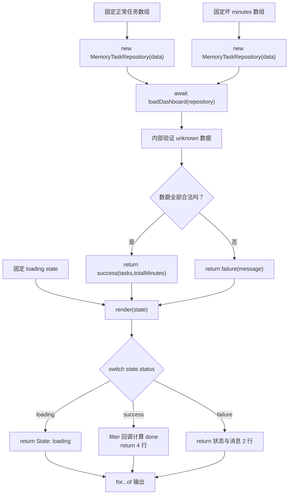

# DAY26 · Practice 02：异步任务面板

[返回当天课程](../README.md)

## 文件位置

- 作答文件：[practice.ts](../../../day26/practice02/practice.ts)
- 完整参考答案：[solution.ts](../../../day26/practice02/solution.ts)
- 答案调用说明：[SOLUTION.md](./SOLUTION.md)

这次只负责把当天已经拆好的仓库和加载逻辑接到渲染入口，重点是模块之间交接的 `LoadState`，不重复实现仓库。

## 场景背景

课程运营希望在管理页展示异步加载的任务摘要，数据仓库返回的响应在验证前不能被当作任务数组使用。若页面过早进入成功状态或直接读取未知字段，任务数、完成数和分钟数都可能不可信。你需要先展示加载状态，再把合法响应转换为成功状态并输出三项统计。

## 数据流

先沿变量名看数据怎样分叉和汇合；`──>` 表示值被交给下一步。

```text
loading 状态 ──> render ──> 首次输出
MemoryTaskRepository
   └── loadDashboard ──> await repository.load()
                              └── unknown 验证 ──> finalState
                                                   ├── success(tasks)
                                                   └── failure(message)
finalState ──> render ──> 数量、完成数、分钟输出
坏 minutes 仓库 ──> loadDashboard ──> failure ──> render 错误消息
```


## 代码流程图

下面这张图按实际执行顺序展开；菱形是判断，箭头上的文字表示走哪条分支。



## 起始代码

以下代码提前给出固定数据、函数签名、调用位置和输出位置。代码可作为完整脚手架阅读；判断、循环、回调与 `return` 的正确实现仍留在 TODO 中。

```ts
import { loadDashboard } from "../dashboard.js";
import { MemoryTaskRepository } from "../repository.js";
import type { LoadState } from "../types.js";

function render(state: LoadState): string[] {
  // TODO：switch；success 中用 filter 统计 done；return string[]。
  void state;
  return [];
}
const repository = new MemoryTaskRepository([
  { id: "a", title: "Async", minutes: 30, status: "done" },
  { id: "b", title: "Tests", minutes: 45, status: "todo" },
]);
for (const line of render({ status: "loading" })) console.log(line);
const finalState = await loadDashboard(repository);
for (const line of render(finalState)) console.log(line);

const invalidRepository = new MemoryTaskRepository([
  { id: "broken", title: "Broken", minutes: "45", status: "todo" },
]);
const invalidState = await loadDashboard(invalidRepository);
for (const line of render(invalidState)) console.log(line);
```

## 和 Practice 01 的区别

Practice 01 从零实现仓库、守卫、加载器、渲染器和四条回归测试。本题把已有模块当作依赖，只实现状态渲染与入口编排；输入包含一个成功仓库和一个字段错误仓库，重点是同一个 `render` 怎样消费两种终态。

## 任务要求

1. 从当天模块导入 `MemoryTaskRepository`、`loadDashboard` 和 `LoadState`，不要在入口重新实现仓库或验证器。
2. 实现 `render(state)`：loading 返回一行；failure 返回状态与消息；success 返回状态、任务数、done 数和总分钟。
3. 固定仓库返回 Async / 30 / done 与 Tests / 45 / todo。先渲染 loading，再 `await loadDashboard(repository)`，最后渲染终态。
4. 再创建一个 `minutes: "45"` 的坏数据仓库，等待其 failure，并用同一个 `render` 输出错误消息。
5. `render` 只读取传入状态，不自行请求数据；仓库也不直接打印界面文字。

- 不得导入 `practice01` 或直接调用其他练习的实现。
- 输出必须由变量、计算或函数返回值产生，不把整行结果写死。
- 每个参数、局部变量和返回值都应能在流程图中找到位置。

## 精确期望输出

```text
State: loading
State: success
Tasks: 2
Done: 1
Minutes: 75
State: failure
Message: Invalid task data
```

## 写完后自检

- 把仓库数据改成 `[]` 或把某项 `minutes` 改成字符串时，`finalState` 和渲染行应该怎样变化？
- 为什么 `render` 接收 `LoadState`，而不是同时接收 `isLoading`、`tasks?` 和 `error?` 三组互不约束的参数？
- 如果把 `await` 去掉，传给 `render` 的会是什么，为什么类型检查应阻止这次调用？

## 文件

在上方链接的 `practice.ts` 作答；独立完成后再查看完整的 `solution.ts`，并用 `SOLUTION.md` 对照直接调用逻辑。
