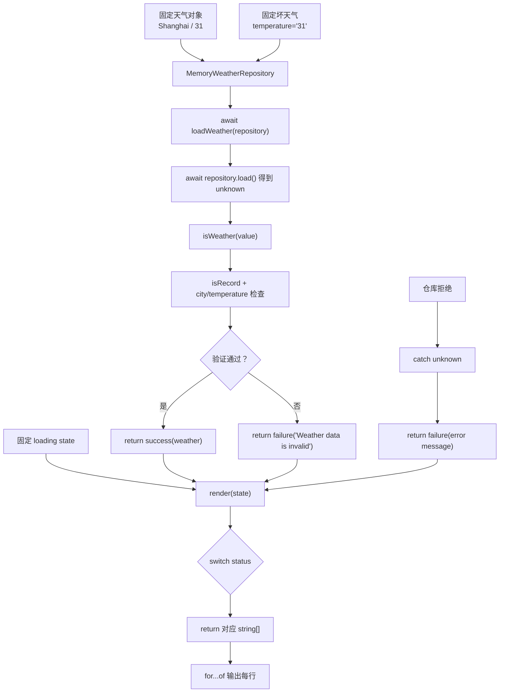

# DAY26 · Practice 03：异步天气面板

[返回当天课程](../README.md)

## 文件位置

- 作答文件：[practice.ts](../../../day26/practice03/practice.ts)
- 完整参考答案：[solution.ts](../../../day26/practice03/solution.ts)
- 答案调用说明：[SOLUTION.md](./SOLUTION.md)

从异步仓库读取 unknown，验证天气数据并渲染 loading、success、failure 三种状态。

## 场景背景

校园活动页需要从第三方天气仓库异步读取城市和温度，但外部响应可能正确，也可能缺字段或提供错误类型。若界面不验证响应就渲染，活动负责人会看到错误天气并据此作出安排。你需要让面板先显示 loading，再对合法数据输出城市与温度，对无效数据输出明确的 failure 信息。

## 数据流

先沿变量名看数据怎样分叉和汇合；`──>` 表示值被交给下一步。

```text
MemoryWeatherRepository.load() ──> Promise<unknown>
                                          └── await ──> isWeather
                                                         ├── 合法 ──> success
                                                         └── 非法 ──> failure
Promise 抛错 ─────────────────────────────────────────────────> failure
success / failure ──> render ──> 天气面板输出
```


## 代码流程图

下面这张图按实际执行顺序展开；菱形是判断，箭头上的文字表示走哪条分支。



## 起始代码

以下代码提前给出固定数据、函数签名、调用位置和输出位置。代码可作为完整脚手架阅读；判断、循环、回调与 `return` 的正确实现仍留在 TODO 中。

```ts
type Weather = { city: string; temperature: number };
type State =
  | { status: "loading" }
  | { status: "success"; weather: Weather }
  | { status: "failure"; message: string };
interface WeatherRepository { load(): Promise<unknown>; }

function isRecord(value: unknown): value is Record<string, unknown> {
  // TODO：对象判断并 return。
  void value;
  return false;
}
function isWeather(value: unknown): value is Weather {
  // TODO：检查 city 和 temperature，并 return。
  void value;
  return false;
}
async function loadWeather(repository: WeatherRepository): Promise<State> {
  // TODO：await、验证、catch，并 return 状态。
  void repository;
  return { status: "failure", message: "" };
}
function render(state: State): string[] {
  // TODO：switch status 并 return 要显示的字符串数组。
  void state;
  return [];
}
class MemoryWeatherRepository implements WeatherRepository {
  constructor(private readonly value: unknown, private readonly error?: Error) {}
  async load(): Promise<unknown> {
    // TODO：有 error 时抛出；否则异步 return value。
    return Promise.resolve(this.value);
  }
}
for (const line of render({ status: "loading" })) console.log(line);
const success = await loadWeather(
  new MemoryWeatherRepository({ city: "Shanghai", temperature: 31 }),
);
for (const line of render(success)) console.log(line);
const failure = await loadWeather(
  new MemoryWeatherRepository({ city: "Shanghai", temperature: "31" }),
);
for (const line of render(failure)) console.log(line);
const rejected = await loadWeather(
  new MemoryWeatherRepository(undefined, new Error("Weather service offline")),
);
// 这次调用专门覆盖 Promise 拒绝路径，不增加题目规定的输出行。
void rejected;
```

## 任务要求

- 声明 `Weather`、三分支 `State` 和返回 `Promise<unknown>` 的 `WeatherRepository`。
- 实现 `isRecord`、`isWeather` 与 `loadWeather`；只有城市为字符串、温度为有限数字时才能构造 success。
- `loadWeather` 要把坏数据转换成消息为 `Weather data is invalid` 的 failure，并把 Promise 拒绝也转换成 failure。
- `render` 根据状态返回字符串数组。固定运行一次 loading、一次上海 31 度的成功响应、一次温度为字符串的失败响应。
- 不得导入其他 practice 文件夹。
- 计算必须来自参数和局部变量；函数用 return 交付结果。
- 保持原数据不变，并按流程图处理边界或状态。

## 精确期望输出

```text
State: loading
State: success
City: Shanghai
Temperature: 31
State: failure
Message: Weather data is invalid
```

## 写完后自检

- 温度改成 `Number.NaN`、仓库改为抛出 `new Error("offline")` 时，两次失败消息应该分别来自哪里？
- 为什么仓库接口返回 `Promise<unknown>` 比直接返回 `Promise<Weather>` 更诚实？
- `render` 为什么不应该在 success 分支之外读取 `state.weather`？

## 文件

在上方链接的 `practice.ts` 作答；完成后再查看完整的 `solution.ts`，并用 `SOLUTION.md` 对照直接调用逻辑。
