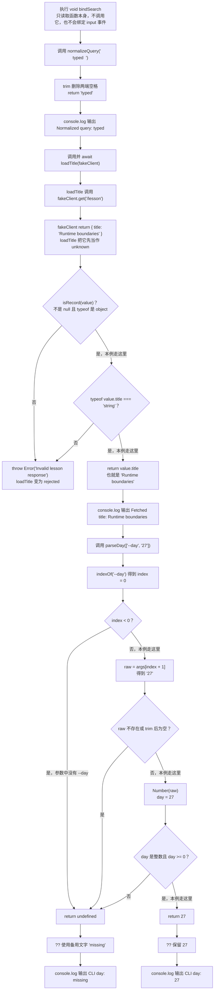

# Day 27（选修）｜浏览器、请求与命令行边界

## 写 Example 前先认识这些写法

### `querySelector` 与 `addEventListener`：找到网页元素，再监听它

这两个 API 由浏览器提供，不是 TypeScript 或本课程自带的业务函数。

- `document.querySelector("#search")` 中，点号左边的 `document` 代表当前网页；参数 `"#search"` 是 CSS 选择器；返回第一个匹配元素，找不到时返回 `null`。
- `input.addEventListener("input", callback)` 中，点号左边的 `input` 是找到的输入框；第一个参数 `"input"` 是事件名，第二个参数是事件发生后才执行的回调；这个调用本身返回 `undefined`。

它们解决的是“用户操作发生时，怎样让代码开始工作”。注册监听器不会立刻运行回调，只有用户真的输入时才会执行。

```html
<input id="search" />
<script>
  const input = document.querySelector("#search");

  input?.addEventListener("input", (event) => {
    console.log("输入:", event.currentTarget.value);
  });
</script>
```

用户在输入框键入 `ts` 后，控制台输出：

```text
输入: ts
```

浏览器才有 `document`；直接在 Node.js 中运行会找不到它。选择器里的 `#` 表示按 `id` 查找，事件名是小写的 `"input"`。`querySelector` 可能返回 `null`，所以必须先判断或像示例一样使用 `?.`。本日的 `normalizeQuery` 则是课程自定义函数，它只处理普通字符串，不负责监听浏览器。

同一份 TypeScript 放到不同地方运行，能用的东西不一样。网页里的输入框由浏览器提供；命令行参数和文件系统由 Node.js 提供。代码中写得出 `document`，不代表当前运行的 Node 进程真的有 `document`。

今天分别处理三个入口：浏览器输入事件、请求返回值和命令行参数。每个入口先把环境提供的数据转成普通值，再交给业务函数，这样才能在 Node 中用假数据单独测试。

建议用时：60–90 分钟。

## 今天会学到

- 用结构类型表达输入事件，并处理空目标；
- 把客户端响应保留为 `Promise<unknown>`；
- 把命令行参数解析成可测试的纯函数；
- 区分环境声明、运行时 API 与外部数据验证。

## 核心讲解

先按来源分开看：

| 数据从哪里来 | 入口拿到什么 | 转成什么普通值 | 失败时怎样处理 |
| --- | --- | --- | --- |
| 浏览器输入框 | `event.currentTarget` | 去掉首尾空格的搜索文字 | 目标不是输入框时不调用搜索 |
| 请求客户端 | `Promise<unknown>` | 验证后的课程标题 | 字段不对就返回失败或抛出明确错误 |
| Node 命令行 | `readonly string[]` | 合法的 day 数字 | 缺标志、缺值或不是整数时返回 `undefined` |

真实网页中，事件目标可以用 `HTMLInputElement` 检查，再读取它的 `value`。本课程的示例最终由 Node 运行，所以不直接操作 `document`；浏览器绑定留在最外层，去空格的普通字符串处理拆成 `normalizeQuery`，Node 只测试这个纯函数。

请求代码写成 TypeScript，也不能约束另一台服务器实际返回什么。`await client.get("/lesson")` 后先得到 `unknown`，确认它是非空对象并且 `title` 是字符串，才返回标题。`await` 只负责等待异步操作完成，不负责验证响应内容。

命令行也一样。给 `parseDay` 传入 `["--day", "27"]`，结果是 `27`；传入 `["--day"]`，标志后面没有值，结果应是 `undefined`。函数自己不读取全局 `process.argv`，测试就能直接传入这两组数据。更通用的解析器也可以写成 `parseArgs(args)`；重点都是让环境入口把参数数组传进来。

## 为什么要这样设计

浏览器事件、网络响应和命令行参数都来自程序外部：目标元素可能缺失，JSON 字段可能写错，标志后也可能没有值。若入口处直接断言类型，错误会带着不可信数据进入业务层，最后在离来源很远的地方爆发。

浏览器和 Node 提供事件、Promise、请求及参数数组，TypeScript 的环境类型负责说明这些 API 的已知外形；你仍要决定要读取哪个元素、响应必须有哪些字段、参数缺失时使用默认值还是报错。环境类型也有边界：DOM 类型不代表代码能在 Node 中运行，请求成功不代表数据结构正确，而每一种外部格式都需要维护自己的验证与错误处理。

## 函数变量追踪

三个入口的变量路线分别是：`event → currentTarget → value → query`；`client.get() → Promise → await 后的 value → title`；`args → index → raw → day`。每一步只做一次转换，也都保留失败分支。

这类入口函数常被称为“边界适配函数”。它们负责认识浏览器、请求客户端或 Node；后面的纯业务函数只认识字符串、数字和普通对象。

## Example 实际输出

运行 `example.ts` 后，终端会按下面的顺序显示。先用代码推测结果，再逐行对照：

```text
Normalized query: typed
Fetched title: Runtime boundaries
CLI day: 27
```

## Example 代码流程图

运行 `example.ts` 前先沿图预测执行顺序；运行后再把每个节点对应到代码行。



## 官方手册扩展阅读（可选）

完成当天教程后，如果还想加深理解，再到 [Day 27 官方手册索引](../OFFICIAL-READING.md#day-27) 只选 1 篇阅读；这不是开始练习前的必修内容。

## 独立练习导航

本日共有 2 道独立练习。每道题都有单独目录、题目说明、作答文件、完整参考答案和调用逻辑说明；题目之间不共享代码。

| 目录 | 场景 | 类型 |
| --- | --- | --- |
| [practice01](./practice01/README.md) | 跨环境课程搜索入口 | 主任务 |
| [practice02](./practice02/README.md) | 搜索与命令行边界 | 闭卷迁移 |

右击任意练习目录中的 `practice.ts` 即可单独检查；命令行也可运行 `npm run beginner -- day27 practice02`。

## 常见错误

- 在 Node 中直接执行 `document.querySelector`；
- 把响应断言成 Lesson 而没有验证；
- 忘记标志后的数组项可能不存在；
- 把全局环境藏进业务函数。

### 错误代码示例

一个结算模块既被浏览器页面使用，也会被 Node 端的报表脚本和测试导入。若模块一加载就访问优惠码输入框，Node 甚至来不及执行报表：

```ts
const couponInput = document.querySelector("#coupon");
// ❌ Node 导入这个文件时没有 document，
// 常见结果是 ReferenceError: document is not defined。

type TaxPayload = { rate: number };

async function fetchTaxRateWrong(): Promise<number> {
  const response = await fetch("/tax-rate");
  const payload = (await response.json()) as TaxPayload;
  // ❌ 接口若返回 { error: "unauthorized" }，rate 实际是 undefined。
  return payload.rate;
}

function readOutputFileWrong(): string {
  // ❌ 当前课程项目没有安装 Node 类型声明，这里会先出现：
  // TS2304: Cannot find name 'process'。
  // 即使 Node 项目补好了类型，用户没传第一个业务参数时，
  // process.argv[2] 在运行时仍然是 undefined。
  return process.argv[2].trim();
}
```

三处错误都把环境值当成了可靠业务值。DOM 错误发生在模块加载阶段；税率接口可能把 `undefined` 带进金额计算，最后得到 `NaN`；CLI 还有两层问题：TypeScript 项目需要 Node 类型声明才能认识 `process`，而类型齐全也不能保证用户真的传了参数。Node 运行时缺少该参数时，代码仍会在 `undefined` 上调用 `trim`。类型声明只是在描述环境，不会替外部数据做业务验证。

### 正确写法

```ts
type RequestJson = (path: string) => Promise<unknown>;

async function requestTaxRate(
  requestJson: RequestJson,
): Promise<number | null> {
  const value = await requestJson("/tax-rate");
  // ✅ 网络响应先保持 unknown，再检查字段类型和业务范围。
  if (
    value === null ||
    typeof value !== "object" ||
    !("rate" in value) ||
    typeof value.rate !== "number" ||
    !Number.isFinite(value.rate) ||
    value.rate < 0 ||
    value.rate > 1
  ) {
    return null;
  }
  return value.rate;
}

function readOutputFile(
  args: readonly string[],
): string | undefined {
  const first = args[0];
  if (first === undefined) return undefined;

  const cleaned = first.trim();
  // ✅ 空字符串和缺少参数都明确返回 undefined。
  return cleaned === "" ? undefined : cleaned;
}
```

浏览器入口负责读取 `HTMLInputElement`，然后只把优惠码字符串交给结算函数；Node 入口把业务参数数组交给 `readOutputFile`；请求层向业务代码提供 `RequestJson`。核心模块不再偷偷访问全局环境，测试时可以分别传入普通数组和返回固定 `unknown` 的假请求函数。

## 面试时怎么回答

**问：** 同一套 TypeScript 代码怎样处理浏览器、Node 和外部请求的边界？

**可以直接这样回答：**

我把浏览器、HTTP 和 CLI 都当作外部边界。浏览器入口负责查找元素、监听事件，再把输入框的字符串交给纯函数；HTTP 响应解析后先按 `unknown` 验证字段；Node 参数先从字符串数组解析成明确的选项对象。核心业务只接收字符串、数字和已验证对象，不直接读取 `document`、`fetch` 或 `process.argv`，因此可以在不同环境中复用和单独测试。

本课程配置包含 DOM 声明，这只说明编译器知道 `document` 的类型，不会在普通 Node 进程中创建 DOM。`querySelector` 还可能返回 `null`；`response.json()` 只负责解析响应体，不保证它符合业务需要的结构；命令行参数也可能缺值。真实项目可以使用 Node 官方的 `util.parseArgs` 处理较复杂的参数，但解析后的业务值仍要按自己的范围规则检查。

在 TypeScript 项目中直接使用 `process` 或导入 Node 内置模块，还需要让项目提供对应的 Node 类型声明；这与“参数内容是否有效”是两层不同检查。

官方参考：[MDN `querySelector`](https://developer.mozilla.org/en-US/docs/Web/API/Document/querySelector)、[MDN `Response.json`](https://developer.mozilla.org/en-US/docs/Web/API/Response/json)、[Node.js `util.parseArgs`](https://nodejs.org/api/util.html#utilparseargsconfig)

## 拓展思考（不要求写代码）

真实网页中应把哪一小段代码留在最外层，负责把 `HTMLInputElement`、`fetch` 和这里的纯函数连接起来？这样拆分对测试有什么帮助？
