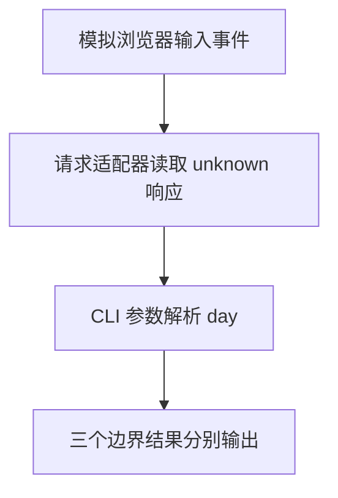

# Day 27（选修）｜浏览器、请求与命令行边界

同一份 TypeScript 放到不同地方运行，能用的东西不一样。网页里的输入框由浏览器提供；命令行参数和文件系统由 Node.js 提供。代码中写得出 `document`，不代表当前运行的 Node 进程真的有 `document`。

今天分别处理三个入口：浏览器输入事件、请求返回值和命令行参数。每个入口先把环境提供的数据转成普通值，再交给业务函数，这样才能在 Node 中用假数据单独测试。

建议用时：60–90 分钟。

## 今天会学到

- 用结构类型表达输入事件，并处理空目标；
- 把客户端响应保留为 `Promise<unknown>`；
- 把命令行参数解析成可测试的纯函数；
- 区分环境声明、运行时 API 与外部数据验证。

## 核心讲解

先按来源分开看：

| 数据从哪里来 | 入口拿到什么 | 转成什么普通值 | 失败时怎样处理 |
| --- | --- | --- | --- |
| 浏览器输入框 | `event.currentTarget` | 去掉首尾空格的搜索文字 | 目标不是输入框时不调用搜索 |
| 请求客户端 | `Promise<unknown>` | 验证后的课程标题 | 字段不对就返回失败或抛出明确错误 |
| Node 命令行 | `readonly string[]` | 合法的 day 数字 | 缺标志、缺值或不是整数时返回 `undefined` |

真实网页中，事件目标可以用 `HTMLInputElement` 检查，再读取它的 `value`。本课程的示例最终由 Node 运行，所以不直接操作 `document`；浏览器绑定留在最外层，搜索逻辑只接收普通字符串。

请求代码写成 TypeScript，也不能约束另一台服务器实际返回什么。`await client.get("/lesson")` 后先得到 `unknown`，确认它是非空对象并且 `title` 是字符串，才返回标题。`await` 只负责等待异步操作完成，不负责验证响应内容。

命令行也一样。给 `parseDay` 传入 `["--day", "27"]`，结果是 `27`；传入 `["--day"]`，标志后面没有值，结果应是 `undefined`。函数自己不读取全局 `process.argv`，测试就能直接传入这两组数据。更通用的解析器也可以写成 `parseArgs(args)`；重点都是让环境入口把参数数组传进来。

## 函数变量追踪

三个入口的变量路线分别是：`event → currentTarget → value → query`；`client.get() → Promise → await 后的 value → title`；`args → index → raw → day`。每一步只做一次转换，也都保留失败分支。

“边界适配函数”是这些入口函数的正式名称。它们负责认识浏览器、请求客户端或 Node；后面的纯业务函数只认识字符串、数字和普通对象。

## Example 实际输出

运行 `example.ts` 后，终端会按下面的顺序显示。先用代码推测结果，再逐行对照：

```text
Browser handler: typed
Fetched title: Runtime boundaries
CLI day: 27
```

## Example 代码流程图

运行 `example.ts` 前先沿图预测执行顺序；运行后再把每个节点对应到代码行。



## 独立练习导航

本日共有 2 道独立练习。每道题都有单独目录、说明、作答文件和解题结构提示；题目之间不共享代码。

| 目录 | 场景 | 类型 |
| --- | --- | --- |
| [practice01](./practice01/README.md) | Day 27 · 运行环境边界独立综合题 | 主任务 |
| [practice02](./practice02/README.md) | 搜索与命令行边界 | 闭卷迁移 |

右击任意练习目录中的 `practice.ts` 即可单独检查；命令行也可运行 `npm run beginner -- day27 practice02`。

## 常见错误

- 在 Node 中直接执行 `document.querySelector`；
- 把响应断言成 Lesson 而没有验证；
- 忘记标志后的数组项可能不存在；
- 把全局环境藏进业务函数。

### 错误代码示例

```ts
async function loadLesson(): Promise<Lesson> {
  const response = await fetch("/lesson");
  // ❌ 类型断言不会验证服务器实际返回的字段。
  return (await response.json()) as Lesson;
}

function parseDay(): number {
  // ❌ 纯业务逻辑偷偷依赖全局 process.argv，难以单独测试。
  return Number(process.argv[process.argv.indexOf("--day") + 1]);
}
```

### 正确写法

```ts
interface JsonClient {
  get(path: string): Promise<unknown>;
}

async function loadLesson(client: JsonClient): Promise<Lesson | null> {
  const value = await client.get("/lesson");
  // ✅ 响应先保持 unknown，并在边界逐字段验证。
  if (
    value === null ||
    typeof value !== "object" ||
    !("title" in value) ||
    typeof value.title !== "string"
  ) {
    return null;
  }
  return { title: value.title };
}

function parseDay(args: readonly string[]): number | undefined {
  const index = args.indexOf("--day");
  const raw = index < 0 ? undefined : args[index + 1];
  const day = raw === undefined ? Number.NaN : Number(raw);
  // ✅ 环境入口负责传入 args，函数只处理普通数据。
  return Number.isInteger(day) && day >= 0 ? day : undefined;
}
```

## 拓展思考（不要求写代码）

真实网页中应把哪一小段代码留在最外层，负责把 `HTMLInputElement`、`fetch` 和这里的纯函数连接起来？这样拆分对测试有什么帮助？

## 官方资料

- [DOM Manipulation](https://www.typescriptlang.org/docs/handbook/dom-manipulation.html)
- [Modules](https://www.typescriptlang.org/docs/handbook/2/modules.html)
- [Type Declarations](https://www.typescriptlang.org/docs/handbook/2/type-declarations.html)
