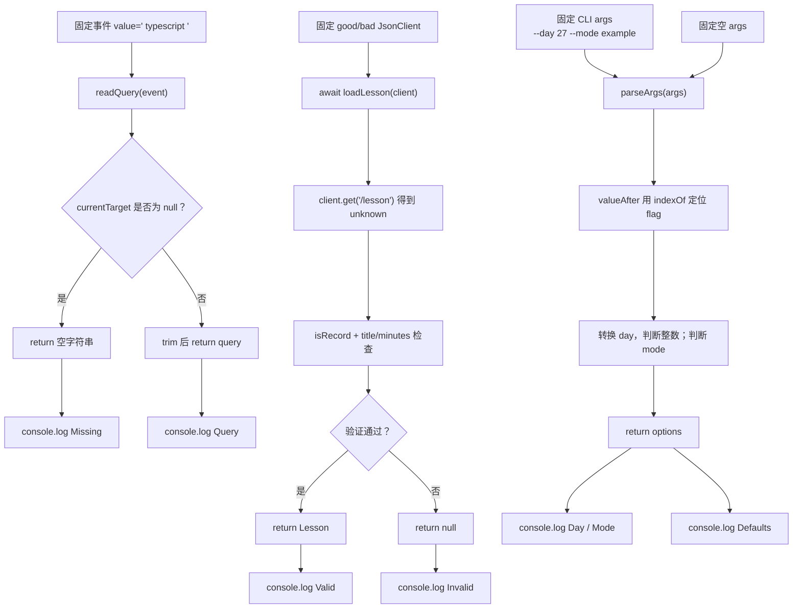

# DAY27 · Practice 01：跨环境课程搜索入口

[返回当天课程](../README.md)

## 文件位置

- 作答文件：[practice.ts](../../../day27/practice01/practice.ts)
- 完整参考答案：[solution.ts](../../../day27/practice01/solution.ts)
- 答案调用说明：[SOLUTION.md](./SOLUTION.md)

这是一道完整、独立的主练习。不要导入其他 practice 文件夹中的代码。

## 场景背景

同一套课程搜索能力要同时服务浏览器输入框、远程课程接口和命令行入口，因此边界输入可能是空事件值、未知网络响应或缺失的参数字符串。若业务逻辑直接依赖 DOM、网络或 `process.argv`，它会难以测试，并可能在换运行环境后失效。你需要把三类外部数据适配成普通值，再输出规范化查询、可信课程信息和带默认值的运行选项。

## 数据流

先沿变量名看数据怎样分叉和汇合；`──>` 表示值被交给下一步。

```text
输入事件 ──> readQuery ──> query 字符串 ──> 输出
JsonClient.get ──> Promise<unknown> ──> loadLesson
                                      └── 字段验证 ──> Lesson | null
CLI args ──> valueAfter ──> 原始参数值 ──> parseArgs ──> Options
三个环境边界的普通值 ──> 分别输出
```


## 代码流程图

下面这张图按实际执行顺序展开；菱形是判断，箭头上的文字表示走哪条分支。



## 起始代码

以下代码提前给出固定数据、函数签名、调用位置和输出位置。代码可作为完整脚手架阅读；判断、循环、回调与 `return` 的正确实现仍留在 TODO 中。

```ts
type InputEventLike = { currentTarget: { value: string } | null };
function readQuery(event: InputEventLike): string {
  // TODO：判断 currentTarget、trim，并 return。
  void event;
  return "";
}
interface JsonClient { get(path: string): Promise<unknown>; }
type Lesson = { title: string; minutes: number };
function isRecord(value: unknown): value is Record<string, unknown> {
  // TODO：return 对象判断。
  void value;
  return false;
}
async function loadLesson(client: JsonClient): Promise<Lesson | null> {
  // TODO：await、验证 unknown，并 return Lesson 或 null。
  void client;
  return null;
}
type Options = { day: number; mode: "practice" | "example" };
function valueAfter(args: readonly string[], flag: string): string | undefined {
  // TODO：查找 flag 并 return 后一项。
  void args;
  void flag;
  return undefined;
}
function parseArgs(args: readonly string[]): Options {
  // TODO：借助 valueAfter 读取值、判断 day/mode，并 return。
  void args;
  return { day: 0, mode: "practice" };
}
console.log(`Query: ${readQuery({ currentTarget: { value: "  typescript  " } })}`);
console.log(`Missing: ${readQuery({ currentTarget: null }) || "empty"}`);
const good: JsonClient = { async get() { return { title: "DOM", minutes: 35 }; } };
const bad: JsonClient = { async get() { return { title: "Broken", minutes: "35" }; } };
const validLesson = await loadLesson(good);
console.log(`Valid: ${validLesson ? `${validLesson.title}/${validLesson.minutes}` : "invalid"}`);
const invalidLesson = await loadLesson(bad);
console.log(`Invalid: ${invalidLesson === null ? "rejected" : "accepted"}`);
const options = parseArgs(["--day", "27", "--mode", "example"]);
console.log(`Day: ${options.day}`);
console.log(`Mode: ${options.mode}`);
const defaults = parseArgs([]);
console.log(`Defaults: ${defaults.day}/${defaults.mode}`);
```


## 任务要求

1. `readQuery` 处理存在或缺失的事件目标，并整理查询文字。
2. `loadLesson` 等待客户端返回的 `unknown`，逐字段验证后返回 `Lesson | null`。
3. `valueAfter` 定位参数；`parseArgs` 只接受非负整数 day 和固定 mode。
4. 分别运行固定事件、好坏客户端、有效参数与空参数。

## 精确期望输出

```text
Query: typescript
Missing: empty
Valid: DOM/35
Invalid: rejected
Day: 27
Mode: example
Defaults: 0/practice
```

## 本题易漏语法

边界适配函数先把事件、响应、CLI 转成普通局部变量，再传给不读取全局对象的纯函数。

## 写完后自检

- 把 `--day` 后的值改成空字符串、`-1` 或 `2.5` 时，`parseArgs` 应该选择什么？
- 为什么浏览器事件、网络响应和 CLI 参数应先转换成普通值，再交给业务函数？
- 好客户端把 `minutes` 改成 `Infinity` 时，类型是 number，但为什么仍应拒绝？

## 文件

- 在 `practice.ts` 中独立作答。
- 独立完成后，再查看完整的 `solution.ts`，并用 `SOLUTION.md` 对照直接调用逻辑。
