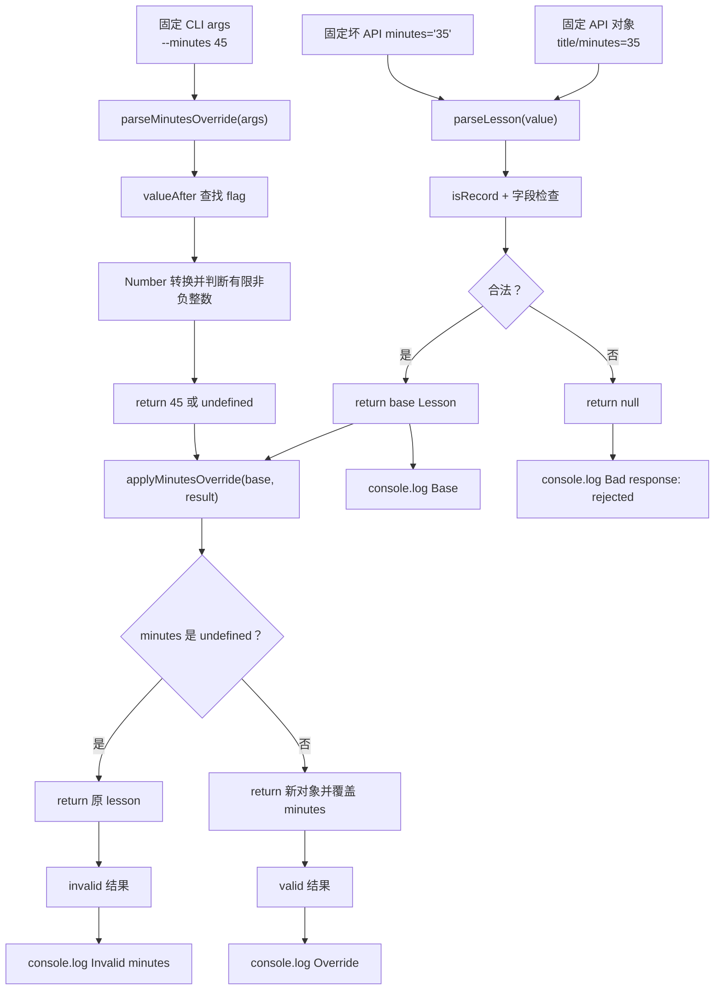

# DAY27 · Practice 02：API 课程与 CLI 覆盖

[返回当天课程](../README.md)

## 文件位置

- 作答文件：[practice.ts](../../../day27/practice02/practice.ts)
- 完整参考答案：[solution.ts](../../../day27/practice02/solution.ts)
- 答案调用说明：[SOLUTION.md](./SOLUTION.md)

这题完全在 Node 中运行，不声明 DOM 类型。你要把 API 返回的课程和 CLI 中可选的分钟覆盖值分别验证，再合并成新的课程对象。

## 场景背景

课程发布脚本先从接口读取课程标题和默认分钟，再允许运营通过 `--minutes` 临时覆盖时长。接口值是 `unknown`，命令行值永远先是字符串；无效覆盖不能把可信的默认分钟改成 `NaN`，坏接口也不能进入发布流程。你需要依次观察默认课程、合法覆盖、非法覆盖和坏响应。

## 数据流

先沿变量名看数据怎样分叉和汇合；`──>` 表示值被交给下一步。

```text
API response: unknown ──> parseLesson
                              ├── 合法 ──> baseLesson
                              └── 非法 ──> null ──> rejected
["--minutes", "45"] ──> parseMinutesOverride ──> 45
["--minutes", "soon"] ──> parseMinutesOverride ──> undefined
baseLesson + override
   └── applyMinutesOverride ──> 新 Lesson / 保留默认 Lesson ──> 输出
```


## 代码流程图

下面这张图按实际执行顺序展开；菱形是判断，箭头上的文字表示走哪条分支。



## 起始代码

以下代码提前给出固定数据、函数签名、调用位置和输出位置。代码可作为完整脚手架阅读；判断、循环、回调与 `return` 的正确实现仍留在 TODO 中。

```ts
type Lesson = { title: string; minutes: number };
function isRecord(value: unknown): value is Record<string, unknown> {
  // TODO：return 对象判断。
  void value;
  return false;
}
function parseLesson(value: unknown): Lesson | null {
  // TODO：验证对象字段，并 return Lesson 或 null。
  void value;
  return null;
}
function valueAfter(args: readonly string[], flag: string): string | undefined {
  // TODO：查找 flag 并 return 后一项。
  void args;
  void flag;
  return undefined;
}
function parseMinutesOverride(args: readonly string[]): number | undefined {
  // TODO：借助 valueAfter 读取值、转换、判断并 return。
  void args;
  return undefined;
}
function applyMinutesOverride(lesson: Lesson, minutes: number | undefined): Lesson {
  // TODO：判断是否覆盖，return 原对象或新对象。
  void minutes;
  return lesson;
}
const base = parseLesson({ title: "Runtime boundaries", minutes: 35 });
if (base !== null) {
  const valid = applyMinutesOverride(base, parseMinutesOverride(["--minutes", "45"]));
  const invalid = applyMinutesOverride(base, parseMinutesOverride(["--minutes", "soon"]));
  console.log(`Base: ${base.title}/${base.minutes}`);
  console.log(`Override: ${valid.title}/${valid.minutes}`);
  console.log(`Invalid minutes: ${invalid.title}/${invalid.minutes}`);
}
const bad = parseLesson({ title: "Broken", minutes: "35" });
console.log(`Bad response: ${bad === null ? "rejected" : "accepted"}`);
```

## 和 Practice 01 的区别

Practice 01 分别适配事件、异步客户端和两项 CLI 选项，三条结果互不合并。本题没有浏览器分支；API 课程与 CLI 覆盖值会汇合到 `applyMinutesOverride`，并且必须比较合法覆盖、非法覆盖、坏响应三种边界。

## 任务要求

1. 声明 `Lesson`，包含 `title: string` 与有限非负 `minutes: number`；实现 `isRecord`、`parseLesson(value)`。
2. 实现 `valueAfter(args, flag)`，读取标记后一项；实现 `parseMinutesOverride(args)`，只接受非空的有限非负整数。
3. 实现 `applyMinutesOverride(lesson, minutes)`：合法数字存在时返回带新分钟的新对象；`undefined` 时返回原课程，不修改输入对象。
4. 固定好响应为 Runtime boundaries / 35；合法参数为 `["--minutes", "45"]`，非法参数为 `["--minutes", "soon"]`。
5. 再验证 `{ title: "Broken", minutes: "35" }` 返回 `null`。四行输出都来自解析或合并结果。

- 不得导入 `practice01` 或直接调用其他练习的实现。
- 输出必须由变量、计算或函数返回值产生，不把整行结果写死。
- 每个参数、局部变量和返回值都应能在流程图中找到位置。

## 精确期望输出

```text
Base: Runtime boundaries/35
Override: Runtime boundaries/45
Invalid minutes: Runtime boundaries/35
Bad response: rejected
```

## 写完后自检

- 参数改成 `["--minutes", "0"]`、空字符串或 `2.5` 时，哪些值应接受？题目的整数规则在哪里执行？
- 为什么 API 守卫与 CLI 解析器要分开，最后才由 `applyMinutesOverride` 合并？
- 合法覆盖为什么返回新课程对象，而不是直接写 `lesson.minutes = value`？

## 文件

在上方链接的 `practice.ts` 作答；独立完成后再查看完整的 `solution.ts`，并用 `SOLUTION.md` 对照直接调用逻辑。
