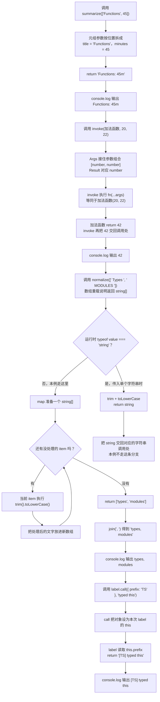

# Day 28（选修）｜元组、重载、`this` 与可变参数

## 写 Example 前先认识这些写法

### `call`：明确指定这一次调用中的 `this`

普通函数从 JavaScript 的 `Function.prototype` 获得 `.call`。在 `label.call(context, value)` 中，点号左边的 `label` 必须是函数；第一个参数 `context` 会成为函数里的 `this`；后面的参数才依次交给函数的普通形参；`.call` 最后返回原函数的返回值。

```ts
function label(this: { prefix: string }, value: string): string {
  return `${this.prefix}: ${value}`;
}

console.log(label.call({ prefix: "TS" }, "functions"));
```

实际输出：

```text
TS: functions
```

它解决的是“函数已经单独拿出来，但这次仍要让它使用指定对象”的问题。函数声明里的 `this: { prefix: string }` 只供 TypeScript 检查，不是运行时的第一个普通参数。箭头函数没有自己的动态 `this`，即使用 `.call` 也不能把它改掉，因此这里必须使用普通 `function`。本日的 `invoke`、`normalize` 都是课程自定义函数，只有 `.call` 是 JavaScript 自带的调用方式。

今天会看到四种平时不常写、但在库代码里很常见的函数形式：用 `["Functions", 45]` 保存固定的“标题 + 分钟”；让 `invoke` 原样转交两个加法参数；让 `normalize` 同时接收一个字符串或一组字符串；用 `.call` 告诉函数“这次由谁来调用”。

普通业务函数仍应优先用简单参数和联合类型。这里的目标是看懂这些类型怎样保护参数顺序、返回值和 `this`，需要设计通用 API 时再使用。

建议用时：60–90 分钟。

## 今天会学到

- 用只读元组表达固定长度和位置含义；
- 用剩余参数与可变参数元组保留函数签名；
- 正确排列重载签名和实现签名；
- 用显式 `this` 参数检查调用上下文。

## 核心讲解

### 1. 元组：每个位置都有固定意义

`readonly [completed: number, total: number]` 只能有两个位置。第一项是已完成数量，第二项是总数；`[3, 5]` 合法，`[3, 5, 99]` 不合法。普通 `number[]` 只说明“里面都是数字”，不保证长度，也不说明每个位置的用途。`completed` 和 `total` 是给开发者看的标签，运行时仍要用 `[0]`、`[1]` 或解构读取。

### 2. 可变参数元组：把整组参数原样转交

示例调用 `invoke((left, right) => left + right, 20, 22)`。调用时，`Args` 对应 `[number, number]`，剩余参数把 `20` 和 `22` 收进 `args`，`fn(...args)` 再按原顺序传给加法函数，最后 `Result` 是 `number`，值为 `42`。同一个 `Args` 同时约束函数和实参，所以少传、错序或传错类型都会被检查。

### 3. 重载：先列允许的调用，再写一次实现

`normalize` 有两种公开调用：传 `string` 返回 `string`；传 `readonly string[]` 返回 `string[]`。上方两行叫“重载签名”，告诉调用者每种输入对应什么返回值；下面的实现签名必须同时处理两种情况。输入和输出关系没有区别时，直接用联合类型通常更容易读。

### 4. 显式 `this`：说明调用者需要有什么字段

`label.call({ prefix: "TS" }, "typed this")` 中，`{ prefix: "TS" }` 是这次调用的 `this`，`"typed this"` 才是普通实参。函数声明里的 `this` 参数只参加类型检查，不占用运行时第一个参数位置。更一般地，可以把这种调用写成 `.call(context, ...)`：`context` 提供 `this`，省略号位置才是普通实参。

## 为什么要这样设计

普通数组和宽泛的函数类型只会说“里面有一些值”，却说不清第一个位置、参数顺序和调用上下文之间的关系。包装函数一旦少转发一个参数，或把字符串输入错误地推成字符串数组输出，调用者可能直到运行时才发现。

元组负责记录固定位置，可变参数泛型把同一组参数连接到原函数与调用处，重载列出允许的输入输出组合，显式 `this` 则检查调用上下文；你仍要决定哪些调用形式合法、每种输入怎样处理，以及上下文需要哪些字段。这些关系主要存在于类型检查阶段，不会自动验证运行时外部数据；重载越多，实现就越难维护，而且实现签名必须覆盖全部重载。

## 函数变量追踪

跟踪 `invoke`：两个实参进入 `args`，`...args` 把它们展开给 `fn`，`fn` 返回 `42`，`invoke` 再把同一个结果返回给调用处。包装器没有改变参数和结果，只负责转交。

跟踪 `label`：`.call` 的第一个值进入 `this`，后面的值进入普通参数 `value`。这两条路径在类型上分开，因此不会误把调用者对象当成普通参数。

## Example 实际输出

运行 `example.ts` 后，终端会按下面的顺序显示。先用代码推测结果，再逐行对照：

```text
Functions: 45m
42
types, modules
[TS] typed this
```

## Example 代码流程图

运行 `example.ts` 前先沿图预测执行顺序；运行后再把每个节点对应到代码行。



## 官方手册扩展阅读（可选）

完成当天教程后，如果还想加深理解，再到 [Day 28 官方手册索引](../OFFICIAL-READING.md#day-28) 只选 1 篇阅读；这不是开始练习前的必修内容。

## 独立练习导航

本日共有 2 道独立练习。每道题都有单独目录、题目说明、作答文件、完整参考答案和调用逻辑说明；题目之间不共享代码。

| 目录 | 场景 | 类型 |
| --- | --- | --- |
| [practice01](./practice01/README.md) | 课程函数工具箱 | 主任务 |
| [practice02](./practice02/README.md) | 高级函数调用器 | 闭卷迁移 |

右击任意练习目录中的 `practice.ts` 即可单独检查；命令行也可运行 `npm run beginner -- day28 practice02`。

## 常见错误

- 用 `(number | boolean)[]` 代替固定元组；
- 包装器写成 `any[]` 丢失关系；
- 只写重载签名却没有兼容实现；
- 把显式 this 当成普通第一个参数。

### 错误代码示例

媒体服务写了一个计时包装器，用来记录图片预览函数耗时。参数全部写成 `any[]` 后，包装器不再保护原函数的参数顺序和类型：

```ts
function measureWrong(
  fn: (...args: any[]) => any,
  ...args: any[]
): { result: any; elapsedMs: number } {
  const startedAt = Date.now();
  return {
    result: fn(...args),
    elapsedMs: Date.now() - startedAt,
  };
}

function previewPixels(width: number, height: number): number {
  return width * height;
}

const measured = measureWrong(previewPixels, "800", 600);
// ❌ 字符串 "800" 本应在调用处被拒绝，却因 any 穿过检查。
console.log(measured.result);
```

实际输出是 `480000`，因为 JavaScript 乘法会把 `"800"` 隐式转成数字。程序没有立即崩溃，错误输入反而被悄悄接受；换成加法、文件路径或布尔参数后，结果可能完全不同。

同一项目还可能把队列记录写成宽泛数组，并把位置放反：

```ts
type QueueEntry = (string | number | boolean)[];
const entry: QueueEntry = [true, "job-7", 3];
// ❌ 类型允许任意长度和顺序，无法保证 [jobId, attempts, urgent]。
```

日志方法依赖对象里的服务名，单独取出后再调用也会丢失 `this`：

```ts
const audit = {
  service: "media",
  write(action: string): string {
    return `[${this.service}] ${action}`;
  },
};

const write = audit.write;
console.log(write("upload"));
// ❌ 严格模式下 this 是 undefined，读取 this.service 会失败。
```

这三处错误分别丢掉了函数参数之间的关系、元组位置含义和方法的调用上下文。

### 正确写法

`Date.now()` 返回当前时间的毫秒数，两次结果相减可以得到这段同步代码的大致耗时。`.bind(context)` 不会立即执行函数；它返回一个新函数，并把以后调用时的 `this` 固定为 `context`。

```ts
type QueueEntry = readonly [
  jobId: string,
  attempts: number,
  urgent: boolean,
];

type Measured<Result> = {
  result: Result;
  elapsedMs: number;
};

function measure<Args extends unknown[], Result>(
  fn: (...args: Args) => Result,
  ...args: Args
): Measured<Result> {
  const startedAt = Date.now();
  const result = fn(...args);
  // ✅ Args 保留原参数关系，Result 进入计时结果对象。
  return { result, elapsedMs: Date.now() - startedAt };
}

interface AuditScope {
  service: string;
}

function writeAudit(this: AuditScope, action: string): string {
  return `[${this.service}] ${action}`;
}

const entry: QueueEntry = ["job-7", 3, true];
const measured = measure(previewPixels, 800, 600);
const mediaAudit = writeAudit.bind({ service: "media" });

console.log(`${entry[0]}: ${entry[1]} attempts`);
console.log(measured.result);
console.log(mediaAudit("upload"));
```

现在 `measure(previewPixels, "800", 600)` 会在编译阶段被拒绝；元组固定了队列字段的位置；`bind` 返回的 `mediaAudit` 已经带着正确的 `this`。计时包装器还刻意返回 `Measured<Result>`，它不等同于一个只做转发的普通调用器。

## 面试时怎么回答

**问：** 元组和数组、重载和联合类型、显式 `this` 分别该怎么选？

**可以直接这样回答：**

元组适合长度和位置都有含义的数据，例如 `[invoiceId: string, total: number]`；普通数组只约束每一项的类型，不固定长度和顺序。函数重载适合“不同输入对应不同返回类型”，例如字符串输入返回字符串、字符串数组输入返回字符串数组；运行时仍然只有一个实现签名。如果输入和输出没有这种对应关系，用联合类型通常更简单。

显式 `this` 参数只参加类型检查，不占运行时普通参数的位置；真正的调用上下文由方法调用、`call`、`apply` 或 `bind` 决定。箭头函数没有自己的动态 `this`，不适合需要由调用者提供上下文的场景。通用包装器可以用 `Args extends unknown[]` 同时连接原函数参数和 `...args`，再用 `Result` 保留返回类型，避免退回 `any[]`。

官方参考：[TypeScript More on Functions](https://www.typescriptlang.org/docs/handbook/2/functions.html)、[TypeScript 3.0 可变参数元组](https://www.typescriptlang.org/docs/handbook/release-notes/typescript-3-0.html#tuples-in-rest-parameters-and-spread-expressions)、[MDN `Function.prototype.call`](https://developer.mozilla.org/en-US/docs/Web/JavaScript/Reference/Global_Objects/Function/call)

## 拓展思考（不要求写代码）

`normalize` 能否只用联合参数写成一个函数？比较联合版本与重载版本在调用处返回类型精度和实现可读性上的差别。
