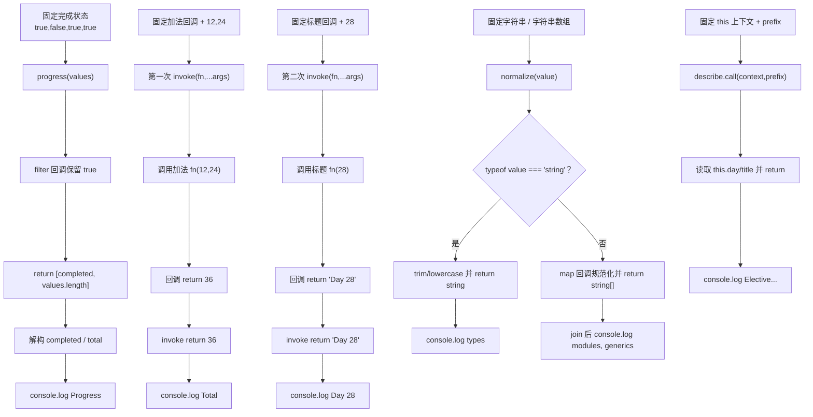

# DAY28 · Practice 01：课程函数工具箱

[返回当天课程](../README.md)

## 文件位置

- 作答文件：[practice.ts](../../../day28/practice01/practice.ts)
- 完整参考答案：[solution.ts](../../../day28/practice01/solution.ts)
- 答案调用说明：[SOLUTION.md](./SOLUTION.md)

这是一道完整、独立的主练习。不要导入其他 practice 文件夹中的代码。

## 场景背景

课程平台团队准备建立一套高级函数工具，用于统计学习进度、转发不同参数的计算、规范化标签，并借助上下文生成课程说明。输入边界包括位置固定的进度数据、长度各异的参数组、单个或多个字符串以及显式调用上下文；包装器若丢失参数、`this` 或返回类型，业务结果就会出错。你需要交付保持这些关系的通用调用结果，并输出进度、计算值、规范化内容和课程描述。

## 数据流

先沿变量名看数据怎样分叉和汇合；`──>` 表示值被交给下一步。

```text
boolean[] ──> progress ──> [completed, total]
fn + args 元组 ──> invoke ──> fn(...args) ──> Result
string | string[] ──> normalize 重载 ──> 对应返回类型
CourseContext + prefix ──> describe.call ──> this + 普通参数
四条精确类型结果 ──> 输出
```


## 代码流程图

下面这张图按实际执行顺序展开；菱形是判断，箭头上的文字表示走哪条分支。



## 起始代码

以下代码提前给出固定数据、函数签名、调用位置和输出位置。代码可作为完整脚手架阅读；判断、循环、回调与 `return` 的正确实现仍留在 TODO 中。

```ts
type ProgressPair = readonly [completed: number, total: number];
function progress(values: readonly boolean[]): ProgressPair {
  // TODO：filter 统计并 return 二元组。
  return [0, values.length];
}
function invoke<Args extends unknown[], Result>(
  fn: (...args: Args) => Result, ...args: Args
): Result {
  // TODO：执行 fn(...args) 并 return 结果。
  return fn(...args);
}
function normalize(value: string): string;
function normalize(value: readonly string[]): string[];
function normalize(value: string | readonly string[]): string | string[] {
  // TODO：判断输入；单值或 map 数组；return 对应结果。
  void value;
  return "";
}
type CourseContext = { title: string; day: number };
function describe(this: CourseContext, prefix: string): string {
  // TODO：读取 this 并 return 描述。
  void prefix;
  return "";
}
const [completed, total] = progress([true, false, true, true]);
console.log(`Progress: ${completed}/${total}`);
const sum = invoke((left: number, right: number) => left + right, 12, 24);
console.log(`Total: ${sum}`);
const title = invoke((day: number) => `Day ${day}`, 28);
console.log(title);
console.log(normalize("  TYPES "));
const normalizedTopics = normalize([" Modules ", " GENERICS "]);
console.log(normalizedTopics.join(", "));
console.log(describe.call({ title: "Advanced functions", day: 28 }, "Elective"));
```


## 任务要求

1. `progress` 返回固定二元组；`invoke` 保留回调参数组与返回类型的关系。
2. `normalize` 提供单字符串和字符串数组两个公开重载。
3. `describe` 使用显式 `this`，并通过 `.call` 接收固定上下文。
4. 所有结果都从函数返回值进入固定的显示位置。

## 精确期望输出

```text
Progress: 3/4
Total: 36
Day 28
types
modules, generics
Elective Day 28: Advanced functions
```

## 本题易漏语法

元组类型用 [] 且位置固定；rest 参数写 ...args: Args；显式 this 不是运行时第一个实参。

## 写完后自检

- 给 `invoke` 传入三个参数的函数，或让函数返回对象时，参数提示与返回类型是否仍能跟着原函数变化？
- 为什么 `normalize` 用重载，而 `progress` 只需要一个元组返回类型？两者要保留的对应关系有什么不同？
- 如果直接调用 `describe("Elective")` 而不提供 `this`，类型检查为什么应该拒绝？

## 文件

- 在 `practice.ts` 中独立作答。
- 独立完成后，再查看完整的 `solution.ts`，并用 `SOLUTION.md` 对照直接调用逻辑。
