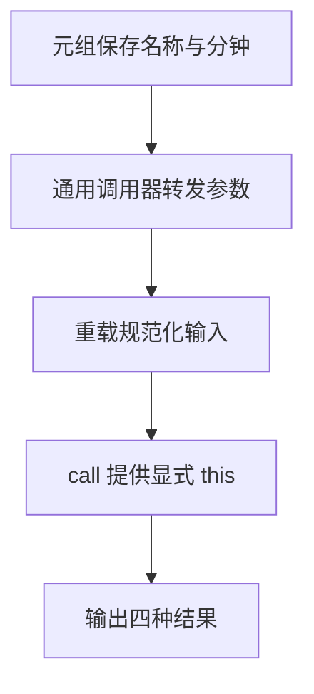

# DAY28 · Practice 02：高级函数调用器

[返回当天课程](../README.md)

## 文件位置

- 作答文件：[practice.ts](../../../day28/practice02/practice.ts)
- 结构提示代码：[solution.ts](../../../day28/practice02/solution.ts)
- 方案说明：[SOLUTION.md](./SOLUTION.md)

这是一道与 Practice 01 文件完全分开的闭卷迁移题。先理解并运行当天 `example.ts`，然后关闭它；不要复制代码，仅根据下面的流程与输出从空白重新实现。

## 场景背景

内容制作工具要用同一个调用器执行数字计算和文本处理，同时保留课程名称与分钟组成的固定结构，以及格式化器所需的调用上下文。若把元组放宽成普通数组、重载关系写错或转发时遗漏 `this`，调用方就会失去可靠的类型提示或得到错误文本。你需要输出课程时长、计算结果、规范化标签和带上下文前缀的说明。

## 代码流程图



## 必须练到的能力

使用元组、重载、显式 this 或可变参数保持函数关系。

- 不得导入 `practice01` 或直接调用其他练习的实现。
- 输出必须由变量、计算或函数返回值产生，不把整行结果写死。
- 每个参数、局部变量和返回值都应能在流程图中找到位置。

## 精确期望输出

```text
Functions: 45m
42
types, modules
[TS] typed this
```

## 文件

在上方链接的 `practice.ts` 作答；独立完成后再查看 `solution.ts` 的 TODO 代码骨架与 `SOLUTION.md` 的解题结构；两者都不提供完整答案。
