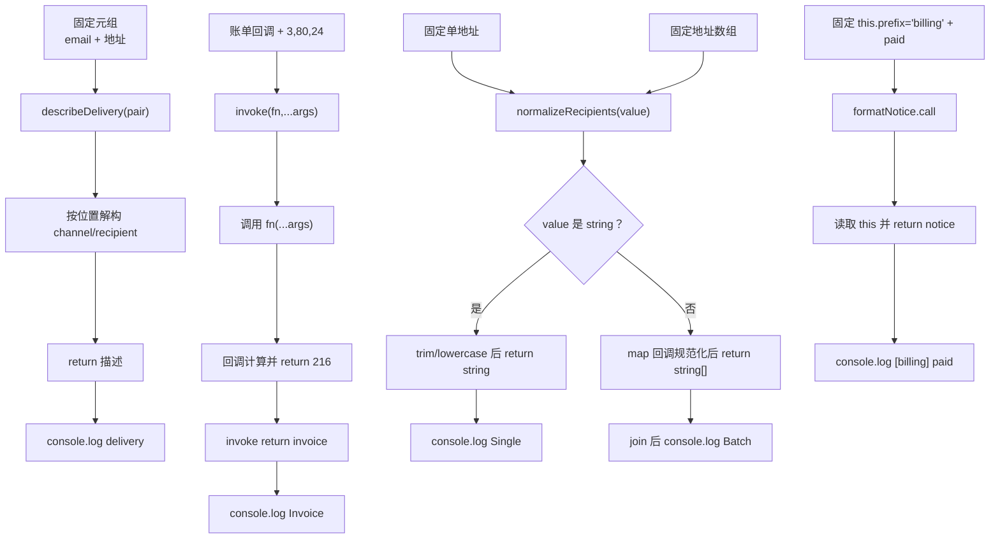

# DAY28 · Practice 02：通知与账单适配器

[返回当天课程](../README.md)

## 文件位置

- 作答文件：[practice.ts](../../../day28/practice02/practice.ts)
- 完整参考答案：[solution.ts](../../../day28/practice02/solution.ts)
- 答案调用说明：[SOLUTION.md](./SOLUTION.md)

这题把四种函数类型关系放进一个通知发送场景。先根据调用方需要判断何时使用元组、可变参数泛型、重载和显式 `this`，不要因为它们都属于“高级函数”就混成一个宽泛联合。

## 场景背景

账单系统会把发送渠道与收件地址成对保存，用通用调用器执行不同参数数量的业务函数，并允许调用方传入一个地址或一批地址。单个地址调用后仍应得到字符串，批量调用后仍应得到字符串数组；账单格式器还会被不同部门借用，因此前缀来自调用时的 `this`。你需要让每一处类型关系保持到最终输出。

## 数据流

先沿变量名看数据怎样分叉和汇合；`──>` 表示值被交给下一步。

```text
DeliveryPair[channel, recipient] ──> describeDelivery ──> 渠道说明
invoice 函数 + [quantity, unitPrice, discount]
   └── invoke<Args, Result> ──> fn(...args) ──> 账单金额
单个地址 ──> normalizeRecipients(string) ──> string
地址数组 ──> normalizeRecipients(string[]) ──> string[]
BillingContext + message ──> formatNotice.call ──> 带部门前缀的通知
```


## 代码流程图

下面这张图按实际执行顺序展开；菱形是判断，箭头上的文字表示走哪条分支。



## 起始代码

以下代码提前给出固定数据、函数签名、调用位置和输出位置。代码可作为完整脚手架阅读；判断、循环、回调与 `return` 的正确实现仍留在 TODO 中。

```ts
type DeliveryPair = readonly [channel: "email" | "sms", recipient: string];
function describeDelivery(pair: DeliveryPair): string {
  // TODO：解构并 return。
  void pair;
  return "";
}
function invoke<Args extends unknown[], Result>(
  fn: (...args: Args) => Result, ...args: Args
): Result {
  // TODO：执行 fn(...args) 并 return。
  return fn(...args);
}
function normalizeRecipients(value: string): string;
function normalizeRecipients(value: readonly string[]): string[];
function normalizeRecipients(value: string | readonly string[]): string | string[] {
  // TODO：判断；单值或 map；return。
  void value;
  return "";
}
type BillingContext = { prefix: string };
function formatNotice(this: BillingContext, message: string): string {
  // TODO：读取 this 并 return。
  void message;
  return "";
}
console.log(describeDelivery(["email", "learner@example.com"]));
const invoice = invoke(
  (quantity: number, unitPrice: number, discount: number) =>
    quantity * unitPrice - discount,
  3, 80, 24,
);
console.log(`Invoice: ${invoice}`);
console.log(`Single: ${normalizeRecipients(" Learner@Example.com ")}`);
const batch = normalizeRecipients([" A@Example.com ", " B@Example.com "]);
console.log(`Batch: ${batch.join(", ")}`);
console.log(formatNotice.call({ prefix: "billing" }, "paid"));
```

## 和 Practice 01 的区别

Practice 01 是课程工具箱，一次并列练习进度元组、两个普通函数调用和标签规范化。本题的类型关系服务同一条通知链：三参数账单函数由 `invoke` 转发，地址 API 同时提供单个/批量重载，格式函数还会被不同账单上下文借用；输入形状会直接决定调用方式与返回类型。

## 任务要求

1. `DeliveryPair` 是只读二元组：第一项只能是 `email | sms`，第二项是收件地址；`describeDelivery` 输出 `渠道 -> 地址`。
2. 实现 `invoke<Args extends unknown[], Result>`，把同一个 `Args` 同时用于 `fn` 和 `...args`。固定账单函数接收数量 `3`、单价 `80`、折扣 `24`，返回 `216`。
3. 为 `normalizeRecipients` 写两条重载：字符串输入返回字符串，字符串数组输入返回新字符串数组；每个地址都执行 `trim()` 和小写转换。
4. `formatNotice` 使用显式 `this: BillingContext`。通过 `.call({ prefix: "billing" }, "paid")` 产生最后一行。
5. 固定收件人为 `learner@example.com`；批量地址为 `A@example.com` 与 `B@example.com`，输入中要保留可供 `trim()` 处理的空格。

- 不得导入 `practice01` 或直接调用其他练习的实现。
- 输出必须由变量、计算或函数返回值产生，不把整行结果写死。
- 每个参数、局部变量和返回值都应能在流程图中找到位置。

## 精确期望输出

```text
email -> learner@example.com
Invoice: 216
Single: learner@example.com
Batch: a@example.com, b@example.com
[billing] paid
```

## 写完后自检

- 如果账单函数增加第四个布尔参数，`invoke` 的调用处和返回类型应该怎样变化？是否需要改 `invoke` 本身？
- 为什么 `normalizeRecipients(value: string | string[])` 只写联合返回类型，会让调用者比两条重载多做一次判断？
- 显式 `this` 只存在于类型检查中。运行时真正把 `prefix` 交给函数的是哪一步？现代模块中何时改用普通参数会更清楚？

## 文件

在上方链接的 `practice.ts` 作答；独立完成后再查看完整的 `solution.ts`，并用 `SOLUTION.md` 对照直接调用逻辑。
