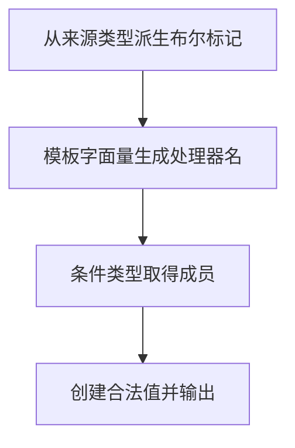

# Day 29（选修）｜从现有类型生成新类型

假设注册表单保存 `email` 和 `age`，另一个“用户碰过哪些输入框”的状态也要有相同的键，但每个值都是布尔值。如果以后表单增加字段，希望触碰状态自动跟着增加，而不是手写第二份类型。这就是“从现有类型生成新类型”要解决的问题。

这一专题常见于库和复杂框架。先看每次转换的输入类型和输出类型，再认识映射类型、条件类型、`infer` 和模板字面量类型。日常业务能用 `Record`、`Awaited` 等内置工具类型时，优先用更短、更容易读的写法。

建议用时：60–90 分钟。

## 今天会学到

- 用映射类型遍历已有对象的键；
- 用条件类型和 `infer` 提取数组元素；
- 用键重映射与模板字面量生成处理器名；
- 用品牌类型防止结构相同的标识符被误传；
- 区分类型层转换与运行时验证。

## 核心讲解

先用表单字段看映射类型怎样逐个处理对象的键：

```ts
type FormValues = {
  email: string;
  age: number;
};

type Touched<T> = {
  [Key in keyof T]: boolean;
};

type FormTouched = Touched<FormValues>;
// 得到：{ email: boolean; age: boolean }
```

`keyof FormValues` 先得到 `"email" | "age"`。`Key in ...` 再依次拿到这两个键，并把每个键的值都写成 `boolean`。这里保留了原键名，只改变每个键对应的值类型。

如果新类型还要改键名，就在 `as` 后写出新名字：

```ts
type Getters<T> = {
  [Key in keyof T as `get${Capitalize<string & Key>}`]: () => T[Key];
};
```

`Key` 先拿到旧键；`as ...` 再把 `email` 变成 `getEmail`，把 `age` 变成 `getAge`。这一步叫键重映射。`T[Key]` 则保留每个旧键原来对应的值类型。

再把示例中的其他转换逐个算出来：

| 原来的类型 | 使用的转换 | 得到的新类型 |
| --- | --- | --- |
| `FormValues` 的键 `email`、`age` | `Touched<FormValues>` 逐个读取键，把值改成 `boolean` | `{ email: boolean; age: boolean }` |
| `readonly ["types", "modules", "async"]` | `ElementOf<...>` 提取数组元素 | `"types" | "modules" | "async"` |
| 字符串字面量 `"ready"` | `HandlerName<"ready">` 添加 `on` 并大写开头 | `"onReady"` |
| `Promise<string>` | 提取 Promise 内部的值 | `string` |

`[Key in keyof T]` 可以读成：“把 `T` 的每个键轮流放进 `Key`，为每个键生成一个属性。”这是映射类型。`T extends readonly (infer Item)[] ? Item : never` 可以读成：“如果 `T` 是只读数组，就把元素类型临时命名为 `Item` 并返回它；否则返回 `never`。”这是条件类型，`infer` 负责给待提取的部分起临时名字。

这些转换只帮助 TypeScript 检查代码，不会在运行时循环，也不会真的改造对象。要把 `ready` 变成运行时字符串 `onReady`，仍然要有 JavaScript 代码执行字符串转换。

品牌类型解决的是另一种误传：`UserId` 和其他 id 在运行时都可能只是字符串，结构类型原本分不出它们。集中使用 `createUserId` 检查 `usr_` 格式，检查通过后再做一次窄断言；其他地方只接收 `UserId`。如果到处写 `rawInput as UserId`，品牌就失去了保护作用。

## 为什么要这样设计

如果配置、事件和界面标记各自手写一份相似类型，来源类型新增字段后，副本很容易忘记更新。映射类型、条件类型和模板字面量类型让编译器从一个来源计算新类型，把“逐个复制键名”的工作交给类型系统。

你仍要决定哪些键保留、值要变成什么、模板名称怎样拼接，以及品牌值通过哪些运行时检查才能建立。派生类型不会生成对象，也不会验证字符串内容；复杂类型还可能让报错更难读。品牌最终仍需在一个已经验证过的边界做窄断言，因此那个构造器必须集中维护，不能到处随手断言。

失败方式也要和函数签名保持一致：返回 `UserId | undefined` 表示调用者用条件分支处理失败；返回 `UserId` 并在无效输入时抛错，表示调用者在需要恢复时用 `try/catch`。这是两套不同协议，本日练习选择后一种，不能一边声明“可能是 undefined”，另一边却只会抛错。

## 类型值怎样追踪

这里追踪的是编译器计算出的类型关系。例如 `topics` 新增一个字面量后，`Topic` 会自动包含它；`FormValues` 新增字段后，`Touched<FormValues>` 会要求同名布尔字段。代码运行时只会看到普通数组、对象和字符串，看不到 `Touched`、`ElementOf` 或 `infer`。

## Example 实际输出

运行 `example.ts` 后，终端会按下面的顺序显示。先用代码推测结果，再逐行对照：

```text
Flags: true/false
Topic: modules
Handler: onReady
Title: Advanced types
```

## Example 代码流程图

运行 `example.ts` 前先沿图预测执行顺序；运行后再把每个节点对应到代码行。



## 独立练习导航

本日共有 2 道独立练习。每道题都有单独目录、说明、作答文件和解题结构提示；题目之间不共享代码。

| 目录 | 场景 | 类型 |
| --- | --- | --- |
| [practice01](./practice01/README.md) | Day 29 · 类型派生独立综合题 | 主任务 |
| [practice02](./practice02/README.md) | 界面类型派生 | 闭卷迁移 |

右击任意练习目录中的 `practice.ts` 即可单独检查；命令行也可运行 `npm run beginner -- day29 practice02`。

## 常见错误

- 能用内置工具类型却先写复杂条件类型；
- 提取元素时写 `T[keyof T]`，混入数组方法；
- 模板键没有限制为字符串；
- 期待类型转换在运行时改造对象；
- 到处把 string 断言成品牌值。

### 错误代码示例

```ts
type ElementOf<T> = T[keyof T];
// ❌ 对数组使用时还会混入 length、数组方法等成员类型。

declare const userIdBrand: unique symbol;
type UserId = string & { readonly [userIdBrand]: true };

const id = rawInput as UserId;
// ❌ 到处断言品牌值，任何普通字符串都能绕过格式检查。
```

### 正确写法

```ts
type ElementOf<T> = T extends readonly (infer Item)[] ? Item : never;
// ✅ infer 只提取数组元素，不会把数组方法混进结果。

declare const userIdBrand: unique symbol;
type UserId = string & { readonly [userIdBrand]: true };

function createUserId(value: string): UserId {
  if (!value.startsWith("usr_") || value.length <= 4) {
    throw new Error("Invalid user id");
  }
  // ✅ 窄断言只集中在已经完成运行时验证的构造边界。
  return value as UserId;
}
```

## 面试时怎么回答

**问：** 条件类型、`infer`、映射类型和模板字面量类型分别解决什么问题？

**答：** 映射类型遍历来源键，例如 `{ [K in keyof Settings]: boolean }` 会把 `theme`、`pageSize` 都变成布尔标记。模板字面量和键重映射能把事件 `ready` 变成 `onReady`。条件类型按类型形状分支，`T extends readonly (infer Item)[] ? Item : never` 中的 `infer Item` 只在匹配数组时提取元素，所以 `["types", "modules"] as const` 能得到字面量联合 `"types" | "modules"`。

**容易答错或追问：** 这些工具都在编译阶段计算，不会在运行时创建 flags、重命名对象键或验证用户输入。`infer` 也不是随处可写的变量声明，它要出现在条件类型的匹配位置。面试官若追问品牌类型，我会说明 `UserId` 运行时仍是字符串，必须先检查 `usr_42` 的格式，再在唯一构造边界建立品牌；失败时抛错还是返回 `undefined` 要和函数签名采用同一协议。

## 拓展思考（不要求写代码）

哪些部分可以直接改用 `Record`、`Awaited` 或其他内置工具类型？在什么情况下“少写一个自定义高级类型”反而能让项目更安全？

## 官方资料

- [Creating Types from Types](https://www.typescriptlang.org/docs/handbook/2/types-from-types.html)
- [Mapped Types](https://www.typescriptlang.org/docs/handbook/2/mapped-types.html)
- [Conditional Types](https://www.typescriptlang.org/docs/handbook/2/conditional-types.html)
- [Template Literal Types](https://www.typescriptlang.org/docs/handbook/2/template-literal-types.html)
