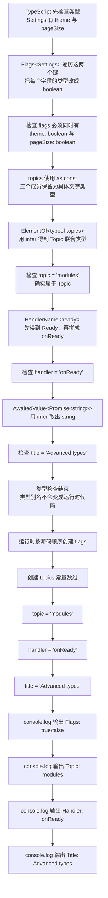

# Day 29（选修）｜从现有类型生成新类型

假设注册表单保存 `email` 和 `age`，另一个“用户碰过哪些输入框”的状态也要有相同的键，但每个值都是布尔值。如果以后表单增加字段，希望触碰状态自动跟着增加，而不是手写第二份类型。这就是“从现有类型生成新类型”要解决的问题。

这一专题常见于库和复杂框架。先看每次转换的输入类型和输出类型，再认识映射类型、条件类型、`infer` 和模板字面量类型。日常业务能用 `Record`、`Awaited` 等内置工具类型时，优先用更短、更容易读的写法。

建议用时：60–90 分钟。

## 今天会学到

- 用映射类型遍历已有对象的键；
- 用条件类型和 `infer` 提取数组元素；
- 用键重映射与模板字面量生成处理器名；
- 用品牌类型防止结构相同的标识符被误传；
- 区分类型层转换与运行时验证。

## 写 Example 前先认识这些写法

### `startsWith`：检查字符串是否以指定文字开头

`.startsWith` 是 JavaScript 字符串自带的方法。在 `value.startsWith("usr_")` 中，点号左边的 `value` 必须是字符串；参数 `"usr_"` 是要检查的开头；返回值是 `boolean`，符合为 `true`，不符合为 `false`。它只检查，不会修改原字符串。

```ts
console.log("usr_42".startsWith("usr_"));
console.log("order_42".startsWith("usr_"));
```

实际输出：

```text
true
false
```

本日用它检查外部字符串是否遵守用户 ID 前缀约定。比较会区分大小写，所以 `"USR_42"` 不会通过；空前缀 `""` 对任何字符串都会得到 `true`，不能拿来做有效前缀规则。`parseUserId` 是课程自定义验证函数，`startsWith` 只是它内部使用的一个 JavaScript 字符串工具；通过前缀检查也不等于其余格式一定正确。

## 核心讲解

先用表单字段看映射类型怎样逐个处理对象的键：

```ts
type FormValues = {
  email: string;
  age: number;
};

type Touched<T> = {
  [Key in keyof T]: boolean;
};

type FormTouched = Touched<FormValues>;
// 得到：{ email: boolean; age: boolean }
```

`keyof FormValues` 先得到 `"email" | "age"`。`Key in ...` 再依次拿到这两个键，并把每个键的值都写成 `boolean`。这里保留了原键名，只改变每个键对应的值类型。

如果新类型还要改键名，就在 `as` 后写出新名字：

```ts
type Getters<T> = {
  [Key in keyof T as `get${Capitalize<string & Key>}`]: () => T[Key];
};
```

`Key` 先拿到旧键；`as ...` 再把 `email` 变成 `getEmail`，把 `age` 变成 `getAge`。这一步叫键重映射。`T[Key]` 则保留每个旧键原来对应的值类型。

再把示例中的其他转换逐个算出来：

| 原来的类型 | 使用的转换 | 得到的新类型 |
| --- | --- | --- |
| `FormValues` 的键 `email`、`age` | `Touched<FormValues>` 逐个读取键，把值改成 `boolean` | `{ email: boolean; age: boolean }` |
| `readonly ["types", "modules", "async"]` | `ElementOf<...>` 提取数组元素 | `"types" | "modules" | "async"` |
| 字符串字面量 `"ready"` | `HandlerName<"ready">` 添加 `on` 并大写开头 | `"onReady"` |
| `Promise<string>` | 提取 Promise 内部的值 | `string` |

`[Key in keyof T]` 可以读成：“把 `T` 的每个键轮流放进 `Key`，为每个键生成一个属性。”这是映射类型。`T extends readonly (infer Item)[] ? Item : never` 可以读成：“如果 `T` 是只读数组，就把元素类型临时命名为 `Item` 并返回它；否则返回 `never`。”这是条件类型，`infer` 负责给待提取的部分起临时名字。

这些转换只帮助 TypeScript 检查代码，不会在运行时循环，也不会真的改造对象。要把 `ready` 变成运行时字符串 `onReady`，仍然要有 JavaScript 代码执行字符串转换。

品牌类型解决的是另一种误传：`UserId` 和其他 id 在运行时都可能只是字符串，结构类型原本分不出它们。集中使用 `createUserId` 检查 `usr_` 格式，检查通过后再做一次窄断言；其他地方只接收 `UserId`。如果到处写 `rawInput as UserId`，品牌就失去了保护作用。

## 为什么要这样设计

如果配置、事件和界面标记各自手写一份相似类型，来源类型新增字段后，副本很容易忘记更新。映射类型、条件类型和模板字面量类型让编译器从一个来源计算新类型，把“逐个复制键名”的工作交给类型系统。

你仍要决定哪些键保留、值要变成什么、模板名称怎样拼接，以及品牌值通过哪些运行时检查才能建立。派生类型不会生成对象，也不会验证字符串内容；复杂类型还可能让报错更难读。品牌最终仍需在一个已经验证过的边界做窄断言，因此那个构造器必须集中维护，不能到处随手断言。

失败方式也要和函数签名保持一致：返回 `UserId | undefined` 表示调用者用条件分支处理失败；返回 `UserId` 并在无效输入时抛错，表示调用者在需要恢复时用 `try/catch`。这是两套不同协议，本日练习选择后一种，不能一边声明“可能是 undefined”，另一边却只会抛错。

## 类型值怎样追踪

这里追踪的是编译器计算出的类型关系。例如 `topics` 新增一个字面量后，`Topic` 会自动包含它；`FormValues` 新增字段后，`Touched<FormValues>` 会要求同名布尔字段。代码运行时只会看到普通数组、对象和字符串，看不到 `Touched`、`ElementOf` 或 `infer`。

## Example 实际输出

运行 `example.ts` 后，终端会按下面的顺序显示。先用代码推测结果，再逐行对照：

```text
Flags: true/false
Topic: modules
Handler: onReady
Title: Advanced types
```

## Example 代码流程图

运行 `example.ts` 前先沿图预测执行顺序；运行后再把每个节点对应到代码行。



## 官方手册扩展阅读（可选）

完成当天教程后，如果还想加深理解，再到 [Day 29 官方手册索引](../OFFICIAL-READING.md#day-29) 只选 1 篇阅读；这不是开始练习前的必修内容。

## 独立练习导航

本日共有 2 道独立练习。每道题都有单独目录、题目说明、作答文件、完整参考答案和调用逻辑说明；题目之间不共享代码。

| 目录 | 场景 | 类型 |
| --- | --- | --- |
| [practice01](./practice01/README.md) | SDK 类型派生与品牌 ID | 主任务 |
| [practice02](./practice02/README.md) | 界面类型派生 | 闭卷迁移 |

右击任意练习目录中的 `practice.ts` 即可单独检查；命令行也可运行 `npm run beginner -- day29 practice02`。

## 常见错误

- 能用内置工具类型却先写复杂条件类型；
- 提取元素时写 `T[keyof T]`，混入数组方法；
- 模板键没有限制为字符串；
- 期待类型转换在运行时改造对象；
- 到处把 string 断言成品牌值。

### 错误代码示例

表单模型和校验器经常由不同人维护。下面的结算字段已经规定了具体类型，手写校验器却又复制了一份名称，并把输入退回 `any`：

```ts
type CheckoutFields = {
  email: string;
  quantity: number;
};

type CheckoutValidators = {
  validateEmail: (value: any) => boolean;
  validateQuantity: (value: any) => boolean;
};

const validators: CheckoutValidators = {
  validateEmail(value) {
    return value.length > 3;
  },
  validateQuantity(value) {
    return value > 0;
  },
};

console.log(validators.validateQuantity("3"));
// ❌ any 允许字符串进入数字校验；JavaScript 比较时发生隐式转换，结果还是 true。
```

如果 `CheckoutFields` 再增加 `coupon`，手写的 `CheckoutValidators` 也不会自动要求新增 `validateCoupon`。字段表和校验器变成两份需要人工同步的清单。

品牌值也经常被随手断言绕过。仓库 SKU 和物流单号在运行时都是字符串，但业务上不能混用：

```ts
declare const shipmentCodeBrand: unique symbol;
type ShipmentCode = string & {
  readonly [shipmentCodeBrand]: true;
};

const productSku = "sku-42";
const shipmentCode = productSku as ShipmentCode;
// ❌ 编译器被迫相信断言，商品 SKU 会被发给物流查询接口。
console.log(`/shipments/${shipmentCode}`);
```

品牌只在创建入口受控时才有意义。业务代码到处写 `as ShipmentCode`，等于主动绕过它想建立的边界。

### 正确写法

```ts
type Validators<Model> = {
  [Key in keyof Model as `validate${Capitalize<string & Key>}`]: (
    value: Model[Key],
  ) => boolean;
};

const validators: Validators<CheckoutFields> = {
  validateEmail(value) {
    return value.length > 3;
  },
  validateQuantity(value) {
    return value > 0;
  },
};

declare const shipmentCodeBrand: unique symbol;
type ShipmentCode = string & {
  readonly [shipmentCodeBrand]: true;
};

function parseShipmentCode(value: string): ShipmentCode | null {
  if (!value.startsWith("ship-") || value.length <= 5) {
    return null;
  }
  // ✅ 只有经过前缀和长度检查的入口能建立品牌。
  return value as ShipmentCode;
}

const shipmentCode = parseShipmentCode("ship-42");
if (shipmentCode !== null) {
  console.log(`/shipments/${shipmentCode}`);
}
```

`Validators<CheckoutFields>` 从字段模型生成校验器名称和参数类型，`validateQuantity` 只能接收数字。字段新增、删除或改名时，校验器对象会立即出现类型提示。`parseShipmentCode` 则返回“合法品牌值或 `null`”，把唯一一次窄断言放在已完成运行时检查的位置。

## 面试时怎么回答

**问：** 条件类型、`infer`、映射类型和模板字面量类型分别解决什么问题？

**可以直接这样回答：**

映射类型遍历已有类型的键，例如 `[K in keyof Settings]` 可以为每个配置项生成一个布尔标记。键重映射配合模板字面量类型可以把 `ready` 生成 `onReady`。条件类型根据类型关系选择结果；在 `T extends readonly (infer Item)[] ? Item : never` 中，`infer` 给匹配到的数组元素类型起临时名字，因此能提取出 `Item`。

这些计算只发生在类型检查阶段，不会在运行时创建对象、重命名字段或验证用户输入。品牌类型也不会改变字符串本身；我会把格式检查集中在构造函数中，验证成功后才建立品牌。能用 `Awaited`、`ReturnType`、`Record` 等内置工具类型时，我会优先使用内置版本，减少团队维护自定义类型的成本。

官方参考：[Mapped Types](https://www.typescriptlang.org/docs/handbook/2/mapped-types.html)、[Conditional Types 与 `infer`](https://www.typescriptlang.org/docs/handbook/2/conditional-types.html)、[Template Literal Types](https://www.typescriptlang.org/docs/handbook/2/template-literal-types.html)

## 拓展思考（不要求写代码）

哪些部分可以直接改用 `Record`、`Awaited` 或其他内置工具类型？在什么情况下“少写一个自定义高级类型”反而能让项目更安全？
