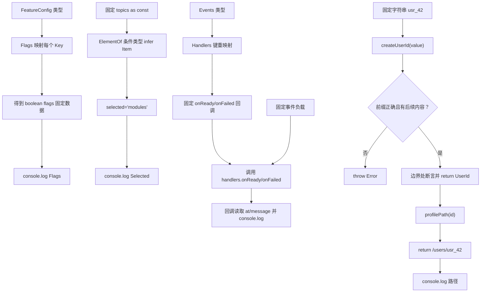

# DAY29 · Practice 01：SDK 类型派生与品牌 ID

[返回当天课程](../README.md)

## 文件位置

- 作答文件：[practice.ts](../../../day29/practice01/practice.ts)
- 完整参考答案：[solution.ts](../../../day29/practice01/solution.ts)
- 答案调用说明：[SOLUTION.md](./SOLUTION.md)

这是一道完整、独立的主练习。不要导入其他 practice 文件夹中的代码。

## 场景背景

平台 SDK 需要从已有配置、主题列表和事件负载中派生界面类型，同时保证用户编号只能由经过格式验证的字符串创建。若每次都手写相似类型，来源模型变化后很容易遗漏字段；若普通字符串能冒充用户编号，请求路径也可能指向错误资源。你需要产出与来源类型同步的标记、主题和事件处理结果，并生成经过验证的用户资料路径。

## 数据流

先沿变量名看数据怎样分叉和汇合；`──>` 表示值被交给下一步。

```text
FeatureConfig ──> Flags<T> ──> flags
topics as const ──> ElementOf<T> ──> Topic ──> selected
Events ──> 键重映射 ──> Handlers<Events> ──> handlers
原始字符串 ──> createUserId ──> UserId ──> profilePath
四条类型派生结果 ──> 输出
```


## 代码流程图

下面这张图按实际执行顺序展开；菱形是判断，箭头上的文字表示走哪条分支。



## 起始代码

以下代码提前给出固定数据、函数签名、调用位置和输出位置。代码可作为完整脚手架阅读；判断、循环、回调与 `return` 的正确实现仍留在 TODO 中。

```ts
type FeatureConfig = { darkMode: string; retries: number };
type Flags<T> = {
  // TODO：理解映射关系；保留全部键，并让值为 boolean。
  [Key in keyof T]: boolean;
};
type ElementOf<T> = T extends readonly (infer Item)[] ? Item : never;
type Events = { ready: { at: number }; failed: { message: string } };
type Handlers<T> = {
  // TODO：理解键重映射与回调负载的对应关系。
  [Key in keyof T as `on${Capitalize<Key & string>}`]: (payload: T[Key]) => void;
};
declare const userIdBrand: unique symbol;
type UserId = string & { readonly [userIdBrand]: true };
function createUserId(value: string): UserId {
  // TODO：判断格式；失败 throw；通过后 return 品牌 ID。
  return value as UserId;
}
function profilePath(id: UserId): string { return `/users/${id}`; }

const flags: Flags<FeatureConfig> = { darkMode: true, retries: false };
const topics = ["types", "modules"] as const;
type Topic = ElementOf<typeof topics>;
const selected: Topic = "modules";
const handlers: Handlers<Events> = {
  onReady(payload) {
    // TODO：使用 payload.at。
    console.log(`Ready at ${payload.at}`);
  },
  onFailed(payload) {
    // TODO：使用 payload.message。
    console.log(`Failed: ${payload.message}`);
  },
};
console.log(`Flags: dark=${flags.darkMode}, retries=${flags.retries}`);
console.log(`Selected: ${selected}`);
handlers.onReady({ at: 29 });
handlers.onFailed({ message: "invalid" });
const userId = createUserId("usr_42");
console.log(profilePath(userId));
```


## 任务要求

1. 用映射类型生成布尔 flags，用条件类型与 `infer` 提取数组元素。
2. 用键重映射生成 `onReady`、`onFailed`，两个回调读取各自负载。
3. `createUserId` 先验证 `usr_` 前缀和后续内容，再在唯一边界创建品牌值。
4. 固定 flags、topic、事件负载和用户 id 必须通过派生类型检查。

## 精确期望输出

```text
Flags: dark=true, retries=false
Selected: modules
Ready at 29
Failed: invalid
/users/usr_42
```

## 本题易漏语法

映射类型在类型花括号中迭代键，模板字面量类型用反引号；这些类型语法不生成运行时对象。

## 写完后自检

- 给 `FeatureConfig` 增加一个字段、给 `Events` 增加 `closed` 事件后，哪些派生对象会立刻要求你补内容？
- 为什么 `ElementOf` 用条件类型与 `infer`，而 `Flags` 用映射类型？它们读取来源类型的方式有什么不同？
- 把 `"abc"` 直接断言成 `UserId` 为什么会破坏品牌类型的意义？构造器还承担哪一段运行时责任？

## 文件

- 在 `practice.ts` 中独立作答。
- 独立完成后，再查看完整的 `solution.ts`，并用 `SOLUTION.md` 对照直接调用逻辑。
