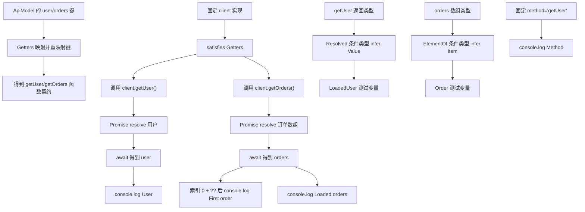

# DAY29 · Practice 02：API 客户端类型派生

[返回当天课程](../README.md)

## 文件位置

- 作答文件：[practice.ts](../../../day29/practice02/practice.ts)
- 完整参考答案：[solution.ts](../../../day29/practice02/solution.ts)
- 答案调用说明：[SOLUTION.md](./SOLUTION.md)

这题不再生成表单开关。你会从一份 API 数据模型派生方法名、异步结果和数组元素类型，并把编译阶段的派生关系连接到真实客户端调用。

## 场景背景

后台 SDK 提供 `user` 与 `orders` 两类资源。团队希望资源键自动生成 `getUser`、`getOrders` 方法，调用 Promise 后能取得内部值类型，订单列表还要能单独提取一项的类型。若手写第二份方法表或把异步结果统一写成 `unknown`，模型增加资源后很容易漏实现，调用处也会失去字段提示。

## 数据流

先沿变量名看数据怎样分叉和汇合；`──>` 表示值被交给下一步。

```text
ApiModel 的资源键
   ├── GetterName<"user"> ──> "getUser"
   └── Getters<ApiModel> ──> getUser / getOrders 方法契约
client.getUser() ──> Promise<User> ──> Resolved<T> ──> User
ApiModel["orders"] ──> ElementOf<T> ──> Order
真实客户端调用 ──> user + orders ──> 可观察输出
```


## 代码流程图

下面这张图按实际执行顺序展开；菱形是判断，箭头上的文字表示走哪条分支。



## 起始代码

以下代码提前给出固定数据、函数签名、调用位置和输出位置。代码可作为完整脚手架阅读；判断、循环、回调与 `return` 的正确实现仍留在 TODO 中。

```ts
type ApiModel = {
  user: { readonly id: string; name: string };
  orders: readonly { readonly id: string; item: string }[];
};
type GetterName<Name extends string> = `get${Capitalize<Name>}`;
type Getters<T> = {
  // TODO：理解键重映射怎样连接资源与 Promise 返回值。
  [Key in keyof T as Key extends string ? GetterName<Key> : never]:
    () => Promise<T[Key]>;
};
type Resolved<T> = T extends Promise<infer Value> ? Value : T;
type ElementOf<T> = T extends readonly (infer Item)[] ? Item : never;

const client = {
  async getUser(): Promise<ApiModel["user"]> {
    // TODO：return 固定用户。
    return { id: "", name: "" };
  },
  async getOrders(): Promise<ApiModel["orders"]> {
    // TODO：return keyboard、mouse 两项。
    return [];
  },
} satisfies Getters<ApiModel>;

type LoadedUser = Resolved<ReturnType<typeof client.getUser>>;
type Order = ElementOf<ApiModel["orders"]>;
const checkedUser: LoadedUser = { id: "usr_1", name: "Ada" };
const checkedOrder: Order = { id: "order_1", item: "keyboard" };
void checkedUser;
void checkedOrder;

const method: GetterName<"user"> = "getUser";
const user = await client.getUser();
const orders = await client.getOrders();
console.log(`Method: ${method}`);
console.log(`User: ${user.name}`);
console.log(`First order: ${orders[0]?.item ?? "none"}`);
console.log(`Loaded orders: ${orders.length}`);
```

## 和 Practice 01 的区别

Practice 01 从配置、事件和字符串品牌派生多类工具，还包含运行时 ID 验证。本题只有一个 API 资源表作为来源：映射和模板字面量生成 getter 契约，两个 `infer` 工具分别拆 Promise 与数组；运行时还要真正实现并调用两个异步资源方法。

## 任务要求

1. 声明 `ApiModel`：`user` 为 `{ id: string; name: string }`，`orders` 为只读订单数组，订单含 `id` 与 `item`。
2. `GetterName<Name>` 用模板字面量把 `user` 变成 `getUser`；`Getters<T>` 用映射类型和键重映射，为每种资源生成返回 `Promise<T[Key]>` 的无参方法。
3. `Resolved<T>` 用条件类型和 `infer` 取得 Promise 内部值，非 Promise 保留原类型；`ElementOf<T>` 只提取只读数组元素。
4. 创建满足 `Getters<ApiModel>` 的客户端：用户为 Ada；订单为 keyboard、mouse。输出方法名、用户名、第一件商品和订单数。
5. 这些类型只约束已有运行时代码，不会自动创建客户端方法；两个异步方法仍要亲自实现。

- 不得导入 `practice01` 或直接调用其他练习的实现。
- 输出必须由变量、计算或函数返回值产生，不把整行结果写死。
- 每个参数、局部变量和返回值都应能在流程图中找到位置。

## 精确期望输出

```text
Method: getUser
User: Ada
First order: keyboard
Loaded orders: 2
```

## 写完后自检

- 给 `ApiModel` 增加 `settings` 资源后，`Getters<ApiModel>` 会要求客户端增加什么？如果没实现，哪里应该报错？
- 为什么生成 `getUser`/`getOrders` 用映射类型和模板字面量，而提取 Promise 内容用条件类型与 `infer`？
- 如果订单数组为空，第一项的运行时值是什么？`ElementOf` 能不能替你保证数组一定非空？

## 文件

在上方链接的 `practice.ts` 作答；独立完成后再查看完整的 `solution.ts`，并用 `SOLUTION.md` 对照直接调用逻辑。
