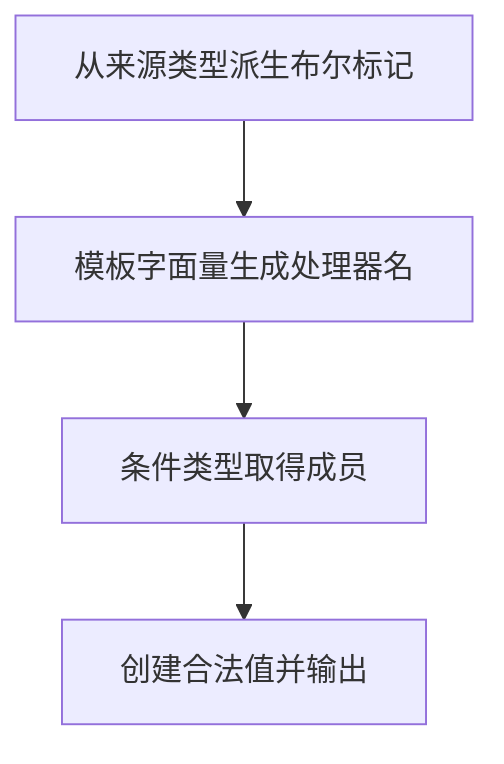

# DAY29 · Practice 02：界面类型派生

[返回当天课程](../README.md)

## 文件位置

- 作答文件：[practice.ts](../../../day29/practice02/practice.ts)
- 结构提示代码：[solution.ts](../../../day29/practice02/solution.ts)
- 方案说明：[SOLUTION.md](./SOLUTION.md)

这是一道与 Practice 01 文件完全分开的闭卷迁移题。先理解并运行当天 `example.ts`，然后关闭它；不要复制代码，仅根据下面的流程与输出从空白重新实现。

## 场景背景

前端团队正在为课程设置页生成开关、主题选项和事件处理器，这些界面模型都应来自同一份领域类型。输入类型以后可能新增字段或事件，手工复制会让界面与业务模型逐渐不一致，甚至出现缺失处理器。你需要通过类型派生得到同步结构，并输出当前标记、选中主题、处理器名称和课程标题。

## 代码流程图



## 必须练到的能力

从现有类型派生映射、条件或模板字面量类型，避免重复手写。

- 不得导入 `practice01` 或直接调用其他练习的实现。
- 输出必须由变量、计算或函数返回值产生，不把整行结果写死。
- 每个参数、局部变量和返回值都应能在流程图中找到位置。

## 精确期望输出

```text
Flags: true/false
Topic: modules
Handler: onReady
Title: Advanced types
```

## 文件

在上方链接的 `practice.ts` 作答；独立完成后再查看 `solution.ts` 的 TODO 代码骨架与 `SOLUTION.md` 的解题结构；两者都不提供完整答案。
