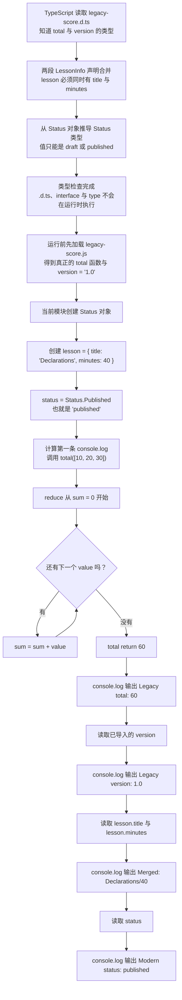

# Day 30（选修）｜声明文件与旧式 TypeScript

你接手了一个旧 JavaScript 模块：运行时已经有 `score.js`，但 TypeScript 不知道它接收什么参数、返回什么值。`.d.ts` 的作用是把这份现有行为告诉编译器；它不会替你创建函数，也不会修正写错的 JavaScript。

今天学习怎样对照真实 JS 写声明文件，再看声明合并、旧 `enum` 和 `namespace`。这些知识主要用于读取和维护旧代码，新项目不需要为了“更像 TypeScript”主动复制旧式写法。

建议用时：60–90 分钟。

## 今天会学到

- 理解 `.d.ts` 只描述运行时，不生成 JavaScript；
- 对照 JavaScript 导出与声明文件；
- 识别同名 interface 的声明合并；
- 把旧 enum 归一化成现代字面量状态；
- 知道错误声明会让编译器相信不真实的行为。

## 写 Example 前先认识这些写法

### `import * as`：把模块导出收进一个对象

`import * as legacyScore from "./score.js"` 是 JavaScript 模块语法。运行时模块系统读取 `"./score.js"`，再让 `legacyScore` 指向一个“模块命名空间对象”；之后用 `legacyScore.score`、`legacyScore.version` 读取这个模块真正导出的成员。

```ts
import * as legacyScore from "../../day30/score.js";

console.log(legacyScore.version);
console.log(legacyScore.score([10, 20]));
```

实际输出：

```text
1.0
30
```

这里的“模块命名空间对象”不是 TypeScript 的 `namespace` 关键字，也不会把模块内容复制到全局。路径拼错、真实 JS 没有该导出，运行时仍会失败；`.d.ts` 只能描述这些成员，不能创造它们。

### `.prototype`：通过本地声明合并给已有类补上运行时方法

JavaScript 类构造函数自带 `.prototype` 对象。实例读取自身没有的成员时，会继续到这个原型对象上查找。`ArchiveRecord.prototype.describe = function (...) { ... }` 的左边是要安装方法的位置，右边的普通函数是实际实现；以后所有 `ArchiveRecord` 实例都能找到它。

```ts
class ArchiveRecord {
  constructor(public fileCount: number) {}
}

// 与上面的 class 位于同一作用域、名称也相同：
// TypeScript 会把这两个声明合在一起。
interface ArchiveRecord {
  describe(): string;
}

console.log(typeof ArchiveRecord.prototype.describe);

ArchiveRecord.prototype.describe = function (
  this: ArchiveRecord,
): string {
  return `Archived files: ${this.fileCount}`;
};

console.log(new ArchiveRecord(3).describe());
```

实际输出：

```text
undefined
Archived files: 3
```

这里使用的是**本地声明合并**：同一作用域中的 `class ArchiveRecord` 和 `interface ArchiveRecord` 名称相同，所以 TypeScript 把两份类型信息合在一起。它不是模块增强。`interface` 只让编译器知道实例可以调用 `describe()`；给 `.prototype` 赋值，才真正把方法安装到 JavaScript 运行时。

如果类来自另一个模块，才需要写 `declare module "./模块路径.js" { ... }` 来做**模块增强**，而且这里的路径必须和 `import` 使用的路径一致。模块增强同样只补充类型信息，不会生成方法实现；仍然要给原型赋值。原型补丁会影响该构造函数创建的所有实例，且普通函数里的动态 `this` 才会指向实例；不要在这里随手换成箭头函数。

## 核心讲解

```text
真实 JavaScript 行为 ←必须吻合→ .d.ts 声明 ←供检查→ TypeScript 调用者
```

一次导入要经过两个阶段：

| 阶段 | 读取什么 | 如果缺失或写错会怎样 |
| --- | --- | --- |
| TypeScript 检查 | `score.d.ts` 中的参数和返回类型 | 声明写错时，编译器会相信错误信息 |
| JavaScript 运行 | `score.js` 中真正执行的函数 | 实现不存在时，即使类型检查通过也会在运行时报错 |

例如真实 `score.js` 返回 `number`，声明却写成 `string`，编辑器会允许调用字符串方法；程序运行后拿到的仍是数字。反过来，声明中写了 `declare function`，也不会生成这个函数。`.d.ts` 必须像一份准确目录，逐项描述已经存在的运行时行为。

两个同名 `interface LessonInfo` 会把字段合在一起，所以最后的对象同时需要 `title` 和 `minutes`。这叫“声明合并”，常用于扩展外部声明。`type` 别名不能用同样方式重复声明。

`enum` 和 `namespace` 在历史 TypeScript 代码中很常见。新模块中的固定状态通常可以写成 `as const` 对象，再从对象值生成字面量联合。这样运行时有普通对象，类型检查阶段也只接受 `"draft"` 或 `"published"`。这里学习旧写法是为了正确接入旧边界，不表示新代码都要使用它们。

## 为什么要这样设计

旧 JavaScript 已经能运行，却没有参数和返回值说明；若每个 TypeScript 调用者都靠猜，错误会反复出现。声明文件让编译器在不改动现有 JavaScript 的情况下检查导入和调用，相当于给既有运行时行为配一份可读取的类型目录。

编译器只负责相信并使用这份目录，维护者仍要逐项核对真实导出、参数、返回值和版本变化。这里最大的边界也是代价：`.d.ts` 写错会制造“检查通过”的假安全，它既不会生成缺失的实现，也不会验证算法结果；旧模块行为一变，声明和运行测试都可能需要同步更新。

## 从检查到运行追踪一次

调用者写 `score([10, 20])` 时，TypeScript 先根据 `score.d.ts` 检查参数，并推断返回值类型；真正执行时，Node 再从 `score.js` 找到实现并计算结果。声明和实现都要存在，而且对同一行为说法一致。业务规则是否正确，例如开始忽略负数，则要由运行测试检查，`.d.ts` 看不出来。

## Example 实际输出

运行 `example.ts` 后，终端会按下面的顺序显示。先用代码推测结果，再逐行对照：

```text
Legacy total: 60
Legacy version: 1.0
Merged: Declarations/40
Modern status: published
```

## Example 代码流程图

运行 `example.ts` 前先沿图预测执行顺序；运行后再把每个节点对应到代码行。



## 官方手册扩展阅读（可选）

完成当天教程后，如果还想加深理解，再到 [Day 30 官方手册索引](../OFFICIAL-READING.md#day-30) 只选 1 篇阅读；这不是开始练习前的必修内容。

## 独立练习导航

本日共有 2 道独立练习。每道题都有单独目录、题目说明、作答文件、完整参考答案和调用逻辑说明；题目之间不共享代码。

| 目录 | 场景 | 类型 |
| --- | --- | --- |
| [practice01](./practice01/README.md) | 旧计分模块兼容入口 | 主任务 |
| [practice02](./practice02/README.md) | 旧模块声明适配 | 闭卷迁移 |

右击任意练习目录中的 `practice.ts` 即可单独检查；命令行也可运行 `npm run beginner -- day30 practice02`。

## 常见错误

- 以为 `.d.ts` 会生成实现；
- 声明与真实 JS 的参数或返回类型不一致；
- 期待 type alias 像 interface 一样合并；
- 新模块继续用 namespace 组织代码；
- 用断言掩盖错误声明。

### 错误代码示例

监控包升级后，`summarize` 从“只返回平均值”改成了“返回平均值和样本数”。运行时文件已经更新，声明文件仍保留旧返回类型。

`metrics.js` 是真实运行时代码：

```js
export function summarize(samples) {
  const total = samples.reduce((sum, sample) => sum + sample, 0);
  return {
    average: total / samples.length,
    sampleCount: samples.length,
  };
}
```

`metrics.d.ts` 忘记同步：

```ts
export declare function summarize(
  samples: readonly number[],
): number;
```

`report.ts` 正确导入了函数，但 TypeScript 只能依据错误的 `.d.ts` 检查：

```ts
import { summarize } from "./metrics.js";

const result = summarize([120, 180]);
console.log(result.toFixed(0));
// ❌ 运行时 result 是对象，常见结果是：
// TypeError: result.toFixed is not a function
```

这段调用会通过类型检查，因为声明声称 `result` 是 `number`。Node 实际执行 `metrics.js` 后得到对象，直到调用 `toFixed` 才失败。错误声明会把一份错误契约传播给所有调用者。

模块增强有另一条边界。假设旧包提供下面两个文件：

`legacy-device.js`：

```js
export class LegacyDevice {
  constructor(serial) {
    this.serial = serial;
  }
}
```

`legacy-device.d.ts`：

```ts
export declare class LegacyDevice {
  constructor(serial: string);
  readonly serial: string;
}
```

调用方可以增强类型，但只写声明不会安装方法：

```ts
import { LegacyDevice } from "./legacy-device.js";

declare module "./legacy-device.js" {
  interface LegacyDevice {
    displayName(): string;
  }
}

const device = new LegacyDevice("A-17");
device.displayName();
// ❌ 类型检查相信 displayName 存在，运行时原型上却没有它：
// TypeError: device.displayName is not a function
```

### 正确写法

先让声明文件忠实描述 `metrics.js`：

```ts
// metrics.d.ts
export interface MetricSummary {
  average: number;
  sampleCount: number;
}

export declare function summarize(
  samples: readonly number[],
): MetricSummary;
```

调用方随后按对象读取：

```ts
// report.ts
import { summarize } from "./metrics.js";

const result = summarize([120, 180]);
console.log(result.average.toFixed(0));
console.log(result.sampleCount);
```

原型扩展则按“导入构造函数、增强类型、安装实现、创建实例”的顺序写在同一个模块中：

```ts
// device-label.ts
import { LegacyDevice } from "./legacy-device.js";

declare module "./legacy-device.js" {
  interface LegacyDevice {
    displayName(): string;
  }
}

// ✅ declare module 只补类型；这行赋值才把方法装到真实原型上。
LegacyDevice.prototype.displayName = function (
  this: LegacyDevice,
): string {
  return `Device ${this.serial}`;
};

const device = new LegacyDevice("A-17");
console.log(device.displayName());
```

`declare module` 中的路径必须与导入路径一致，增强的也必须是目标模块已有的命名导出。导入让当前文件拿到运行时的 `LegacyDevice` 构造函数；接口增强让编译器认识 `displayName`；原型赋值才提供真实实现。维护这类边界时要同时做类型检查和运行测试。

## 面试时怎么回答

**问：** `.d.ts`、声明合并、模块增强和 `enum` 各自有什么运行时边界？

**可以直接这样回答：**

`.d.ts` 只包含类型信息，不生成 JavaScript，所以它必须忠实描述已经存在的运行时值。声明合并是编译器把同名声明组合成一个定义，最常见的是 interface 合并；它不是把两个普通对象在运行时合并。模块增强会把新增成员并入现有模块的类型，但真实方法仍要由原模块或原型补丁提供。

普通 `enum` 同时创建类型和值，通常会产生运行时代码；`interface` 和 `type` 只存在于类型层。维护第三方扩展时，我会先导入目标模块，再增强它的命名导出类型，并确保另有代码安装实现。错误 `.d.ts` 会让编译器相信不存在的行为，所以声明更新要和运行测试、包版本一起管理。

官方参考：[TypeScript `.d.ts` Files](https://www.typescriptlang.org/docs/handbook/2/type-declarations.html#dts-files)、[Declaration Merging 与 Module Augmentation](https://www.typescriptlang.org/docs/handbook/declaration-merging.html)、[Modules Reference](https://www.typescriptlang.org/docs/handbook/modules/reference)

## 拓展思考（不要求写代码）

如果 `score.js` 实际开始忽略负数，但 `.d.ts` 完全没有变化，TypeScript 能发现这次业务行为变更吗？应由哪类测试保护它？
