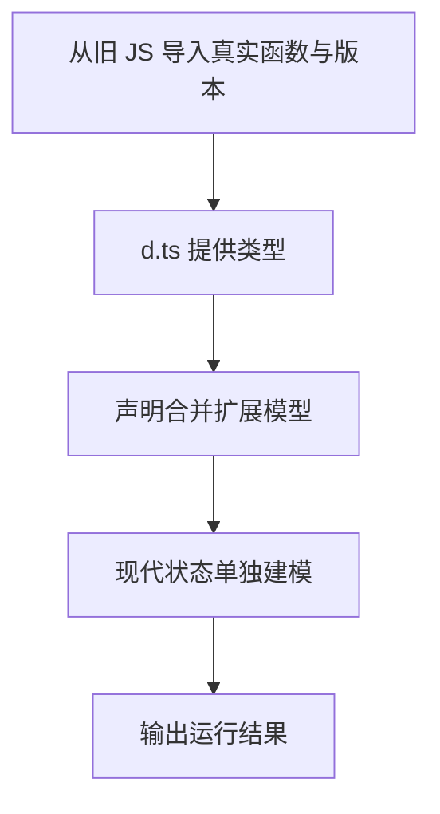

# Day 30（选修）｜声明文件与旧式 TypeScript

你接手了一个旧 JavaScript 模块：运行时已经有 `score.js`，但 TypeScript 不知道它接收什么参数、返回什么值。`.d.ts` 的作用是把这份现有行为告诉编译器；它不会替你创建函数，也不会修正写错的 JavaScript。

今天学习怎样对照真实 JS 写声明文件，再看声明合并、旧 `enum` 和 `namespace`。这些知识主要用于读取和维护旧代码，新项目不需要为了“更像 TypeScript”主动复制旧式写法。

建议用时：60–90 分钟。

## 今天会学到

- 理解 `.d.ts` 只描述运行时，不生成 JavaScript；
- 对照 JavaScript 导出与声明文件；
- 识别同名 interface 的声明合并；
- 把旧 enum 归一化成现代字面量状态；
- 知道错误声明会让编译器相信不真实的行为。

## 核心讲解

```text
真实 JavaScript 行为 ←必须吻合→ .d.ts 声明 ←供检查→ TypeScript 调用者
```

一次导入要经过两个阶段：

| 阶段 | 读取什么 | 如果缺失或写错会怎样 |
| --- | --- | --- |
| TypeScript 检查 | `score.d.ts` 中的参数和返回类型 | 声明写错时，编译器会相信错误信息 |
| JavaScript 运行 | `score.js` 中真正执行的函数 | 实现不存在时，即使类型检查通过也会在运行时报错 |

例如真实 `score.js` 返回 `number`，声明却写成 `string`，编辑器会允许调用字符串方法；程序运行后拿到的仍是数字。反过来，声明中写了 `declare function`，也不会生成这个函数。`.d.ts` 必须像一份准确目录，逐项描述已经存在的运行时行为。

两个同名 `interface LessonInfo` 会把字段合在一起，所以最后的对象同时需要 `title` 和 `minutes`。这叫“声明合并”，常用于扩展外部声明。`type` 别名不能用同样方式重复声明。

`enum` 和 `namespace` 在历史 TypeScript 代码中很常见。新模块中的固定状态通常可以写成 `as const` 对象，再从对象值生成字面量联合。这样运行时有普通对象，类型检查阶段也只接受 `"draft"` 或 `"published"`。这里学习旧写法是为了正确接入旧边界，不表示新代码都要使用它们。

## 从检查到运行追踪一次

调用者写 `score([10, 20])` 时，TypeScript 先根据 `score.d.ts` 检查参数，并推断返回值类型；真正执行时，Node 再从 `score.js` 找到实现并计算结果。声明和实现都要存在，而且对同一行为说法一致。业务规则是否正确，例如开始忽略负数，则要由运行测试检查，`.d.ts` 看不出来。

## Example 实际输出

运行 `example.ts` 后，终端会按下面的顺序显示。先用代码推测结果，再逐行对照：

```text
Legacy total: 60
Legacy version: 1.0
Merged: Declarations/40
Modern status: published
```

## Example 代码流程图

运行 `example.ts` 前先沿图预测执行顺序；运行后再把每个节点对应到代码行。



## 独立练习导航

本日共有 2 道独立练习。每道题都有单独目录、说明、作答文件和解题结构提示；题目之间不共享代码。

| 目录 | 场景 | 类型 |
| --- | --- | --- |
| [practice01](./practice01/README.md) | Day 30 · 声明文件与旧代码独立综合题 | 主任务 |
| [practice02](./practice02/README.md) | 旧模块声明适配 | 闭卷迁移 |

右击任意练习目录中的 `practice.ts` 即可单独检查；命令行也可运行 `npm run beginner -- day30 practice02`。

## 常见错误

- 以为 `.d.ts` 会生成实现；
- 声明与真实 JS 的参数或返回类型不一致；
- 期待 type alias 像 interface 一样合并；
- 新模块继续用 namespace 组织代码；
- 用断言掩盖错误声明。

### 错误代码示例

```ts
// score.js 的真实实现返回 number：
export function score(values) {
  return values.reduce((sum, value) => sum + value, 0);
}

// score.d.ts 却这样声明：
export declare function score(values: number[]): string;
// ❌ 声明让编译器相信了错误的返回类型，却不会改变真实 JS。
```

### 正确写法

```ts
// score.d.ts 必须忠实描述 score.js 已存在的参数与返回值：
export declare function score(values: readonly number[]): number;

// ✅ .d.ts 只提供类型；运行时仍由 score.js 提供真正实现。
import { score } from "./score.js";
console.log(score([10, 20]).toFixed(0));
```

## 拓展思考（不要求写代码）

如果 `score.js` 实际开始忽略负数，但 `.d.ts` 完全没有变化，TypeScript 能发现这次业务行为变更吗？应由哪类测试保护它？

## 官方资料

- [Type Declarations](https://www.typescriptlang.org/docs/handbook/2/type-declarations.html)
- [Declaration Files](https://www.typescriptlang.org/docs/handbook/declaration-files/introduction.html)
- [Declaration Merging](https://www.typescriptlang.org/docs/handbook/declaration-merging.html)
- [Enums](https://www.typescriptlang.org/docs/handbook/enums.html)
