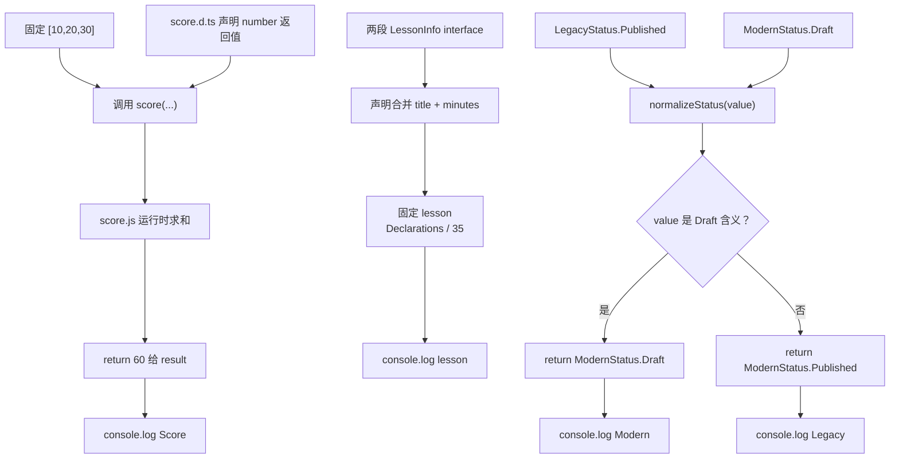

# DAY30 · Practice 01：旧计分模块兼容入口

[返回当天课程](../README.md)

## 文件位置

- 作答文件：[practice.ts](../../../day30/practice01/practice.ts)
- 完整参考答案：[solution.ts](../../../day30/practice01/solution.ts)
- 答案调用说明：[SOLUTION.md](./SOLUTION.md)

这是一道完整、独立的主练习。不要导入其他 practice 文件夹中的代码。

## 场景背景

团队正在把一个仍在生产环境使用的旧 JavaScript 计分模块接入 TypeScript 课程系统，运行时实现不能随意修改，只能由声明文件诚实描述。若 `.d.ts` 写出的导出或返回类型与真实 JS 不一致，编译器会给出虚假的安全感，错误要到运行时才暴露。你需要验证旧模块的真实结果，建立合并后的课程模型，并把旧状态与现代状态统一成可输出的形式。

## 数据流

先沿变量名看数据怎样分叉和汇合；`──>` 表示值被交给下一步。

```text
score.js 的真实行为 ──> score.d.ts 声明 ──> TypeScript 调用检查
数字数组 ──> score(...) ──> result
两段 LessonInfo 声明 ──> 声明合并 ──> lesson
LegacyStatus / ModernStatus ──> normalizeStatus ──> 现代状态
运行时结果 ──> 输出并核对声明
```


## 代码流程图

下面这张图按实际执行顺序展开；菱形是判断，箭头上的文字表示走哪条分支。



## 起始代码

以下代码提前给出固定数据、函数签名、调用位置和输出位置。代码可作为完整脚手架阅读；判断、循环、回调与 `return` 的正确实现仍留在 TODO 中。

```ts
import { score } from "../score.js";
interface LessonInfo { title: string; }
interface LessonInfo { minutes: number; }
enum LegacyStatus { Draft, Published }
const ModernStatus = { Draft: "draft", Published: "published" } as const;
type ModernStatus = (typeof ModernStatus)[keyof typeof ModernStatus];

function normalizeStatus(value: LegacyStatus | ModernStatus): ModernStatus {
  // TODO：判断旧/新状态含义并 return 现代值。
  void value;
  return ModernStatus.Draft;
}
const result: number = score([10, 20, 30]);
const lesson: LessonInfo = { title: "Declarations", minutes: 35 };
console.log(`Score: ${result}`);
console.log(`${lesson.title}: ${lesson.minutes} minutes`);
console.log(`Legacy: ${normalizeStatus(LegacyStatus.Published)}`);
console.log(`Modern: ${normalizeStatus(ModernStatus.Draft)}`);
```


## 任务要求

1. 从旧模块导入 `score`，让 `.d.ts` 与真实 `.js` 一起约束固定调用。
2. 用两段同名 `LessonInfo` 演示接口合并。
3. 声明旧数字枚举与现代字符串状态，并在 `normalizeStatus` 中统一含义。
4. 不要修改辅助 JavaScript 或声明文件来迎合入口代码。

## 精确期望输出

```text
Score: 60
Declarations: 35 minutes
Legacy: published
Modern: draft
```

## 本题易漏语法

.d.ts 只写声明不写实现；声明以分号结束，并与 JS 的真实导出和结果一致。

## 写完后自检

- 如果 `score.js` 开始返回字符串，但 `.d.ts` 仍声明 number，类型检查和运行时会各自相信什么？
- 为什么两个同名 `interface LessonInfo` 能合并，而重复声明两个同名 `type LessonInfo` 不行？
- `normalizeStatus` 为什么需要运行时代码，`ModernStatus` 的字面量联合本身不能完成哪一步转换？

## 文件

- 在 `practice.ts` 中独立作答。
- 独立完成后，再查看完整的 `solution.ts`，并用 `SOLUTION.md` 对照直接调用逻辑。
