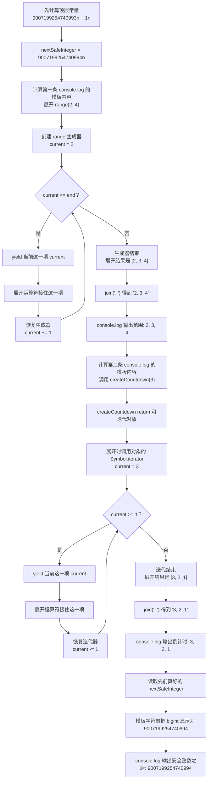

# Day 31（选修）｜迭代协议、生成器与 `bigint`

## 写 Example 前先认识这些写法

### `[Symbol.iterator]()` 与 `next()`：约定“下一个值怎样拿”

`Symbol.iterator` 是 JavaScript 提供的标准符号，`for...of` 和展开语法都认识它。对象上的 `[Symbol.iterator]()` 不接收参数，返回一次新的迭代器；迭代器的 `.next()` 也通常不接收参数，每调用一次就返回 `{ value, done }`。

```ts
const values = [10, 20];
const iterator = values[Symbol.iterator]();

console.log(iterator.next());
console.log(iterator.next());
console.log(iterator.next());
```

实际输出的字段是：

```text
{ value: 10, done: false }
{ value: 20, done: false }
{ value: undefined, done: true }
```

点号左边的 `values` 是可迭代对象，点号左边的 `iterator` 保存这一次遍历走到哪里。方括号不能省略，拼写是大写的 `Symbol`、小写的 `iterator`。若把当前位置放在可迭代对象外层，两次遍历会错误地共用进度；每次调用 `[Symbol.iterator]()` 都应得到独立状态。

### `BigInt` 与 JSON 的转换边界

`bigint` 是 JavaScript 的精确整数类型。可以写 `9007199254740993n`，也可以调用内置函数 `BigInt("9007199254740993")`；后者接收可转换的整数文本并返回 `bigint`。不能写 `new BigInt(...)`，也不能把 `bigint` 与普通 `number` 直接相加。

`JSON.stringify(value, replacer)` 由 JavaScript 内置的 `JSON` 对象提供。第一个参数是要变成 JSON 文本的值；可选的第二个参数 `replacer` 会逐项接收键和值，并把它返回的内容写入 JSON；最终返回 JSON 字符串。原生 JSON 不认识 `bigint`，所以本例在边界处明确转成字符串：

```ts
const payload = { id: 9_007_199_254_740_993n };
const text = JSON.stringify(payload, (_key, value: unknown) =>
  typeof value === "bigint" ? value.toString() : value,
);

console.log(text);
```

实际输出：

```text
{"id":"9007199254740993"}
```

`value.toString()` 中点号左边是当前 `bigint`，不传参数时返回十进制字符串。这个转换解决了 JSON 无法序列化 `bigint` 的问题，但读取 JSON 后得到的仍是字符串，不会自动恢复成 `bigint`；发送方和接收方必须共同约定该字段的格式。

调用 `range(2, 4)` 时，程序不会立刻一次算出 `[2, 3, 4]`。它先返回一个能“交出下一个值”的对象；展开语法每要一次值，函数才运行到下一个 `yield`。这适合按需产生序列。

今天还会处理超过普通 `number` 精确范围的整数。`9_007_199_254_740_993n + 1n` 两边都带 `n`，结果仍是 `bigint`；进入 JSON 前要明确转成字符串。

建议用时：60–90 分钟。

## 今天会学到

- 区分 iterable 与 iterator；
- 理解 `[Symbol.iterator]()`、`next()` 和 IteratorResult；
- 用 `function*`、`yield` 惰性产生值；
- 安全计算并序列化 bigint。

## 核心讲解

### iterable 和 iterator 分别是什么

可以把一次遍历拆成“从哪里开始”和“现在走到哪里”：

- iterable（可迭代对象）提供 `[Symbol.iterator]()`，表示“请创建一次遍历”。
- iterator（迭代器）保存这一次遍历的当前位置，并提供 `next()`。
- `next()` 返回 `{ done, value }`。`done: false` 表示还有值；`done: true` 表示遍历结束。`for...of` 和展开语法会替你反复调用这套协议。

对 `range(2, 4)` 连续请求时，过程如下：

| 请求 | 返回的主要内容 | 函数停在哪里 |
| --- | --- | --- |
| 第一次 `next()` | `value: 2, done: false` | 第一个 `yield` |
| 第二次 `next()` | `value: 3, done: false` | 第二个 `yield` |
| 第三次 `next()` | `value: 4, done: false` | 第三个 `yield` |
| 第四次 `next()` | `done: true` | 函数结束 |

`function*` 写出的生成器会自动保存当前位置。执行到 `yield` 时，它暂时把值交出去并暂停；下一次 `next()` 再从暂停处继续。`return` 则结束这次遍历。

生成器对象通常只能从头到尾消费一次。要重新遍历，就重新调用生成器函数，创建新的迭代器。数据量很小、还要反复使用 `map` 和 `filter` 时，直接生成数组通常更容易读。

### `bigint` 不能和 `number` 混着算

`1` 是 `number`，`1n` 是 `bigint`，两者不能直接相加。原生 `JSON.stringify` 也不能直接序列化 `bigint`。示例先调用 `nextId.toString()`，JSON 中保存字符串；读取时再按照双方约定转换回来。这样不会在 JSON 边界悄悄丢掉大整数精度。

## 为什么要这样设计

若先把很大甚至没有终点的序列全部放进数组，程序会提前占用大量内存，或永远等不到数组创建完成。迭代协议让使用者一次请求一个值，生成器替你保存暂停位置；`bigint` 则把超出安全范围的整数运算交给专门的精确整数类型。

你仍要决定序列是否包含起止值、什么时候结束，以及大整数进入 JSON 时采用什么字符串约定。生成器通常消费一次就结束，无限序列若被直接展开仍会卡住；`bigint` 也不能和 `number` 混算，原生 JSON 不认识它，所以按需计算和精度保护都伴随着明确的使用边界。

## 函数变量追踪

跟踪 `range(2, 4)`：调用函数先得到迭代器；展开语法开始消费它；局部变量 `current` 依次是 `2`、`3`、`4`；每次 `yield current` 把当前值交给外部；循环结束后本次迭代永久完成。

所以 `yield` 和 `return` 不一样。`yield` 是“这次先给你一个值，我还可以继续”，`return` 是“这次调用结束，不再有后续值”。

## Example 实际输出

运行 `example.ts` 后，终端会按下面的顺序显示。先用代码推测结果，再逐行对照：

```text
范围: 2, 3, 4
倒计时: 3, 2, 1
安全整数之后: 9007199254740994
```

## Example 代码流程图

运行 `example.ts` 前先沿图预测执行顺序；运行后再把每个节点对应到代码行。



## 官方手册扩展阅读（可选）

完成当天教程后，如果还想加深理解，再到 [Day 31 官方手册索引](../OFFICIAL-READING.md#day-31) 只选 1 篇阅读；这不是开始练习前的必修内容。

## 独立练习导航

本日共有 2 道独立练习。每道题都有单独目录、题目说明、作答文件、完整参考答案和调用逻辑说明；题目之间不共享代码。

| 目录 | 场景 | 类型 |
| --- | --- | --- |
| [practice01](./practice01/README.md) | 惰性序列与大整数编号 | 主任务 |
| [practice02](./practice02/README.md) | 数字序列生成器 | 闭卷迁移 |

右击任意练习目录中的 `practice.ts` 即可单独检查；命令行也可运行 `npm run beginner -- day31 practice02`。

## 常见错误

- 混淆 iterable 与 iterator；
- 手写迭代器第一次就少 1；
- 把 yield 当普通 return；
- 写 `currentId + 1`；
- 直接 `JSON.stringify(nextId)`。

### 错误代码示例

日志系统想按每 2 行一组惰性读取数据，监控页面和归档任务会同时遍历同一个 iterable。这里会用到 `lines.slice(start, end)`：它创建一个新数组，包含 `start` 位置、但不包含 `end` 位置的元素，不会修改原数组。

如果批次位置写在 iterable 外层，两位消费者就会共享进度：

```ts
function createLogBatches(
  lines: readonly string[],
  batchSize: number,
): Iterable<readonly string[]> {
  let offset = 0;

  return {
    [Symbol.iterator](): Iterator<readonly string[]> {
      return {
        next(): IteratorResult<readonly string[]> {
          if (offset >= lines.length) {
            return { done: true, value: undefined };
          }

          const batch = lines.slice(offset, offset + batchSize);
          offset += batchSize;
          return { done: false, value: batch };
        },
      };
    },
  };
}

const batches = createLogBatches(
  ["login", "upload", "logout", "cleanup"],
  2,
);
const dashboard = batches[Symbol.iterator]();
const archive = batches[Symbol.iterator]();

console.log(dashboard.next().value?.join(", "));
console.log(archive.next().value?.join(", "));
// ❌ archive 得到第二批，而不是从第一批开始；offset 被两个 iterator 共享。
```

实际输出：

```text
login, upload
logout, cleanup
```

单独测试任意一位消费者时可能正常；两者交错调用后，一个任务会把另一个任务的日志批次“拿走”。每次 `[Symbol.iterator]()` 都应创建独立的遍历状态。

大整数边界还有一种更隐蔽的错误：

```ts
const balance = 12_345_678_901_234_567_890n;
const payload = JSON.stringify({ balance: Number(balance) });

console.log(payload);
// ❌ 为了绕开 JSON 的 bigint 限制而转成 number，账本金额已经改变。
```

实际会得到 `{"balance":12345678901234567000}`。程序成功生成 JSON，却改掉了原来的整数，财务系统接收后无法恢复丢失的数字。

### 正确写法

`Number.isInteger(value)` 是 JavaScript 的整数检查函数：传入整数时返回 `true`，传入小数、`NaN` 或无限值时返回 `false`。批次大小还必须大于 `0`，所以这里把“不是整数”和“小于等于 0”都当成无效输入，并抛出 `RangeError`。

```ts
function createLogBatches(
  lines: readonly string[],
  batchSize: number,
): Iterable<readonly string[]> {
  if (!Number.isInteger(batchSize) || batchSize <= 0) {
    throw new RangeError("batchSize 必须是正整数");
  }

  return {
    [Symbol.iterator](): Iterator<readonly string[]> {
      // ✅ 每次创建 iterator 时，都创建一份独立 offset。
      let offset = 0;

      return {
        next(): IteratorResult<readonly string[]> {
          if (offset >= lines.length) {
            return { done: true, value: undefined };
          }

          const batch = lines.slice(offset, offset + batchSize);
          offset += batchSize;
          return { done: false, value: batch };
        },
      };
    },
  };
}

const batches = createLogBatches(
  ["login", "upload", "logout", "cleanup"],
  2,
);
const dashboard = batches[Symbol.iterator]();
const archive = batches[Symbol.iterator]();
console.log(dashboard.next().value?.join(", "));
console.log(archive.next().value?.join(", "));

const balance = 12_345_678_901_234_567_890n;
const json = JSON.stringify(
  { balance },
  (_key, value: unknown) =>
    typeof value === "bigint"
      ? `bigint:${value.toString()}`
      : value,
);
// ✅ replacer 统一把 bigint 写成带标记的精确字符串。
```

两个 iterator 现在都会先输出 `login, upload`。JSON 中的余额是 `"bigint:12345678901234567890"`，没有经过 `number`。接收方可以按约定识别 `bigint:` 前缀，再决定是否恢复成 `bigint`。

如果调用 `createLogBatches(["login"], 0)`，函数会立即抛出：

```text
RangeError: batchSize 必须是正整数
```

这个校验不只是为了让报错更好看。若 `batchSize` 是 `0`，`offset += batchSize` 后仍然是 `0`，`next()` 会一直返回空批次并且永远到不了 `done: true`；若是负数，`offset` 还会向后移动，同样无法正常结束。先拒绝无效批次大小，可以避免调用方在 `for...of` 或展开操作中陷入无限迭代。

## 面试时怎么回答

**问：** iterable、iterator、generator、`Symbol.iterator` 和 `bigint` 怎么串起来解释？

**可以直接这样回答：**

iterable 是可被遍历的对象，它提供 `[Symbol.iterator]()`；这个方法返回 iterator。iterator 保存一次遍历的当前位置，并通过 `next()` 返回 `{ value, done }`。同一个对象可以同时实现两种协议，但可重复遍历的数据源通常应在每次 `[Symbol.iterator]()` 调用时创建独立状态。生成器函数每次调用都会返回 generator 对象，语言替我保存暂停位置，执行到 `yield` 时才按需产生下一个值。

`bigint` 用于需要精确表示的大整数，不能和 `number` 直接混算。原生 `JSON.stringify` 也不会默认序列化 bigint；在接口边界我会和接收方约定字符串格式，而不是先转成可能丢精度的 `number`。读取时再根据字段协议显式恢复。

官方参考：[MDN Iteration Protocols](https://developer.mozilla.org/en-US/docs/Web/JavaScript/Reference/Iteration_protocols)、[MDN `function*`](https://developer.mozilla.org/en-US/docs/Web/JavaScript/Reference/Statements/function*), [MDN `BigInt`](https://developer.mozilla.org/en-US/docs/Web/JavaScript/Reference/Global_Objects/BigInt)

## 拓展思考（不要求写代码）

如果序列没有终点，哪些消费方式仍可能安全，哪些写法（例如直接展开成数组）会导致程序无法结束？
