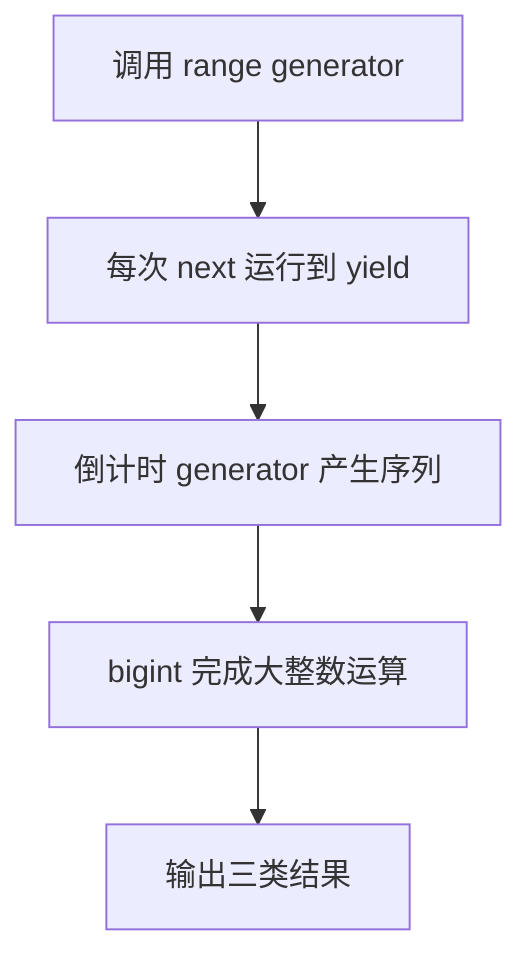

# Day 31（选修）｜迭代协议、生成器与 `bigint`

调用 `range(2, 4)` 时，程序不会立刻一次算出 `[2, 3, 4]`。它先返回一个能“交出下一个值”的对象；展开语法每要一次值，函数才运行到下一个 `yield`。这适合按需产生序列。

今天还会处理超过普通 `number` 精确范围的整数。`9_007_199_254_740_993n + 1n` 两边都带 `n`，结果仍是 `bigint`；进入 JSON 前要明确转成字符串。

建议用时：60–90 分钟。

## 今天会学到

- 区分 iterable 与 iterator；
- 理解 `[Symbol.iterator]()`、`next()` 和 IteratorResult；
- 用 `function*`、`yield` 惰性产生值；
- 安全计算并序列化 bigint。

## 核心讲解

### iterable 和 iterator 分别是什么

可以把一次遍历拆成“从哪里开始”和“现在走到哪里”：

- iterable（可迭代对象）提供 `[Symbol.iterator]()`，表示“请创建一次遍历”。
- iterator（迭代器）保存这一次遍历的当前位置，并提供 `next()`。
- `next()` 返回 `{ done, value }`。`done: false` 表示还有值；`done: true` 表示遍历结束。`for...of` 和展开语法会替你反复调用这套协议。

对 `range(2, 4)` 连续请求时，过程如下：

| 请求 | 返回的主要内容 | 函数停在哪里 |
| --- | --- | --- |
| 第一次 `next()` | `value: 2, done: false` | 第一个 `yield` |
| 第二次 `next()` | `value: 3, done: false` | 第二个 `yield` |
| 第三次 `next()` | `value: 4, done: false` | 第三个 `yield` |
| 第四次 `next()` | `done: true` | 函数结束 |

`function*` 写出的生成器会自动保存当前位置。执行到 `yield` 时，它暂时把值交出去并暂停；下一次 `next()` 再从暂停处继续。`return` 则结束这次遍历。

生成器对象通常只能从头到尾消费一次。要重新遍历，就重新调用生成器函数，创建新的迭代器。数据量很小、还要反复使用 `map` 和 `filter` 时，直接生成数组通常更容易读。

### `bigint` 不能和 `number` 混着算

`1` 是 `number`，`1n` 是 `bigint`，两者不能直接相加。原生 `JSON.stringify` 也不能直接序列化 `bigint`。示例先调用 `nextId.toString()`，JSON 中保存字符串；读取时再按照双方约定转换回来。这样不会在 JSON 边界悄悄丢掉大整数精度。

## 函数变量追踪

跟踪 `range(2, 4)`：调用函数先得到迭代器；展开语法开始消费它；局部变量 `current` 依次是 `2`、`3`、`4`；每次 `yield current` 把当前值交给外部；循环结束后本次迭代永久完成。

所以 `yield` 和 `return` 不一样。`yield` 是“这次先给你一个值，我还可以继续”，`return` 是“这次调用结束，不再有后续值”。

## Example 实际输出

运行 `example.ts` 后，终端会按下面的顺序显示。先用代码推测结果，再逐行对照：

```text
范围: 2, 3, 4
倒计时: 3, 2, 1
安全整数之后: 9007199254740994
```

## Example 代码流程图

运行 `example.ts` 前先沿图预测执行顺序；运行后再把每个节点对应到代码行。



## 独立练习导航

本日共有 2 道独立练习。每道题都有单独目录、说明、作答文件和解题结构提示；题目之间不共享代码。

| 目录 | 场景 | 类型 |
| --- | --- | --- |
| [practice01](./practice01/README.md) | Day 31 · 迭代器、生成器与 bigint 独立综合题 | 主任务 |
| [practice02](./practice02/README.md) | 数字序列生成器 | 闭卷迁移 |

右击任意练习目录中的 `practice.ts` 即可单独检查；命令行也可运行 `npm run beginner -- day31 practice02`。

## 常见错误

- 混淆 iterable 与 iterator；
- 手写迭代器第一次就少 1；
- 把 yield 当普通 return；
- 写 `currentId + 1`；
- 直接 `JSON.stringify(nextId)`。

### 错误代码示例

```ts
function* countdown(start: number): Generator<number> {
  let current = start;
  while (current >= 1) {
    current -= 1;
    yield current; // ❌ 先递减再 yield，第一次少 1，最后还会产出 0。
  }
}

const nextId = 9_007_199_254_740_993n + 1;
// ❌ bigint 不能和 number 直接混算。
JSON.stringify({ id: nextId }); // ❌ 原生 JSON 不能直接序列化 bigint。
```

### 正确写法

```ts
function* countdown(start: number): Generator<number, void, unknown> {
  for (let current = start; current >= 1; current -= 1) {
    yield current; // ✅ 先交出当前值，下一轮再递减。
  }
}

const nextId = 9_007_199_254_740_993n + 1n; // ✅ 两边都是 bigint。
const json = JSON.stringify({ id: nextId.toString() });
// ✅ 进入 JSON 边界前明确转为字符串，读取时再按约定恢复。
```

## 拓展思考（不要求写代码）

如果序列没有终点，哪些消费方式仍可能安全，哪些写法（例如直接展开成数组）会导致程序无法结束？

## 官方资料

- [Iterators and Generators](https://www.typescriptlang.org/docs/handbook/iterators-and-generators.html)
- [Symbols 与 Symbol.iterator](https://www.typescriptlang.org/docs/handbook/symbols.html#symboliterator)
- [BigInt](https://www.typescriptlang.org/docs/handbook/release-notes/typescript-3-2.html#bigint)
