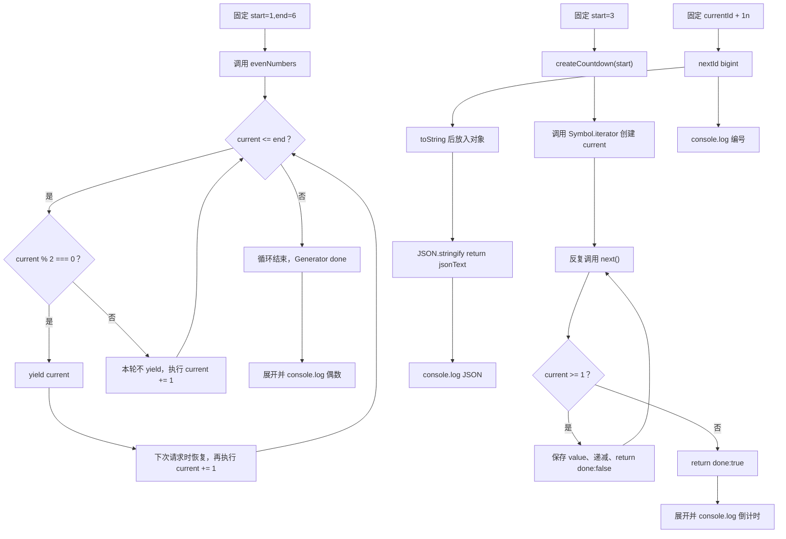

# DAY31 · Practice 01：惰性序列与大整数编号

[返回当天课程](../README.md)

## 文件位置

- 作答文件：[practice.ts](../../../day31/practice01/practice.ts)
- 完整参考答案：[solution.ts](../../../day31/practice01/solution.ts)
- 答案调用说明：[SOLUTION.md](./SOLUTION.md)

这是一道完整、独立的主练习。不要导入其他 practice 文件夹中的代码。

## 场景背景

后台任务服务要按需生成数字序列和倒计时，还要创建超过 JavaScript 安全整数范围的唯一编号并写入 JSON。输入边界包括给定闭区间、倒计时起点和大整数当前值；若提前创建完整序列会浪费内存，混用 `number` 又会让编号丢失精度，直接序列化 `bigint` 还会失败。你需要交付惰性产生的两组序列、精确递增后的编号，以及可以安全传输的 JSON 文本。

## 数据流

先沿变量名看数据怎样分叉和汇合；`──>` 表示值被交给下一步。

```text
start + end ──> evenNumbers 生成器 ──> 每次消费 ──> yield 偶数 / 结束
起始数字 ──> createCountdown ──> Iterable<number>
                                   └── [Symbol.iterator]() ──> iterator
                                                                  └── next() ──> { value, done }
currentId + increment ──> nextId: bigint
nextId ──> toString ──> JSON.stringify ──> jsonText
迭代结果 + bigint JSON ──> 输出
```


## 代码流程图

下面这张图按实际执行顺序展开；菱形是判断，箭头上的文字表示走哪条分支。



## 起始代码

以下代码提前给出固定数据、函数签名、调用位置和输出位置。代码可作为完整脚手架阅读；判断、循环、回调与 `return` 的正确实现仍留在 TODO 中。

```ts
function* evenNumbers(
  start: number, end: number
): Generator<number, void, unknown> {
  // TODO：for 循环、偶数判断、yield。
  void start;
  void end;
}
function createCountdown(start: number): Iterable<number> {
  return {
    [Symbol.iterator](): Iterator<number, void, unknown> {
      let current = start;
      return {
        next(): IteratorResult<number, void> {
          // TODO：判断 current、递减，并 return IteratorResult。
          void current;
          return { done: true, value: undefined };
        },
      };
    },
  };
}
const currentId = 9_007_199_254_740_993n;
const increment = 1n;
const nextId = currentId + increment;
// TODO：把 nextId 转成字符串，再放入对象并交给 JSON.stringify。
const jsonText = "";
console.log(`偶数: ${[...evenNumbers(1, 6)].join(", ")}`);
console.log(`倒计时: ${[...createCountdown(3)].join(", ")}`);
console.log(`下一个编号: ${nextId}`);
console.log(`JSON: ${jsonText}`);
```


## 任务要求

1. `evenNumbers` 在闭区间循环中只 `yield` 偶数，不能预先创建完整结果数组。
2. `createCountdown` 手写 iterable、iterator 与 `next()`，每次遍历拥有独立游标。
3. 用 `bigint` 的 `1n` 精确递增编号，不能与 `number` 混算。
4. 进入 JSON 前先把 `nextId` 转成字符串。

## 精确期望输出

```text
偶数: 2, 4, 6
倒计时: 3, 2, 1
下一个编号: 9007199254740994
JSON: {"id":"9007199254740994"}
```

## 本题易漏语法

generator 写 function* name()，暂停点写 yield value;；yield 与结束函数的 return 不同。

## 写完后自检

- `evenNumbers(6, 1)`、`createCountdown(0)` 各会产出什么？你的终止条件会不会进入死循环？
- 为什么倒计时的 `current` 要放在 `[Symbol.iterator]()` 内部，而不是所有遍历共享的外层？
- `bigint` 进入 JSON 前为什么转成字符串，而不能先转成 `number` 再序列化？

## 文件

- 在 `practice.ts` 中独立作答。
- 独立完成后，再查看完整的 `solution.ts`，并用 `SOLUTION.md` 对照直接调用逻辑。
