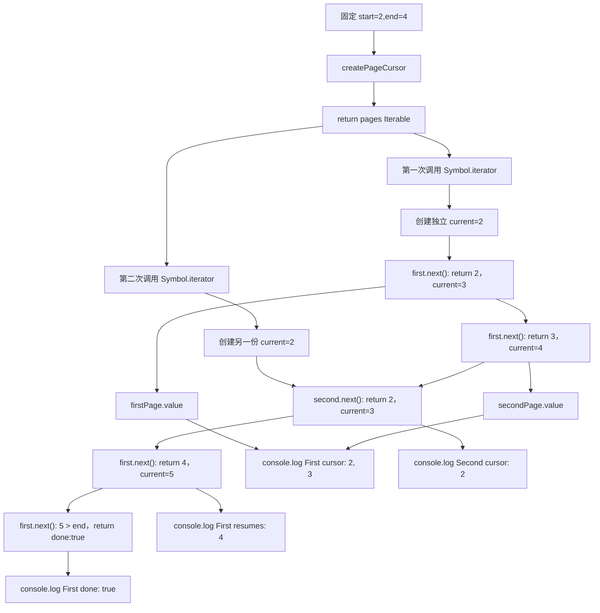

# DAY31 · Practice 02：可重复分页游标

[返回当天课程](../README.md)

## 文件位置

- 作答文件：[practice.ts](../../../day31/practice02/practice.ts)
- 完整参考答案：[solution.ts](../../../day31/practice02/solution.ts)
- 答案调用说明：[SOLUTION.md](./SOLUTION.md)

这题不写 generator，也不处理 `bigint`。你要手写一个可重复遍历的分页 iterable，并直接观察两个 iterator 各自保存的游标。

## 场景背景

日志查看器一次只请求一页，不希望预先生成完整页码数组。同一个查询还可能被两个消费者同时浏览：第一个已经走到第 4 页时，第二个仍应从第 2 页开始。若游标放在 iterable 外层共享，两个消费者会互相抢走页码。你需要手写 `[Symbol.iterator]()` 与 `next()`，直接验证两次遍历互不影响。

## 数据流

先沿变量名看数据怎样分叉和汇合；`──>` 表示值被交给下一步。

```text
start=2 + end=4 ──> createPageCursor ──> pages: Iterable<number>
pages[Symbol.iterator]()
   ├── firstIterator ──> next() 2 ──> next() 3 ──> next() 4 ──> done
   └── secondIterator ──> next() 2（独立 current）
两个 iterator 的 IteratorResult ──> 输出推进顺序与完成状态
```


## 代码流程图

下面这张图按实际执行顺序展开；菱形是判断，箭头上的文字表示走哪条分支。



## 起始代码

以下代码提前给出固定数据、函数签名、调用位置和输出位置。代码可作为完整脚手架阅读；判断、循环、回调与 `return` 的正确实现仍留在 TODO 中。

```ts
function createPageCursor(start: number, end: number): Iterable<number> {
  return {
    [Symbol.iterator](): Iterator<number, void, unknown> {
      let current = start;
      return {
        next(): IteratorResult<number, void> {
          // TODO：判断边界、保存页码、推进并 return。
          void current;
          void end;
          return { done: true, value: undefined };
        },
      };
    },
  };
}
const pages = createPageCursor(2, 4);
const firstIterator = pages[Symbol.iterator]();
const secondIterator = pages[Symbol.iterator]();
const firstPage = firstIterator.next();
const secondPage = firstIterator.next();
const independentPage = secondIterator.next();
const resumedPage = firstIterator.next();
const finished = firstIterator.next();
// TODO：显示结果前先确认前四个 done 都是 false。
console.log(`First cursor: ${String(firstPage.value)}, ${String(secondPage.value)}`);
console.log(`Second cursor: ${String(independentPage.value)}`);
console.log(`First resumes: ${String(resumedPage.value)}`);
console.log(`First done: ${finished.done}`);
```

## 和 Practice 01 的区别

Practice 01 同时使用 generator、手写 iterator 和 `bigint`，最后大多通过展开语法一次消费。本题只练手写协议，并保留两个 iterator 交错调用；输入从“生成两类序列”变成“同一个 iterable 上的两个独立游标”，核心边界是状态应该放在哪里。

## 任务要求

1. 实现 `createPageCursor(start, end): Iterable<number>`，不使用 `function*`、`yield` 或预先创建的页码数组。
2. 每次调用 `[Symbol.iterator]()` 都在函数内部创建自己的 `current = start`。
3. `next()` 在 `current <= end` 时返回当前页并推进，在超出终点后返回 `done: true`；完成后再次调用仍保持完成。
4. 为 `createPageCursor(2, 4)` 创建 `firstIterator`、`secondIterator`。第一个先取 2、3，第二个再取 2，第一个继续取 4 并确认下一次已完成。
5. 输出值必须来自各次 `next()` 的 `IteratorResult`，不能直接写死页码行。

- 不得导入 `practice01` 或直接调用其他练习的实现。
- 输出必须由变量、计算或函数返回值产生，不把整行结果写死。
- 每个参数、局部变量和返回值都应能在流程图中找到位置。

## 精确期望输出

```text
First cursor: 2, 3
Second cursor: 2
First resumes: 4
First done: true
```

## 写完后自检

- `createPageCursor(5, 4)` 第一次 `next()` 应返回什么？完成后再调用一次是否仍然完成？
- 为什么 `current` 必须创建在 `[Symbol.iterator]()` 内部，而不是 `createPageCursor` 的函数体里？
- generator 能更短地写出页码序列。什么情况下仍值得手写 `next()` 和 `IteratorResult`？

## 文件

在上方链接的 `practice.ts` 作答；独立完成后再查看完整的 `solution.ts`，并用 `SOLUTION.md` 对照直接调用逻辑。
