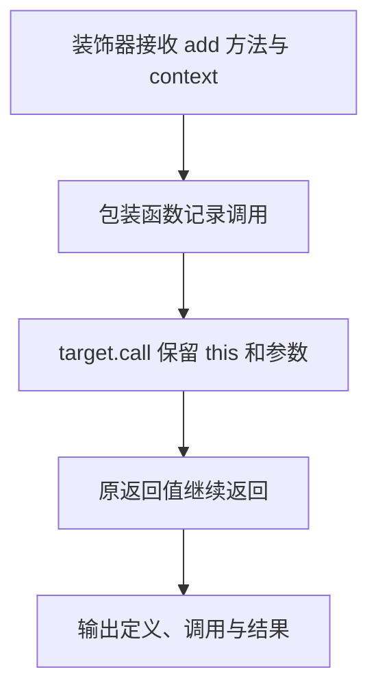

# Day 32（选修）｜现代装饰器、Mixin 与组合

示例中的 `Calculator.add(2, 3)` 原本只返回 `5`。加上方法装饰器后，调用时会先打印方法名，再把相同的 `this`、`2` 和 `3` 交给原方法，最后仍返回 `5`。装饰器是在原调用外面包一层，不能把原方法的参数或结果弄丢。

这里使用 TypeScript 5+ 的 ECMAScript 标准装饰器语义：装饰器接收 `(value, context)`，不启用旧版 `experimentalDecorators`。本日还会比较对象 Mixin 和普通组合，看看三种方式各自改变什么。

建议用时：60–90 分钟。

## 今天会学到

- 使用标准装饰器签名 `(value, context)`；
- 保留方法的 `this`、参数元组和返回类型；
- 从 `ClassDecoratorContext` 读取类名；
- 写一个不使用 any 的对象 Mixin；
- 在横切功能、Mixin 与普通组合之间做选择。

## 核心讲解

### 方法装饰器分两个时刻工作

类定义时，`loggedMethod` 接到两个值：`target` 是原来的 `add` 方法，`context` 描述这个成员，例如它的名称。装饰器返回一个包装函数，之后实例上的调用会进入这个包装函数。

真正执行 `calculator.add(2, 3)` 时：

1. 实例进入包装函数的 `this`。
2. `2` 和 `3` 被收进 `args`。
3. 包装函数读取 `context.name` 对应的名称并记录调用。
4. `target.call(this, ...args)` 用原实例和原参数调用 `add`。
5. 原方法返回 `5`，包装函数也把 `5` 原样返回。

`This`、`Args`、`Return` 分别保存调用者类型、整组参数类型和返回类型。包装前后使用同一组泛型，调用者看到的仍是 `(number, number) => number`。改用 `any[]` 会丢掉参数检查；用拿不到实例 `this` 的箭头函数，还会改变方法运行时的调用上下文。

旧教程中的 `(target, key, descriptor)` 是 legacy 三参数签名，不能直接放进当前标准装饰器配置。看到教程时先辨认签名，不要把两套语义混在同一个项目里。

### 类装饰器、Mixin 和组合各做什么

类装饰器也接收类值和 `context`。本练习只读取类名并输出，不替换类。

对象 Mixin `withCategory` 使用 `Object.assign` 给传入对象增加 `category`。它返回的类型是原对象类型与新字段的交叉类型，所以调用处既能用 `add`，也能读 `category`。但 `Object.assign` 会直接修改传入的那个对象，并不是创建副本；这项副作用要在函数设计中说清楚。

如果一个服务只是需要可替换的 `Formatter`，普通组合通常更直白：构造函数接收 `Formatter`，字段清楚写出依赖，测试时传入假的实现。装饰器适合包日志、注册或验证这类横跨多个成员的功能；Mixin 适合给对象增加一组能力；普通组合适合连接可替换对象。

## 为什么要这样设计

若每个业务方法都手写同一套日志，核心计算会被重复代码包围；若为了复用能力不断加深继承层级，对象之间的关系也会越来越难改。装饰器把横跨多个方法的包装集中起来，Mixin 给对象补充一组能力，组合则让服务通过接口接收可替换依赖。

语言和类型系统负责把装饰器接到类或方法上，并可用泛型保持原签名；你仍要决定哪种机制适合当前问题、包装时记录什么、Mixin 是否允许修改原对象、依赖如何替换。代价是调用过程多了一层间接关系，装饰顺序会影响行为，`Object.assign` 还可能产生可见副作用；标准装饰器与旧三参数语义也不能混用。

## 函数变量追踪

追踪一次调用：`calculator` 进入包装函数的 `this`；`2`、`3` 进入 `args`；`target.call(this, ...args)` 把三者转回原方法；原方法的 `Return` 是 `5`；包装函数再把 `5` 交给最外层调用者。

装饰器只要漏传 `this`、漏传一个参数，或者忘记 `return` 原结果，行为就会改变。读装饰器时可以固定检查这三条路线：调用者有没有保留、参数有没有原序转交、返回值有没有继续返回。

## Example 实际输出

运行 `example.ts` 后，终端会按下面的顺序显示。先用代码推测结果，再逐行对照：

```text
定义类: Calculator
类别: utility
调用方法: add
结果: 5
```

## Example 代码流程图

运行 `example.ts` 前先沿图预测执行顺序；运行后再把每个节点对应到代码行。



## 独立练习导航

本日共有 2 道独立练习。每道题都有单独目录、说明、作答文件和解题结构提示；题目之间不共享代码。

| 目录 | 场景 | 类型 |
| --- | --- | --- |
| [practice01](./practice01/README.md) | Day 32 · 标准装饰器、Mixin 与组合独立综合题 | 主任务 |
| [practice02](./practice02/README.md) | 计算器方法日志 | 闭卷迁移 |

右击任意练习目录中的 `practice.ts` 即可单独检查；命令行也可运行 `npm run beginner -- day32 practice02`。

## 常见错误

- 从旧文章复制三参数装饰器；
- 包装方法时忘记传递 this；
- 用 any[] 放弃参数检查；
- 认为装饰器会自动把新增属性加入实例类型；
- 普通依赖也用装饰器隐藏起来。

### 错误代码示例

```ts
function logged(
  target: object,
  key: string,
  descriptor: PropertyDescriptor,
): void {
  // ❌ 这是旧版三参数装饰器签名，不能直接用于标准装饰器配置。
  console.log(key, descriptor.value);
}

function badWrapper(target: (...args: any[]) => any) {
  // ❌ any[] 丢掉签名；箭头函数也不会取得实例调用时的 this。
  return (...args: any[]) => target(...args);
}
```

### 正确写法

```ts
function logged<This, Args extends unknown[], Return>(
  target: (this: This, ...args: Args) => Return,
  context: ClassMethodDecoratorContext<
    This,
    (this: This, ...args: Args) => Return
  >,
): (this: This, ...args: Args) => Return {
  const name = String(context.name);

  return function (this: This, ...args: Args): Return {
    console.log(`调用: ${name}`);
    // ✅ 普通 function 接住实例 this，并把参数和返回值原样转交。
    return target.call(this, ...args);
  };
}
```

## 面试时怎么回答

**问：** 标准装饰器和 `experimentalDecorators` 旧装饰器有什么区别？Mixin 与组合又怎么选？

**答：** TypeScript 5.0 起支持的标准方法装饰器不需要开启 `experimentalDecorators`，它接收原方法和 `context`，形状是 `(value, context)`；包装器要用普通 `function` 接住实例 `this`，再执行 `target.call(this, ...args)` 并返回原结果。开启 `experimentalDecorators` 使用的是旧语义，常见签名为 `(target, key, descriptor)`。两套写法的配置、类型、运行语义和输出代码都不同，不能直接互换。Mixin 适合给对象增加 `category` 这类能力，组合则让 `MessageService` 通过构造器接收可替换的 `Formatter`。

**容易答错或追问：** 不要把装饰器说成纯类型语法，它会参与类定义或方法调用时的运行行为；也不要忘记包装器若漏传 `this`、参数或返回值，会改变原方法。`Object.assign` 型 Mixin 可能直接修改传入对象，并要用交叉类型反映新增字段；组合的依赖更显式，通常更容易替换和测试。若面试官给出三参数代码，先确认项目是否启用了旧 `experimentalDecorators`，不能套用标准装饰器的 `context` 解释。

## 拓展思考（不要求写代码）

如果 `total` 改成返回 Promise 的异步方法，当前装饰器会保留什么？若还要在异步完成后记录结果，包装器应在哪一步等待，又会怎样影响 Return 的类型设计？

## 官方资料

- [TypeScript 5.0：Decorators](https://www.typescriptlang.org/docs/handbook/release-notes/typescript-5-0.html#decorators)
- [Writing Well-Typed Decorators](https://www.typescriptlang.org/docs/handbook/release-notes/typescript-5-0.html#writing-well-typed-decorators)
- [旧版 Decorators 页面（仅用于辨认 legacy）](https://www.typescriptlang.org/docs/handbook/decorators)
