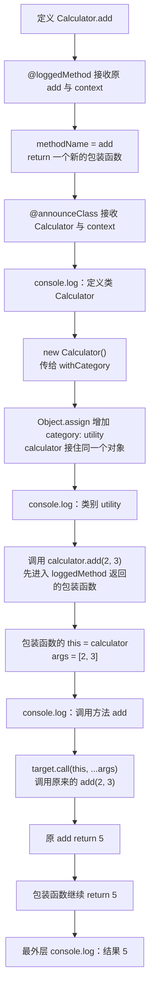

# Day 32（选修）｜现代装饰器、Mixin 与组合

示例中的 `Calculator.add(2, 3)` 原本只返回 `5`。加上方法装饰器后，调用时会先打印方法名，再把相同的 `this`、`2` 和 `3` 交给原方法，最后仍返回 `5`。装饰器是在原调用外面包一层，不能把原方法的参数或结果弄丢。

这里使用 TypeScript 5+ 的 ECMAScript 标准装饰器语义：装饰器接收 `(value, context)`，不启用旧版 `experimentalDecorators`。本日还会比较对象 Mixin 和普通组合，看看三种方式各自改变什么。

建议用时：60–90 分钟。

## 今天会学到

- 使用标准装饰器签名 `(value, context)`；
- 保留方法的 `this`、参数元组和返回类型；
- 从 `ClassDecoratorContext` 读取类名；
- 写一个不使用 any 的对象 Mixin；
- 在横切功能、Mixin 与普通组合之间做选择。

## 写 Example 前先认识这些写法

### `Object.assign`：把来源对象的字段复制到目标对象

`Object.assign(target, source)` 是 JavaScript 内置方法。点号左边的 `Object` 是内置对象；第一个参数 `target` 是被修改的目标，后面的一个或多个参数是字段来源；返回值仍是修改后的 `target`。

```ts
const calculator = { name: "calculator" };
const enhanced = Object.assign(calculator, { category: "utility" });

console.log(enhanced.category);
console.log(calculator === enhanced);
console.log(calculator);
```

实际输出：

```text
utility
true
{ name: 'calculator', category: 'utility' }
```

它适合给对象补充一组字段，但会直接修改第一个参数，只做一层复制；嵌套对象不会被深度复制，后面的同名字段还会覆盖前面的字段。本日的 `withCategory` 是课程自定义 Mixin，内部选择使用 `Object.assign`；调用者必须知道原对象也会改变。

## 核心讲解

### 方法装饰器分两个时刻工作

类定义时，`loggedMethod` 接到两个值：`target` 是原来的 `add` 方法，`context` 描述这个成员，例如它的名称。装饰器返回一个包装函数，之后实例上的调用会进入这个包装函数。

真正执行 `calculator.add(2, 3)` 时：

1. 实例进入包装函数的 `this`。
2. `2` 和 `3` 被收进 `args`。
3. 包装函数读取 `context.name` 对应的名称并记录调用。
4. `target.call(this, ...args)` 用原实例和原参数调用 `add`。
5. 原方法返回 `5`，包装函数也把 `5` 原样返回。

`This`、`Args`、`Return` 分别保存调用者类型、整组参数类型和返回类型。包装前后使用同一组泛型，调用者看到的仍是 `(number, number) => number`。改用 `any[]` 会丢掉参数检查；用拿不到实例 `this` 的箭头函数，还会改变方法运行时的调用上下文。

旧教程中的 `(target, key, descriptor)` 是 legacy 三参数签名，不能直接放进当前标准装饰器配置。看到教程时先辨认签名，不要把两套语义混在同一个项目里。

### 类装饰器、Mixin 和组合各做什么

类装饰器也接收类值和 `context`。本练习只读取类名并输出，不替换类。

对象 Mixin `withCategory` 使用 `Object.assign` 给传入对象增加 `category`。它返回的类型是原对象类型与新字段的交叉类型，所以调用处既能用 `add`，也能读 `category`。但 `Object.assign` 会直接修改传入的那个对象，并不是创建副本；这项副作用要在函数设计中说清楚。

如果一个服务只是需要可替换的 `Formatter`，普通组合通常更直白：构造函数接收 `Formatter`，字段清楚写出依赖，测试时传入假的实现。装饰器适合包日志、注册或验证这类横跨多个成员的功能；Mixin 适合给对象增加一组能力；普通组合适合连接可替换对象。

## 为什么要这样设计

若每个业务方法都手写同一套日志，核心计算会被重复代码包围；若为了复用能力不断加深继承层级，对象之间的关系也会越来越难改。装饰器把横跨多个方法的包装集中起来，Mixin 给对象补充一组能力，组合则让服务通过接口接收可替换依赖。

语言和类型系统负责把装饰器接到类或方法上，并可用泛型保持原签名；你仍要决定哪种机制适合当前问题、包装时记录什么、Mixin 是否允许修改原对象、依赖如何替换。代价是调用过程多了一层间接关系，装饰顺序会影响行为，`Object.assign` 还可能产生可见副作用；标准装饰器与旧三参数语义也不能混用。

## 函数变量追踪

追踪一次调用：`calculator` 进入包装函数的 `this`；`2`、`3` 进入 `args`；`target.call(this, ...args)` 把三者转回原方法；原方法的 `Return` 是 `5`；包装函数再把 `5` 交给最外层调用者。

装饰器只要漏传 `this`、漏传一个参数，或者忘记 `return` 原结果，行为就会改变。读装饰器时可以固定检查这三条路线：调用者有没有保留、参数有没有原序转交、返回值有没有继续返回。

## Example 实际输出

运行 `example.ts` 后，终端会按下面的顺序显示。先用代码推测结果，再逐行对照：

```text
定义类: Calculator
类别: utility
调用方法: add
结果: 5
```

## Example 代码流程图

运行 `example.ts` 前先沿图预测执行顺序；运行后再把每个节点对应到代码行。



## 官方手册扩展阅读（可选）

完成当天教程后，如果还想加深理解，再到 [Day 32 官方手册索引](../OFFICIAL-READING.md#day-32) 只选 1 篇阅读；这不是开始练习前的必修内容。

## 独立练习导航

本日共有 2 道独立练习。每道题都有单独目录、题目说明、作答文件、完整参考答案和调用逻辑说明；题目之间不共享代码。

| 目录 | 场景 | 类型 |
| --- | --- | --- |
| [practice01](./practice01/README.md) | 带追踪的价格服务 | 主任务 |
| [practice02](./practice02/README.md) | 计算器方法日志 | 闭卷迁移 |

右击任意练习目录中的 `practice.ts` 即可单独检查；命令行也可运行 `npm run beginner -- day32 practice02`。

## 常见错误

- 从旧文章复制三参数装饰器；
- 包装方法时忘记传递 this；
- 用 any[] 放弃参数检查；
- 认为装饰器会自动把新增属性加入实例类型；
- 普通依赖也用装饰器隐藏起来。

### 错误代码示例

团队把一个启用了旧 `experimentalDecorators` 的项目迁到当前标准装饰器语义时，最容易直接复制旧三参数实现：

```ts
function legacyTimer(
  target: object,
  key: string,
  descriptor: PropertyDescriptor,
): void {
  console.log(key, descriptor.value);
}

class CacheStore {
  @legacyTimer
  read(key: string): string {
    return `cached:${key}`;
  }
}
// ❌ 在当前标准装饰器模式下，方法装饰器接收 value 和 context，
// 旧的 target/key/descriptor 签名会在编译阶段不匹配。
```

旧代码不是“少改一个参数”就能迁移：两套装饰器的上下文对象、返回约定、初始化时机和编译选项不同。若项目明确启用了 `experimentalDecorators`，三参数签名仍属于那套旧语义；若使用 TypeScript 5.0 引入的标准装饰器模型，就应使用 `(value, context)`。

即使签名改成两个参数，包装器也可能破坏原方法：

```ts
function brokenTrace(
  target: (...args: any[]) => any,
  context: ClassMethodDecoratorContext,
): any {
  return (...args: any[]) => {
    console.log(`调用: ${String(context.name)}`);
    target(...args);
    // ❌ 返回类型 any 把问题藏起来：箭头函数没有实例调用时的动态 this，
    // 这里也没有 return 原方法结果。
  };
}
```

假如用它装饰货币换算方法，原方法读取实例汇率时会因 `this` 丢失而报错；即使原方法不使用 `this`，调用者拿到的也会是 `undefined`。`any` 让编译器无法继续检查“包装前后签名必须一致”这条关系。

### 正确写法

下面故意写成只适用于货币换算方法的具体装饰器，不给练习题提供通用泛型答案。`target.apply(thisValue, args)` 会用指定的 `thisValue` 和参数数组调用原函数，并把原函数的返回值交回来；这里的参数数组只有一个 `cents`。

```ts
type ConversionMethod = (
  this: CurrencyConverter,
  cents: number,
) => number;

function traceConversion(
  target: ConversionMethod,
  context: ClassMethodDecoratorContext<
    CurrencyConverter,
    ConversionMethod
  >,
): ConversionMethod {
  const name = String(context.name);

  return function (
    this: CurrencyConverter,
    cents: number,
  ): number {
    console.log(`换算: ${name}`);
    // ✅ 普通 function 接住实例 this；apply 转交参数数组并返回原结果。
    return target.apply(this, [cents]);
  };
}

class CurrencyConverter {
  constructor(private readonly rate: number) {}

  @traceConversion
  toMainUnit(cents: number): number {
    return cents * this.rate;
  }
}

const converter = new CurrencyConverter(0.01);
console.log(converter.toMainUnit(250));
```

这里的包装器保留实例、一个数字参数和数字返回值。它能讲清标准装饰器的运行边界，但不能直接套到其他签名上；需要复用时，才进一步把 `CurrencyConverter`、`number` 和参数列表抽成泛型。

## 面试时怎么回答

**问：** 标准装饰器和 `experimentalDecorators` 旧装饰器有什么区别？Mixin 与组合又怎么选？

**可以直接这样回答：**

TypeScript 5.0 支持当前标准装饰器模型，方法装饰器接收原方法和 context，也就是 `(value, context)`；它不依赖 `experimentalDecorators`。旧实验性装饰器常见签名是 `(target, propertyKey, descriptor)`，需要开启 `experimentalDecorators`。两套语义的参数、类型、初始化方式和生成代码不同；新版还不能直接使用旧版的参数装饰器与 `emitDecoratorMetadata` 工作流，所以迁移前要先确认框架依赖哪一套。

包装方法时，我会保留 `this`、全部参数和返回值：用普通 `function` 接住实例，通过 `target.call(this, ...args)` 调原方法，并返回结果。Mixin 适合从可复用组件组合出额外能力，但它会增加类型和运行时结构；普通组合把依赖放在字段或构造器中，更显式，也更容易替换和测试。日志这类横切包装可以考虑装饰器，支付审计器这类需要测试和替换的业务依赖通常优先组合。

官方参考：[TypeScript 5.0 标准装饰器说明](https://www.typescriptlang.org/docs/handbook/release-notes/typescript-5-0.html#decorators)、[旧版 Experimental Decorators 说明](https://www.typescriptlang.org/docs/handbook/decorators)、[TypeScript Mixins](https://www.typescriptlang.org/docs/handbook/mixins.html)

## 拓展思考（不要求写代码）

如果 `total` 改成返回 Promise 的异步方法，当前装饰器会保留什么？若还要在异步完成后记录结果，包装器应在哪一步等待，又会怎样影响 Return 的类型设计？
