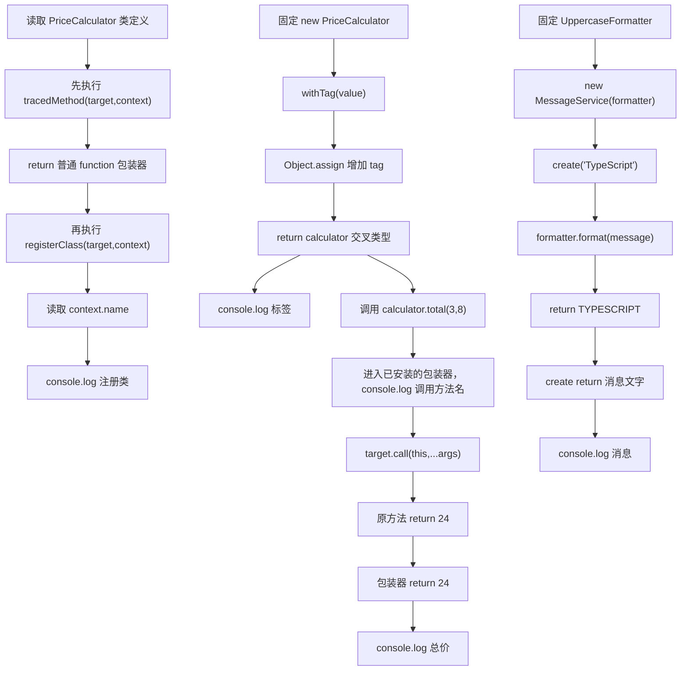

# DAY32 · Practice 01：带追踪的价格服务

[返回当天课程](../README.md)

## 文件位置

- 作答文件：[practice.ts](../../../day32/practice01/practice.ts)
- 完整参考答案：[solution.ts](../../../day32/practice01/solution.ts)
- 答案调用说明：[SOLUTION.md](./SOLUTION.md)

这是一道完整、独立的主练习。不要导入其他 practice 文件夹中的代码。

## 场景背景

商品服务团队希望在不改写核心价格算法的前提下记录类注册和方法调用，同时给服务对象增加标签，并组合可替换的消息格式器。装饰器接收的方法、参数组和实例上下文都是边界；若包装函数丢失 `this`、实参或返回值，价格会算错，旧式装饰器写法也无法匹配当前配置。你需要输出注册与调用轨迹、对象标签、准确总价和格式化后的消息。

## 数据流

先沿变量名看数据怎样分叉和汇合；`──>` 表示值被交给下一步。

```text
PriceCalculator.total + context ──> tracedMethod
   └── 普通 function 包装器 ──> target.call(this, ...args) ──> 原返回值
PriceCalculator 类 ──> registerClass ──> 注册日志
new PriceCalculator ──> withTag ──> calculator + tag
message ──> MessageService ──> Formatter ──> 最终文字
装饰、Mixin、组合三条结果 ──> 输出
```


## 代码流程图

下面这张图按实际执行顺序展开；菱形是判断，箭头上的文字表示走哪条分支。



## 起始代码

以下代码提前给出固定数据、函数签名、调用位置和输出位置。代码可作为完整脚手架阅读；判断、循环、回调与 `return` 的正确实现仍留在 TODO 中。

```ts
function tracedMethod<This, Args extends unknown[], Return>(
  target: (this: This, ...args: Args) => Return,
  context: ClassMethodDecoratorContext<This, (this: This, ...args: Args) => Return>,
): (this: This, ...args: Args) => Return {
  // TODO：return 包装函数；显示名称；call 原方法；return 原结果。
  void context;
  return target;
}
function registerClass<Value extends abstract new (...args: never[]) => object>(
  target: Value,
  context: ClassDecoratorContext<Value>,
): void {
  // TODO：读取 context.name 并显示类名。
  void target;
  void context;
}
function withTag<Value extends object>(
  value: Value,
): Value & { readonly tag: "advanced" } {
  // TODO：增加 tag 并 return。
  return Object.assign(value, { tag: "advanced" as const });
}
@registerClass
class PriceCalculator {
  @tracedMethod
  total(quantity: number, unitPrice: number): number {
    return quantity * unitPrice;
  }
}
interface Formatter { format(value: string): string; }
class UppercaseFormatter implements Formatter {
  format(value: string): string {
    // TODO：return 大写文字。
    return value;
  }
}
class MessageService {
  constructor(private readonly formatter: Formatter) {}
  create(message: string): string {
    // TODO：把 message 交给 formatter，并 return 带“消息: ”的文字。
    void message;
    return "";
  }
}
const calculator = withTag(new PriceCalculator());
console.log(`标签: ${calculator.tag}`);
console.log(`总价: ${calculator.total(3, 8)}`);
console.log(new MessageService(new UppercaseFormatter()).create("TypeScript"));
```


## 任务要求

1. `registerClass` 与 `tracedMethod` 使用 TS 5 标准装饰器的 `(value, context)` 形式。
2. 方法包装器必须保留 `this`、全部参数和原返回值。
3. `withTag` 在运行时增加 `advanced`，返回类型同时保留原对象能力。
4. `MessageService` 通过构造器组合格式器，并使用其返回值组成消息。

## 精确期望输出

```text
注册类: PriceCalculator
标签: advanced
调用: total
总价: 24
消息: TYPESCRIPT
```

## 本题易漏语法

标准方法装饰器接收原方法与 context；用 target.call(this, ...args) 保留 this、参数和返回值。

## 写完后自检

- 把 `total` 改成三个参数或 Promise 返回值后，包装器的 `Args`、`Return` 会怎样跟随？
- 为什么标准装饰器用 `(value, context)`，旧文章里的 `(target, key, descriptor)` 不能直接复制进本题？
- 格式器为什么使用构造器组合，而标签使用 Mixin？如果标签也需要随时替换，哪种设计会更清楚？

## 文件

- 在 `practice.ts` 中独立作答。
- 独立完成后，再查看完整的 `solution.ts`，并用 `SOLUTION.md` 对照直接调用逻辑。
