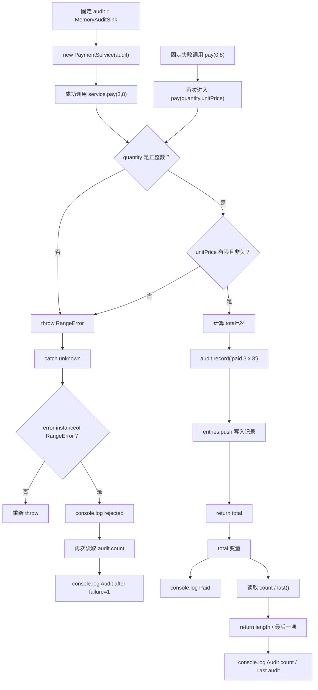

# DAY32 · Practice 02：可替换支付审计器

[返回当天课程](../README.md)

## 文件位置

- 作答文件：[practice.ts](../../../day32/practice02/practice.ts)
- 完整参考答案：[solution.ts](../../../day32/practice02/solution.ts)
- 答案调用说明：[SOLUTION.md](./SOLUTION.md)

这题刻意不使用装饰器或 Mixin。审计记录是 `PaymentService` 的明确依赖，并且测试要读取记录条数，因此用构造器组合会比隐藏包装更直接。

## 场景背景

支付服务每次成功扣款后都要写入审计记录，测试环境使用内存记录器，生产环境以后可以换成数据库实现。数量无效时必须在扣款前失败，而且不能留下审计记录。你需要通过 `AuditSink` 接口组合服务与记录器，分别观察成功和失败两条路径。

## 数据流

先沿变量名看数据怎样分叉和汇合；`──>` 表示值被交给下一步。

```text
quantity + unitPrice ──> PaymentService.pay
                              ├── quantity 合法
                              │      ├── 计算 total
                              │      └── AuditSink.record ──> MemoryAuditSink.entries
                              └── quantity 非法 ──> RangeError ──> 不写审计
成功 total + entries.length + last entry ──> 输出
失败结果 + 失败后的 entries.length ───────> 输出
```


## 代码流程图

下面这张图按实际执行顺序展开；菱形是判断，箭头上的文字表示走哪条分支。



## 起始代码

以下代码提前给出固定数据、函数签名、调用位置和输出位置。代码可作为完整脚手架阅读；判断、循环、回调与 `return` 的正确实现仍留在 TODO 中。

```ts
interface AuditSink { record(message: string): void; }
class MemoryAuditSink implements AuditSink {
  private readonly entries: string[] = [];
  record(message: string): void {
    // TODO：用 push 把 message 加入数组。
    void message;
  }
  get count(): number {
    // TODO：return 数组长度。
    return 0;
  }
  last(): string | undefined {
    // TODO：return 最后一项或 undefined。
    return undefined;
  }
}
class PaymentService {
  constructor(private readonly audit: AuditSink) {}
  pay(quantity: number, unitPrice: number): number {
    // TODO：先判断两个输入；计算；记录；return total。
    void quantity;
    void unitPrice;
    return 0;
  }
}
const audit = new MemoryAuditSink();
const service = new PaymentService(audit);
const total = service.pay(3, 8);
console.log(`Paid: ${total}`);
console.log(`Audit count: ${audit.count}`);
console.log(`Last audit: ${audit.last() ?? "none"}`);
try {
  service.pay(0, 8);
  console.log("Invalid quantity: accepted");
} catch (error: unknown) {
  // TODO：判断 RangeError；其他错误重新 throw。
  void error;
  console.log("Invalid quantity: rejected");
}
console.log(`Audit after failure: ${audit.count}`);
```

## 和 Practice 01 的区别

Practice 01 用标准装饰器包装横跨方法的日志，再用 Mixin 增加标签；调用行为藏在包装层。本题不做方法包装，审计器通过构造器显式进入服务，控制流还多了一条“校验失败时禁止记录”的分支，重点是组合、替换依赖和副作用顺序。

## 任务要求

1. 声明 `AuditSink`，只暴露 `record(message): void`。
2. 实现 `MemoryAuditSink`：内部保存记录，提供只读 `count` 和 `last()`；不要把可修改数组直接暴露给调用者。
3. `PaymentService` 通过构造器接收 `AuditSink`。`pay(quantity, unitPrice)` 只接受正整数数量和有限非负单价，否则抛出 `RangeError`。
4. 成功时先计算总价，再记录 `paid 数量 x 单价` 并返回总价。固定成功输入为 `3 × 8`。
5. 再调用一次 `pay(0, 8)`，捕获 `RangeError` 并确认审计数量仍是 `1`。失败路径不能写审计。
6. 不使用标准或旧式装饰器，也不把记录器混入服务对象；本题要验证“普通组合何时更合适”。

- 不得导入 `practice01` 或直接调用其他练习的实现。
- 输出必须由变量、计算或函数返回值产生，不把整行结果写死。
- 每个参数、局部变量和返回值都应能在流程图中找到位置。

## 精确期望输出

```text
Paid: 24
Audit count: 1
Last audit: paid 3 x 8
Invalid quantity: rejected
Audit after failure: 1
```

## 写完后自检

- 把无效调用改成 `pay(2, Number.NaN)` 时，应该抛错还是记录？审计条数为什么不能增加？
- 为什么本题把 `AuditSink` 放进构造器，而不是用 Mixin 给服务临时增加 `record` 方法？
- 如果许多互不相关的方法都要记录耗时，组合仍然能做，但标准装饰器可能减少什么重复？旧式三参数装饰器为什么仍不能直接使用？

## 文件

在上方链接的 `practice.ts` 作答；独立完成后再查看完整的 `solution.ts`，并用 `SOLUTION.md` 对照直接调用逻辑。
